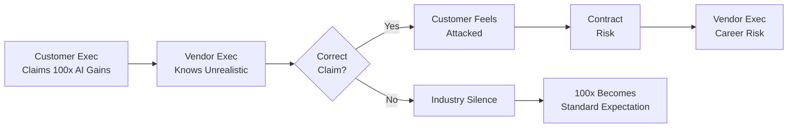

## AI Mania Is Eviscerating Global Decision-Making

Nik Suresh 分析企业 AI 炒作现象背后的经济学激励机制，揭示根本问题不仅是销售夸大（如 100x 生产力声称），而是组织结构性困境：纠正不切实际的 AI 预期会被视为攻击合作伙伴的公信力，进而威胁企业合同签订与续约，导致主张理性的高管面临职业风险。具体案例包括没用过 AI 工具的高管制定 $2B+ 公司 AI 战略、员工虚构 AI 代码改写项目以保住工作等。这种激励扭曲使得销售团队即使认识到夸大问题，也难以主动纠正，因为纠正动作会伤害客户高管的地位进而威胁合同。

### 重點
- 组织激励陷阱：纠正 AI 炒作被视为威胁客户高管信誉 → 合同风险 → 职业风险，导致销售/管理层集体沉默
- 具体现象：无 AI 使用经验的高管主导 $2B+ 公司战略；工程师虚构 AI 改写项目以证明价值；100x 生产力承诺成为行业标准
- 根本原因是销售与客户间的权力结构与信息不对称，而非技术能力问题；经济激励使得即使知悉夸大也难以纠正

**原文：** [simon-willison](https://simonwillison.net/2026/Jul/19/ai-mania/#atom-everything)

---

### 📄 原文內容

點此展開 / 收合

# AI Mania Is Eviscerating Global Decision-Making

AI Mania Is Eviscerating Global Decision-Making 
Here's an entertaining perspective from Nik Suresh on the AI mania that is overwhelming the large companies that he consults with. It's crammed with spicy anecdotes from anonymous sources. 
 
 In one extreme case, I have seen an executive confess that they had never even used ChatGPT or any AI tool in their life, immediately after producing a technical strategy for an organisation with $2B+ in revenue which was entirely centered around AI. 
 
 Here's a report from an engineer at a company with a token leaderboard: 
 
 Checking out a parallel copy of our Go repository and telling the AI to rewrite the whole thing in Zig while I work on something else just so I can keep my job. 
 
 I particularly enjoyed this conversation with a skeptical executive at an over-enthusiastic company: 
 
 I asked why this was being repeated without opposition. Was it just sales fluff? 
 The answer was a lot more interesting. It was partially ridiculous sales material being delivered to an easily excitable audience, but this was not the dominant factor constraining honesty. Executives at their customers were saying absurd things about achieving 100x productivity, and this meant that if any executive at the vendor said that these gains were not plausible, it would undermine the credibility of the customer’s executive, be perceived as an attack (or heresy), and possibly result in an enterprise contract cancellation. And getting enterprise contracts cancelled because you wanted to opine on something that doesn’t really matter to your organisation’s mission is a great way to get fired. 
 

 Via Hacker News 

 Tags: ai , ai-ethics , ai-misuse

