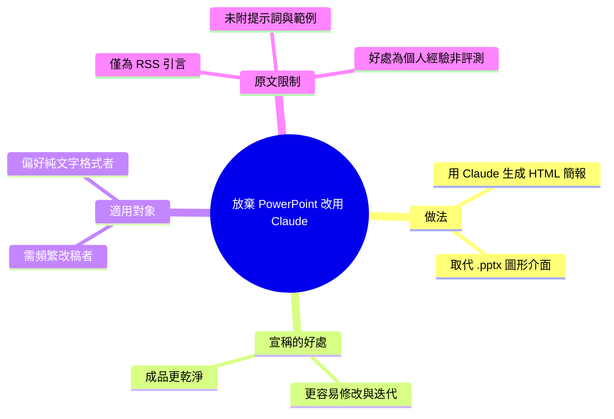

## I Ditched PowerPoint. Here Is What I Use Instead.

作者分享了使用 Claude AI 建立 HTML 幻燈片的工作流經驗。相比傳統 PowerPoint 軟體，用 Claude 生成的 HTML 幻燈片具有更簡潔的設計。HTML 格式使得幻燈片編輯和迭代流程更加高效、更易修改。這一應用案例展示了 Claude 在內容創作工具中的實踐價值。為需要頻繁修改演示文稿的用戶提供了新的工作流選擇。

### 重點
- 用 Claude 生成 HTML 幻燈片替代 PowerPoint
- HTML 幻燈片相比傳統工具更簡潔、迭代速度更快
- 實現幻燈片編輯和迭代流程的加速

**原文：** [medium-tag-claude](https://medium.com/@milanavalerio/i-ditched-powerpoint-here-is-what-i-use-instead-99c5aa99c7ed?source=rss------claude-5)

---

<!-- deep-analysis:begin -->
> ⚠️ **來源說明**：本則抓取到的是 Medium 的 RSS 摘要片段，正文正文需點擊原文閱讀。目前可用內容僅有標題與兩句引言，因此以下整理聚焦在作者已明確表述的主張，未在原文出現的工作流細節、工具版本或範例不予臆測。

## 📌 摘要 (TL;DR)

- 作者（Medium 帳號 @milanavalerio）發文宣告已放棄 PowerPoint，改用 Claude 生成 HTML 幻燈片（HTML slide decks）來製作簡報。
- 兩項核心主張：Claude 產出的 HTML 簡報比她過去用 PowerPoint 做的「更乾淨」（cleaner），而且「更容易修改」（easier to change）。
- 這是把大型語言模型（LLM）當成簡報生成工具的實務案例，對象是需要頻繁改稿、又不想被 .pptx 格式綁住的使用者。
- 原文為付費 / 導流性質的短引言，未提供具體提示詞、CSS 框架或前後對比截圖。

## 🎯 核心概念

- **HTML 幻燈片（HTML slide decks）**：以 HTML/CSS（可能搭配 JavaScript）撰寫、在瀏覽器中呈現的簡報，取代傳統 PowerPoint 的 .pptx 二進位檔案。
- **以 LLM 生成簡報**：把 Claude 當作「簡報後端」，用自然語言描述需求，由模型輸出可直接執行的簡報程式碼，而非在圖形介面裡手動拉版面。

## 📖 整理分析

### 1. 作者的核心決定
作者明確表示「I build HTML slide decks with Claude」——她的簡報製作流程已從 PowerPoint 圖形介面，轉為請 Claude 直接產出 HTML 程式碼。這是全文唯一被明確陳述的做法。

### 2. 提出的兩個好處
原文給出的優勢只有兩點：一是成品「更乾淨」（cleaner than the ones I built in PowerPoint），二是「更容易修改」（easier to change）。前者指向設計成果的視覺一致性，後者指向 HTML 這種純文字格式在迭代時的便利性——改文字、換樣式只需編輯程式碼，而非重排 PowerPoint 物件。

### 3. 原文未涵蓋、需保留判斷的部分
本則抓取內容並未說明她使用哪個 Claude 版本、是否搭配特定簡報框架（如 reveal.js、Slidev），也沒有實際提示詞、程式碼片段或前後對比圖。因此「HTML 一定比 PowerPoint 好」只是作者的個人經驗陳述，而非可驗證的評測結論；讀者若要落地，仍需點進 Medium 原文取得完整步驟。

## 🧠 Mindmap

<!-- deep-analysis:end -->
### 📄 原文內容

點此展開 / 收合

I build HTML slide decks with Claude. Cleaner than the ones I built in PowerPoint, and easier to change. Continue reading on Medium »

