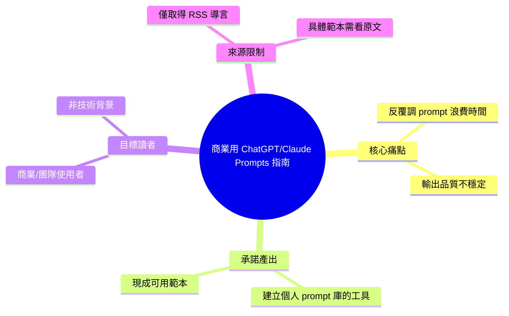

## How to Use ChatGPT & Claude Prompts for Your Business (Without Wasting Hours)

文章提供實用指南，教讀者如何在商業場景中有效使用 ChatGPT 和 Claude 的 prompts。內容包含現成可用的 prompt 範本庫和構建個人 prompt 工具集的方法。指南強調通過優化 prompts 獲得有用的 AI 輸出。適合希望提升 AI 工具使用效率和構建 prompt 管理體系的商業人士和團隊。

### 重點
- 提供 ChatGPT 和 Claude 商業應用的實用指南與現成 prompt 範本庫
- 介紹構建和管理企業級個人 prompt 工具集的方法
- 通過現成模板和工具庫減少 prompt 工程的試錯成本

**原文：** [medium-tag-claude](https://medium.com/@Upskillvault/how-to-use-chatgpt-claude-prompts-for-your-business-without-wasting-hours-2d843ccfceb6?source=rss------claude-5)

---

<!-- deep-analysis:begin -->
## 📌 摘要 (TL;DR)

- 這是一篇 Medium 文章（作者帳號 **Upskillvault**），主題是如何在商業場景中有效率地使用 ChatGPT 與 Claude 的 prompts，訴求是「不浪費時間」。
- 原文導言承諾提供兩類價值：**現成可用的 prompt 範本（ready-to-use templates）**，以及**打造個人 prompt 資料庫（prompt library）所需的工具**。
- ⚠️ **來源限制**：本次擷取到的僅是 RSS 摘要（teaser），正文只有一句導言，完整內容需點回 Medium 閱讀。以下整理基於標題與導言可確認的資訊，無法還原文中實際列出的具體範本、工具名稱或步驟——這些原文擷取中並未提供，故不臆測補完。

## 🎯 核心概念

- **Prompt 範本庫 (prompt library / templates)**：把常用、經驗證有效的指令整理成可重複套用的模板，避免每次從零開始寫 prompt。
- **商業場景應用 (business use case)**：文章定位不在技術研究，而在讓商業使用者（行銷、營運、團隊）用 AI 產出可用結果。

## 📖 整理分析

### 1. 文章定位與訴求
從標題「Without Wasting Hours」可判斷，本文鎖定的痛點是**使用者花太多時間反覆調整 prompt 卻得不到好結果**。作者主張透過現成範本與系統化管理來縮短這段摸索時間。這是內容行銷／教學類文章的常見切角，訴諸效率而非深度技術。

### 2. 承諾提供的兩項產出
導言明確列出兩個交付項目：一是「ready-to-use prompt templates」，即可直接複製套用的指令範本；二是「the tools to build your own library」，即協助讀者建立並維護自己 prompt 資料庫的工具。至於**具體是哪些範本、哪些工具**，擷取到的摘要並未揭露，需以原文為準。

### 3. 為什麼讀者可能關注
對非技術背景的商業團隊而言，prompt 的品質直接決定 AI 輸出是否可用。將有效指令模板化、集中管理，可降低團隊使用門檻並維持輸出一致性——這是此類指南的核心價值主張。但本文屬入門實用型內容，資深使用者能獲得的新資訊有限。

### 4. 閱讀建議
由於本次僅取得導言，若需要文中實際的範本清單與工具推薦，建議直接前往原文網址閱讀完整版本，再自行判斷其範本是否適用於自身業務流程。本整理不代替原文的具體內容。

## 🧠 Mindmap

<!-- deep-analysis:end -->
### 📄 原文內容

點此展開 / 收合

A practical guide to getting useful AI output &#x2014; including ready-to-use prompt templates and the tools to build your own library. Continue reading on Medium »

