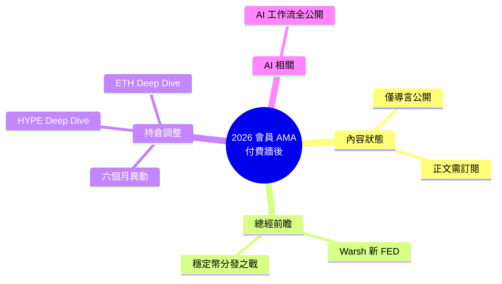

## 🔒 2026 會員 AMA:持倉大調整+AI 工作流公開

無法生成完整摘要。Substack 文章涉及 2026 年加密市場前景、持倉調整、AI 工作流程等議題，但提供之內文為 HTML 編碼摘要片段。來源為加密貨幣／金融類 Substack，主要內容非 AI 產業聚焦。

### 重點

**原文：** [substack-maxcryptospace](https://www.maxcrypto.space/p/202607-ama)

---

<!-- deep-analysis:begin -->
> ⚠️ **內容取得說明**：本篇為加密貨幣電子報 maxcrypto.space 的**付費會員專屬 AMA**（標題含 🔒 鎖頭符號），完整正文位於付費牆之後。抓取到的內文只有標題與一段導言，沒有作者的實際論述、持倉數字或結論。以下整理只能還原「導言揭示的議程」與各名詞的背景脈絡，**無法呈現正文內容**（遵守不捏造原則）。

## 📌 摘要 (TL;DR)

- 這是 maxcrypto.space 針對付費會員的 2026 年 AMA（Ask Me Anything）貼文，主軸是**持倉大調整**與**作者 AI 工作流公開**兩件事，但完整內容需訂閱才可見。
- 依公開導言，本期定位為「**2026 下半年前瞻**」，列出五大議題：Warsh 執掌新 FED、穩定幣分發之戰、六個月持倉異動、HYPE/ETH Deep Dive、AI 工作流全公開。
- 內容屬性為**加密投資 / 總體經濟**，非 AI 產業聚焦；唯一與 AI 相關的是最後一節「AI 工作流公開」，導言未透露細節。
- 因正文被鎖，本文無法讓讀者「不跳原文即完全理解」——若需作者的具體觀點與數據，須至原連結訂閱閱讀。

## 🎯 核心概念

（以下為導言出現名詞的**背景脈絡**，屬一般知識，非文章正文論點）

- **Warsh 新 FED**：指與 Kevin Warsh 相關的美國聯準會（Federal Reserve，FED）人事／政策情境。Kevin Warsh 為前 Fed 理事，市場長期將其列為潛在主席人選之一——導言未說明作者的具體推論。
- **穩定幣分發之戰**（stablecoin distribution）：指穩定幣發行商爭奪通路、錢包與交易所鋪貨的市佔競爭主題。
- **HYPE**：去中心化永續合約交易所 Hyperliquid 的原生代幣。
- **ETH** (Ethereum)：以太坊的原生資產。
- **Deep Dive**：對特定標的做深度基本面／估值分析。

## 📖 整理分析

### 1. 內容狀態：付費牆後的會員 AMA
可公開存取的僅有標題「2026 會員 AMA：持倉大調整＋AI 工作流公開」與一句導言。正文（作者觀點、倉位、金額、時間點）皆在付費牆之後，本次抓取未包含。

### 2. 議題一：Warsh 新 FED 與下半年總經前瞻
導言以「2026 下半年前瞻」開場，首項議題為「Warsh 新 FED」，指向聯準會人事變動對利率與風險資產的影響。作者的具體判斷（是否升息／降息、對加密市場多空）在正文中，此處無從得知。

### 3. 議題二：穩定幣分發之戰
導言列出「穩定幣分發之戰」，屬 2026 年穩定幣賽道的通路競爭主題。作者對哪些發行商、哪些鏈或錢包受惠的觀點未公開。

### 4. 議題三：六個月持倉異動 + HYPE/ETH Deep Dive
標題點名「持倉大調整」，導言補充為「六個月持倉異動」，並對 HYPE 與 ETH 做 Deep Dive。這意味作者會揭露近半年組合變化與這兩個標的的深度分析，但**加減碼的品項、比重、進出價位等具體數字均在付費區**。

### 5. 議題四：AI 工作流全公開
導言最後一項為「加碼我的 AI 工作流全公開」，是本篇唯一與 AI 直接相關的段落，推測會分享作者用於研究／內容產出的 AI 工具與流程。實際使用哪些模型、工具或提示流程，正文未開放故無法整理。

## 🧠 Mindmap

<!-- deep-analysis:end -->
### 📄 原文內容

點此展開 / 收合

2026 &#19979;&#21322;&#24180;&#21069;&#30651;&#65306;Warsh &#26032; FED&#12289;&#31337;&#23450;&#24163;&#20998;&#30332;&#20043;&#25136;&#12289;&#20845;&#20491;&#26376;&#25345;&#20489;&#30064;&#21205;&#12289;HYPE&#65295;ETH Deep Dive&#65292;&#21152;&#30908;&#25105;&#30340; AI &#24037;&#20316;&#27969;&#20840;&#20844;&#38283;

