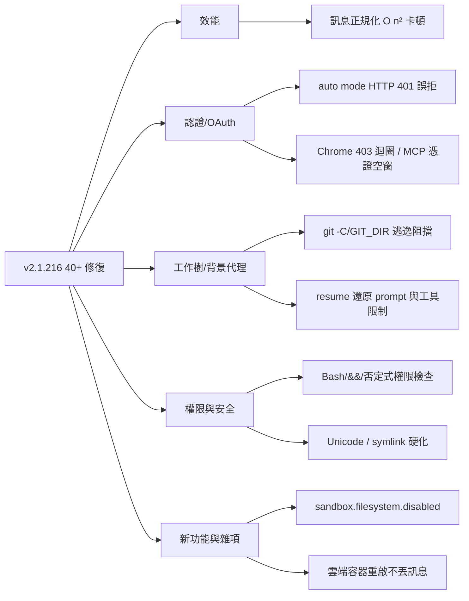
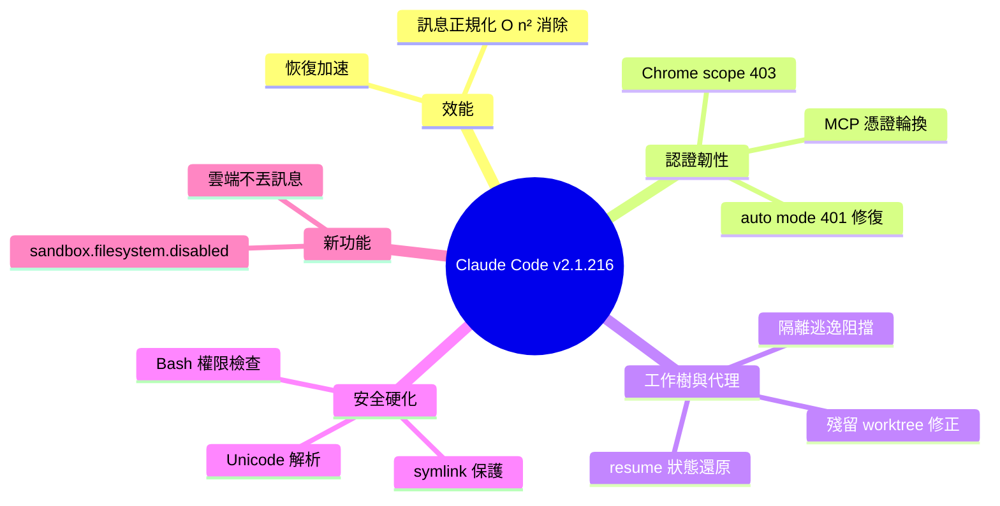

## v2.1.216

Claude Code v2.1.216 發布，包含 40+ 項重要修復和改進。其中最關鍵的是修復 message normalization 在長會話中的二次方複雜度問題（O(n²)），導致多秒卡頓和慢恢復。修復 OAuth token 過期/輪換後 auto mode 拒絕命令的 HTTP 401 錯誤。新增 sandbox.filesystem.disabled 設置以跳過文件系統隔離（保留網路封鎖）。修復 background agent 會話恢復時丟失 prompt 和工具限制、worktree 隔離的 subagents 不當重定向 git 命令到共享 checkout、resumed 會話中 Esc-Esc 無法打開 rewind picker 等。還包括多項 UI 細節、權限檢查在複雜 shell 場景的改進、Unicode 字符處理修復。

### 重點
- Message normalization O(n²) 複雜度 → 多秒卡頓：長會話中每次 turn 重新序列化所有歷史消息導致指數級性能衰減，需要增量更新機制
- Background agent 恢復後失去配置：已修復會話恢復時遺失 prompt 和 tool restrictions，防止 agent 行為異常
- Worktree 隔離邊界破裂：已修復 subagents 通過 git -C/--git-dir/GIT_DIR 環境變數繞過隔離，重定向到共享 checkout

**原文：** [claude-code-releases](https://github.com/anthropics/claude-code/releases/tag/v2.1.216)

---

<!-- deep-analysis:begin -->
## 📌 摘要 (TL;DR)

- Claude Code v2.1.216 是一次以修復為主的釋出，涵蓋 40+ 項改進，最關鍵的是消除長會話中訊息正規化的**二次方複雜度（O(n²)）**問題，該問題會隨對話輪次增加造成數秒卡頓與緩慢恢復。
- 修復 OAuth token 在會話中過期或輪換後，auto mode 以「HTTP 401」分類錯誤誤拒指令；同時修復 Claude-in-Chrome 因 token 缺少 scope 而 403 重連迴圈、以及 MCP 重新認證時提早撤銷仍可用的憑證。
- 強化**工作樹隔離（worktree isolation）**邊界：阻止子代理（subagent）透過 `git -C`、`--git-dir`、`GIT_DIR`/`GIT_WORK_TREE` 把 git 操作重導向到共用 checkout。
- 新增 `sandbox.filesystem.disabled` 設定，可跳過檔案系統隔離但保留網路出口控管（network egress control）。
- 多項權限與安全硬化：修正 `&&` 串接與否定式中含重導向的 Bash 權限檢查、Windows 唯讀指令存取網路路徑未提示、以及 PowerShell 對隱形 Unicode 字元的驗證。

## 🎯 核心概念

- **訊息正規化（message normalization）**：每輪對話前將完整歷史轉為標準格式的處理；若每輪都重新序列化全部歷史，成本會隨輪次呈平方成長。
- **二次方複雜度（O(n²)）**：處理成本與輸入量的平方成正比，在長會話下會放大成數秒級延遲。
- **工作樹隔離（worktree isolation）**：讓子代理在獨立 git worktree 內作業，避免污染主 checkout 的機制。
- **auto mode**：自動核准並執行指令的模式，本次修復其在 token 失效時的誤拒行為。

## 📖 整理分析

### 1. 消除長會話 O(n²) 卡頓
本次最高影響力的修復：先前訊息正規化的成本會隨對話輪次數平方成長，導致多秒停頓與恢復緩慢。對長時間運行的背景代理與需要 resume 的會話影響最大，修復後長對話的互動延遲顯著降低。

### 2. OAuth 與憑證韌性
修正 token 於會話中過期或輪換後，auto mode 以「HTTP 401」分類錯誤拒絕指令的問題。相關認證修復還包括：Claude-in-Chrome 在 token 缺少必要 scope 時的 403 重連迴圈，以及 MCP 重新認證時「先撤銷舊憑證、新登入卻尚未成功」的空窗；背景會話中的 needs-auth 提示也不再指向無法使用的指令。

### 3. 工作樹隔離與背景代理狀態
強化隔離邊界，防止子代理透過 `git -C`、`--git-dir` 或 `GIT_DIR`/`GIT_WORK_TREE` 逃逸到共用 checkout；同時修正工作目錄不符時誤落入他專案殘留 worktree、以及無 git repo 的背景會話無法刪除等問題。恢復（resume）的背景代理會話不再退回預設代理——其 prompt 與工具限制現在會被正確還原。

### 4. 權限檢查與安全硬化
多項針對指令解析的安全修正：正確處理 `&&` 串接或否定式中含重導向的 Bash 權限檢查；Windows 唯讀指令存取網路路徑現在會提示；Bash 依真實 shell 詞界解析非 ASCII 字元；PowerShell 驗證含隱形 Unicode 字元的指令。此外，workflow 儲存與排程寫入不再跟隨 `.claude` 的符號連結而寫到專案外，`/rewind` 也不再透過 symlink 或 hard link 還原/刪除受追蹤路徑的檔案，並回報略過的路徑數。

### 5. 新設定與雲端／可靠性
新增 `sandbox.filesystem.disabled`，可停用檔案系統隔離但保留網路出口控管。雲端會話在容器中途重啟時不再丟失進行中訊息——被中斷的該輪會在 resume 時重跑，而非讓會話卡死。遙測（telemetry）也修正誤報：失敗的權限提示請求不再計為使用者拒絕，使用者中斷改記為 user abort。

## 🧭 修復主題分類

## 🧠 Mindmap

<!-- deep-analysis:end -->
### 📄 原文內容

點此展開 / 收合

What's changed 
 
 Added sandbox.filesystem.disabled setting to skip filesystem isolation while keeping network egress control 
 Fixed a slowdown in long sessions where message normalization cost grew quadratically with the number of turns, causing multi-second stalls and slow resumes 
 Fixed auto mode denying commands with "HTTP 401" classifier errors after the OAuth token expired or rotated mid-session 
 Fixed AskUserQuestion telling Claude to continue even when your answer asked it to wait or explain first — free-text answers now get neutral wording 
 Fixed Claude Code on the web re-asking the same question and dropping your answer after the session sat idle for a few minutes 
 Fixed @-mentions silently attaching nothing after file-modifying hooks, vim dot-repeat of c -operators and paste, statusline running twice on resume, and resume-picker hangs on failure 
 Fixed resumed background agent sessions reverting to the default agent: the agent's prompt and tool restrictions are now restored 
 Fixed worktree-isolated subagents redirecting git into the shared checkout via git -C , --git-dir , or GIT_DIR / GIT_WORK_TREE 
 Fixed worktree sessions landing in another project's leftover worktree when the working directory did not match the selected project 
 Fixed background sessions whose worktree has no git repository being undeletable 
 Fixed claude daemon stop --any potentially terminating an unrelated process via a stale legacy daemon lockfile 
 Fixed Esc-Esc at an idle prompt not opening the rewind picker in long-running sessions with background tasks 
 Fixed Bash command permission checking for compound statements with redirects inside &amp;&amp; lists or negations 
 Fixed pressing Ctrl+X twice in the agent list failing to delete a session, and deleted sessions reappearing when their background worker had died 
 Fixed background subagents getting cancelled when a high-priority message arrives during their startup window 
 Fixed mouse and focus garbage in the terminal while a GUI editor from /memory , /plan , /keybindings , or Ctrl+G is open; /memory no longer waits for the editor to close 
 Fixed Claude-in-Chrome 403-looping on reconnect when the session's OAuth token lacks a required scope 
 Fixed workflow saves and scheduled-task writes following a symlink at .claude , which could redirect writes outside the project 
 Fixed MCP re-authenticate revoking working credentials before the new sign-in succeeds, and the reconnect needs-auth message in background sessions pointing at an unusable command 
 Fixed read-only commands on Windows accessing network paths without a permission prompt 
 Fixed Bash command parsing of non-ASCII characters to match real shell word boundaries 
 Fixed PowerShell tool permission validation of commands containing invisible Unicode characters 
 Fixed dialogs in fullscreen mode stretching past the right-hand edge of their panel 
 Fixed the /config settings list in fullscreen mode clipping its keyboard-hint footer 
 Fixed the transcript-mode (Ctrl+O) footer hint wrapping on terminals narrower than 104 columns 
 Fixed the Prometheus metrics endpoint ( OTEL_METRICS_EXPORTER=prometheus ) emitting invalid # UNIT lines 
 Fixed skills and commands changed during a session not appearing in the slash menu until restart 
 Fixed plugin skills with a name frontmatter field losing their plugin prefix in slash-command autocomplete 
 Fixed telemetry misreporting permission denials: failed permission-prompt requests no longer count as user rejections, and user interrupts are now reported as user aborts instead of rejections 
 Improved the /fork confirmation to one line with the new session's name, claude attach id, and a note when the copy shares your checkout 
 Improved validation of git and gh command arguments in the PowerShell tool 
 Improved the /ultrareview diff-too-large error to show configured limits, measured diff size, and largest contributing files 
 Improved /code-review ultra empty-diff message to name the exact base ref and suggest passing an explicit base 
 Improved the spend limit adjustment prompt to show the server's reason when a spend limit change is rejected 
 /context now shows an explicit warning when the conversation exceeds the context window, and a failed /compact displays as an error 
 /rewind no longer restores or deletes files through symlinks or hard links at tracked paths and reports how many paths it skipped 
 Background sessions: /mcp and /install-github-app now park a "needs input" request in the agent view when no client is attached 
 Updated the bundled dataviz skill: reordered the default chart palette and fixed guidance that suggested direct labels for four-series charts 
 [VSCode] Fixed right-to-left text (Arabic, Hebrew, Persian) rendering in the wrong order when mixed with English or code 
 Fixed cloud sessions dropping the in-flight message when the session's container restarts mid-turn — the interrupted turn now re-runs on resume instead of leaving the session unresponsive

