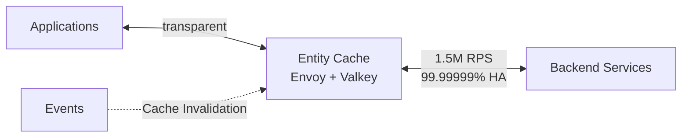

## DoorDash Uses Envoy and Valkey for a 1.5M RPS Proxy Cache with 99.99999% Availability

DoorDash 開發了 Entity Cache，一個嵌入服務網格層的透明代理快取平台，基於 Envoy 和 Valkey 構建，旨在減少微服務架構中的冗餘服務間調用。該系統在生產環境日常處理 150 萬次請求/秒（1.5M RPS），並通過多層快取策略、事件驅動的快取失效機制和故障處理邏輯實現 99.99999%（5 個 9）的可用性。Entity Cache 採用事件驅動的失效機制而非簡單 TTL，確保快取一致性；同時整合故障轉移邏輯，當上游服務宕機時自動降級。這項架構模式展示了在代理層進行透明快取如何能以最小應用改動的代價顯著提升大規模微服務系統的效率和可靠性。

### 重點
- Entity Cache 在 Envoy 代理層實現透明快取，支援 1.5M RPS 吞吐量並保持 99.99999% 可用性
- 採用事件驅動的快取失效機制而非簡單 TTL，確保資料一致性和快取命中率
- 整合故障轉移邏輯的代理層快取架構，使應用無需改動即可獲得顯著效能提升

**原文：** [infoq-main](https://www.infoq.com/news/2026/07/doordash-entity-cache-proxy/?utm_campaign=infoq_content&utm_source=infoq&utm_medium=feed&utm_term=global)

---

### 📄 原文內容

點此展開 / 收合

# DoorDash Uses Envoy and Valkey for a 1.5M RPS Proxy Cache with 99.99999% Availability

DoorDash has developed Entity Cache, a transparent proxy caching platform built on Envoy and Valkey to reduce redundant service-to-service requests across its microservices architecture. Operating within DoorDash’s service mesh, the platform serves over 1.5M requests per second with 99.99999% availability through caching, event-driven invalidation, failure handling, and performance optimizations. By Leela Kumili

