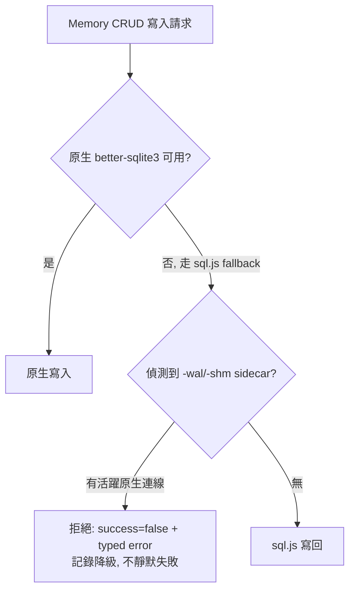
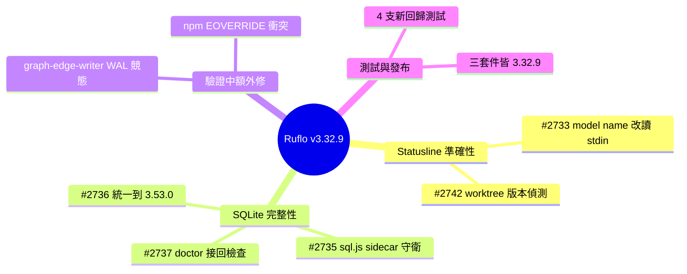

## v3.32.9 — Statusline accuracy + memory/SQLite integrity fixes

Ruflo v3.32.9 patch 修復 statusline 準確性和 SQLite 完整性的多個關鍵問題。修復 statusline CLI 子命令硬編碼 model name 為 'Opus 4.6 (1M context)'，現改為從 stdin 讀取，確保顯示實際使用的模型。修復 getPkgVersion() 在 linked git worktree 上失敗的 bug——之前只檢查本地 node_modules，現改為從 CWD 走廊尋找 .git 文件並解析 worktree 根目錄的 install。統一升級 SQLite 從漏洞版本 3.49.2（有 WAL-reset bug）到 3.53.0，跨全樹 4 個 package.json 統一依賴。修復 Memory CRUD 的 sql.js 備選路徑在併發原生連接時可能損壞 WAL 數據庫，現已改為檢測並拒絕不安全操作。修復 doctor 檢查始終無執行導致損壞數據庫仍報告正常的問題。

### 重點
- SQLite 3.49.2 WAL 重置漏洞 → 數據損壞風險：必須跨全樹 4 個 package.json 統一升級到 3.53.0，涉及複雜的版本依賴同步
- Memory CRUD 的 sql.js 不安全路徑：在併發寫入下可能直接覆蓋 WAL 文件導致損壞，已改為檢測 -wal/-shm sidecar 並拒絕危險操作
- Linked worktree 版本檢測失敗：需要追蹤 .git 文件的 gitdir 指針以解析真實主倉庫位置，否則版本信息基於過時的 baked-in 值

**原文：** [ruflo-releases](https://github.com/ruvnet/ruflo/releases/tag/v3.32.9)

---

<!-- deep-analysis:begin -->
## 📌 摘要 (TL;DR)

- Ruflo **v3.32.9** 是一個 patch 版本，集中修復 statusline 顯示準確性與 memory/SQLite 資料完整性的 5 個關鍵 issue（#2733、#2742、#2736、#2735、#2737）。
- statusline 過去把 model name 硬編碼成 `Opus 4.6 (1M context)`，不論實際模型為何都照顯示；現改為從 stdin 讀取，讀不到時退回顯示 `Claude Code`（而非假的模型名）。
- SQLite 依賴被統一升級：`agentdb` 底層 `better-sqlite3 ^11.8.1` 綁的是有 WAL-reset bug 的 **SQLite 3.49.2**，現全樹統一到修補版 **12.9.0（SQLite 3.53.0）**，跨 4 個 `package.json` 用 overrides 去重。
- Memory CRUD 的 `sql.js` 備援路徑在有原生連線併發寫入時會損毀 WAL 資料庫，現改為偵測到 `-wal`/`-shm` sidecar 檔案就拒絕不安全操作；同時修好 `doctor` 檢查形同虛設、損壞資料庫仍報 "healthy" 的問題。
- 對使用 background agent、worktree 隔離、以及 SQLite 持久化記憶體的團隊來說，這是一個涉及靜默資料損毀的安全性 patch，建議儘快升級。

## 🎯 核心概念

- **預寫式日誌**（Write-Ahead Logging，WAL）：SQLite 的一種寫入模式，變更先寫入 `-wal` 日誌檔再合併回主檔，`-wal`/`-shm` sidecar 檔案的存在代表有活躍連線。
- **連結式工作樹**（linked git worktree）：git 讓同一 repo 有多個工作目錄，worktree 目錄下的 `.git` 是指向主 repo 的檔案而非目錄，且通常沒有自己的 `node_modules`。
- **sql.js fallback**：當原生 `better-sqlite3` 不可用時退回的純 JS SQLite 實作；本版問題出在它的寫回方式與原生併發連線衝突。
- **doctor**：Ruflo 的健康檢查子命令，用來驗證資料庫結構與完整性。
- **overrides**：npm 用來在整個依賴樹中強制指定某套件單一版本的機制，用於消除重複的混合引擎（mixed-engine）建置。

## 📖 整理分析

### 1. Statusline 硬編碼模型名 (#2733)
hooks 的 statusline CLI 子命令原本把 model name 寫死成 `Opus 4.6 (1M context)`，無論實際 active model 是什麼都顯示同一行。修復後改為從 stdin 讀取（與自動產生的 helper 行為一致），當 stdin 沒有 model 欄位時退回顯示 `Claude Code`，而不是捏造一個假模型名。

### 2. worktree 下版本偵測失敗 (#2742)
產生的 `statusline.cjs` 裡的 `getPkgVersion()`，當 CWD 是連結式 worktree（沒有本地 `node_modules`）時會漏掉專案安裝，靜默退回一個過時的內建（baked-in）版本號。現在會從 CWD 往上尋找 worktree 的 `.git` 檔案，解析其中 `gitdir:` 指標找到主 repo 根目錄，並一併探測該根目錄的安裝版本。

### 3. SQLite 漏洞版本統一 (#2736)
`agentdb` 的 `better-sqlite3` 版本下限 `^11.8.1` 會綁入有記錄在案 WAL-reset bug 的 **SQLite 3.49.2**，並與本 repo 自己修補過的 **12.9.0** 副本並存，形成混合引擎樹。修復方式是透過 4 個 `package.json` 的 overrides 全樹去重，統一到單一修補建置（12.9.0 / SQLite 3.53.0）並重新產生 lockfile。

### 4. 併發寫入資料損毀與 doctor 檢查 (#2735, #2737)
Memory CRUD 的 `sql.js` fallback 路徑會靜默降級成對整個活檔做 `rename()` 覆蓋寫入，在有原生 writer 併發時可能損毀 WAL 資料庫。現在偵測到 `-wal`/`-shm` sidecar 檔案（代表有活躍原生連線）時，會直接拒絕該不安全路徑（回傳 `success: false` 與具型別的錯誤），並記錄 sql.js-fallback 降級而非靜默失敗。同時 #2737 修好了 `doctor` 預設執行從不跑記憶體完整性檢查的問題——過去損壞資料庫仍會回報「All checks passed! System is healthy.」，現已把真正的結構/完整性檢查接進預設流程。

### 5. 驗證中額外發現的問題
驗證過程另修了兩個問題：一是 `graph-edge-writer.ts` 中「關閉時做 WAL checkpoint」的時序競態——因為 better-sqlite3 去重強制了單一確切建置，讓原本被遮蔽的 best-effort checkpoint 時序敏感性在 Linux CI 上重現，現在改為關閉前強制執行阻塞式 `wal_checkpoint(TRUNCATE)`；二是 `@claude-flow/cli/package.json` 中新的直接 `better-sqlite3` 依賴與版本規格不符的自我引用 override 造成的 npm `EOVERRIDE` 衝突。測試方面，`v3-ci.yml` 在合併後於 main 為綠燈，並新增 4 支回歸測試（statusline model name、worktree version、memory WAL sidecar guard、doctor structural），`npm view` 確認 `@claude-flow/cli`、`claude-flow`、`ruflo` 三個套件皆為 3.32.9 且 `latest === alpha === v3alpha`。

## 🧭 流程圖 / 架構圖

Memory CRUD 寫入時的 sql.js fallback 決策（#2735 修復後）：

## 🧠 Mindmap

<!-- deep-analysis:end -->
### 📄 原文內容

點此展開 / 收合

Summary 
 Patch release — statusline accuracy + memory/SQLite integrity fixes. 
 Statusline 
 
 #2733 — hooks statusline CLI subcommand hardcoded the model name to 'Opus 4.6 (1M context)' regardless of the actual active model. Now reads it from stdin (matching the generated helper's own behavior), falling back to "Claude Code" — not a fake model name — when stdin has no model field. 
 #2742 — getPkgVersion() in the generated statusline.cjs missed the project install when CWD is a linked git worktree (no local node_modules ), silently falling back to a stale baked-in version. Now walks up from CWD to find the worktree's .git file, resolves the main repo root from its gitdir: pointer, and probes that root's install too. 
 
 Memory / SQLite data integrity 
 
 #2736 — agentdb 's better-sqlite3 floor ( ^11.8.1 ) bundled vulnerable SQLite 3.49.2 (documented WAL-reset bug), coexisting with this repo's own patched 12.9.0 copy in a mixed-engine tree. Deduplicated to a single patched build (12.9.0, SQLite 3.53.0) tree-wide via overrides across all four package.json files, with regenerated lockfiles. 
 #2735 — Memory CRUD's sql.js fallback path silently degraded to a whole-image rename() -over-the-live-file write, which can corrupt a WAL database under a concurrent native writer. Now refuses that unsafe path ( success: false , typed error) when -wal / -shm sidecar files indicate a live native connection, and logs sql.js-fallback demotions instead of failing silently. 
 #2737 — The default doctor run never executed its memory integrity checks — a corrupt database still reported "All checks passed! System is healthy." Wired the real structural/integrity checks into the default run. 
 
 Also fixed during validation 
 
 A WAL-checkpoint-on-close timing race in graph-edge-writer.ts , made newly reproducible on Linux CI by the better-sqlite3 dedup (forcing a single exact build made a previously-masked best-effort checkpoint's timing sensitivity visible). Now forces a blocking wal_checkpoint(TRUNCATE) before close. 
 An npm EOVERRIDE conflict in @claude-flow/cli/package.json between a new direct better-sqlite3 dependency and a self-referential override with a mismatched version spec. 
 
 Test plan 
 
 v3-ci.yml green on main post-merge (all four PRs individually green, plus the merged result) 
 New regression tests: issue-2733-statusline-model-name.test.ts , issue-2742-statusline-worktree-version.test.ts , issue-2735-memory-wal-sidecar-guard.test.ts , doctor-2737-memory-structural.test.ts 
 npm view @claude-flow/cli@latest / claude-flow@latest / ruflo@latest all report 3.32.9 , with latest === alpha === v3alpha on all three packages

