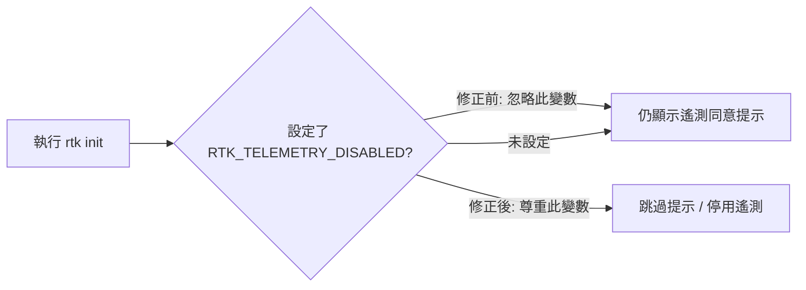
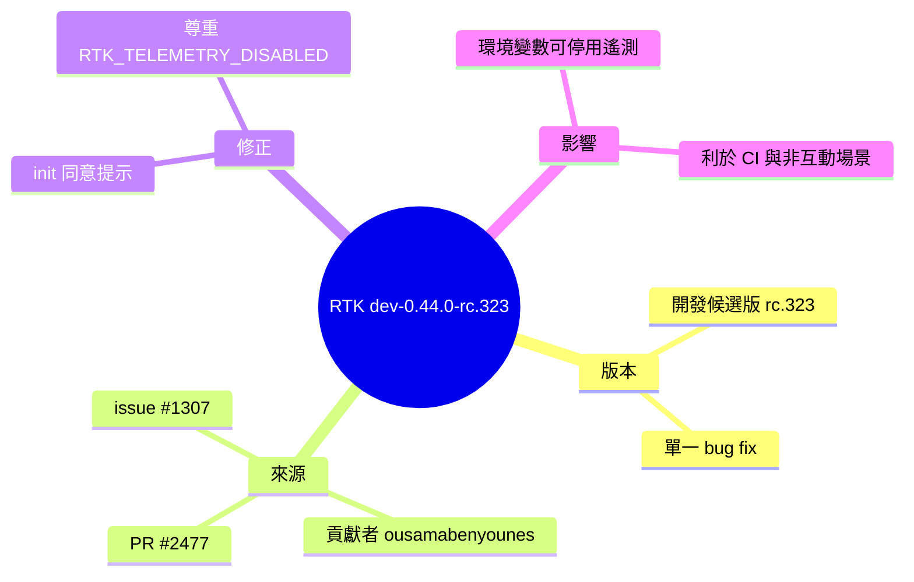

## dev-0.44.0-rc.323

RTK dev-0.44.0-rc.323 發布，修復初始化流程中未尊重 RTK_TELEMETRY_DISABLED 環境變數的問題。該環境變數現已被正確識別和應用，使用戶可透過環境變數在初始化時禁用遙測同意提示。

### 重點
- RTK_TELEMETRY_DISABLED 環境變數現已在初始化同意提示中被正確尊重

**原文：** [rtk-releases](https://github.com/rtk-ai/rtk/releases/tag/dev-0.44.0-rc.323)

---

<!-- deep-analysis:begin -->
## 📌 摘要 (TL;DR)

- RTK 專案（rtk-ai/rtk）發布開發版 **dev-0.44.0-rc.323**，為 release candidate（候選版本），核心內容是單一項初始化流程的錯誤修正。
- 本版合併 **PR #2477**，由貢獻者 **ousamabenyounes** 提交（分支 `fix/issue-1307`），對應 **issue #1307**。
- 修正主題：`fix(init): honor RTK_TELEMETRY_DISABLED in consent prompt` — 初始化（init）時的遙測同意提示先前**未尊重** `RTK_TELEMETRY_DISABLED` 環境變數。
- 修正後，設定該環境變數即可在 init 階段被正確識別並套用，使用者可藉此停用遙測同意提示。
- 為何關注：對於 CI/CD、容器與非互動式自動化場景，能以環境變數預先關閉遙測，避免流程卡在互動式提示（此為依修正性質的合理推論）。

## 🎯 核心概念

- **遙測** (telemetry)：軟體將使用數據回傳給開發者以供分析的機制。
- **同意提示** (consent prompt)：init 時詢問使用者是否同意收集遙測的互動式步驟。
- **RTK_TELEMETRY_DISABLED**：一個用來停用遙測的環境變數，本版修正的主角。

## 📖 整理分析

### 1. 版本定位：開發候選版
dev-0.44.0-rc.323 屬於 `0.44.0` 開發線的候選版本（release candidate），版號中的 `rc.323` 顯示這是一條持續迭代的開發序列，非正式穩定發布。本次 release 內容聚焦於一個 bug fix，未見其他功能新增。

### 2. 修正的問題（issue #1307）
原本的行為缺陷在於：即使使用者設定了 `RTK_TELEMETRY_DISABLED` 環境變數，init 指令的同意提示仍未讀取或套用此設定，導致使用者無法透過環境變數的方式在初始化時直接停用遙測。

### 3. 修正內容與效果
此版讓 init 流程在顯示同意提示前，會先檢查並「尊重」(honor) `RTK_TELEMETRY_DISABLED`。當該變數被設定時，系統據以停用遙測同意步驟。這使得偏好隱私或需自動化執行的使用者，能以標準的環境變數機制控制遙測行為，而非只能透過互動回答。

## 🧭 流程圖 / 架構圖

修正前後的 init 行為對比（依修正描述繪製）：

## 🧠 Mindmap

<!-- deep-analysis:end -->
### 📄 原文內容

點此展開 / 收合

Merge pull request #2477 from ousamabenyounes/fix/issue-1307 

 fix(init): honor RTK_TELEMETRY_DISABLED in consent prompt ( #1307 )

