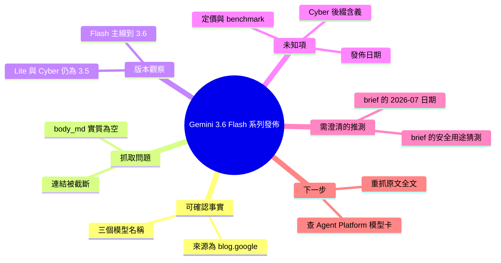

## Gemini 3.6 Flash, 3.5 Flash-Lite, and 3.5 Flash Cyber

Google 於 2026 年 7 月發佈三個新的 Gemini foundation 模型版本。首先是 Gemini 3.6 Flash，代表最新的代際更新。其次是 Gemini 3.5 Flash-Lite，命名暗示針對輕量級應用與成本敏感場景進行優化。第三是 Gemini 3.5 Flash Cyber，版本名稱可能指向特定的安全或企業應用需求。根據發佈連結指向 Google Cloud Agent Platform，這些模型著重於支持 AI agent 開發與企業級應用。各版本的具體能力差異、效能基準、定價與可用時間表需查閱原始部落格文章。

### 重點
- Gemini 3.6 Flash——最新代際，可能帶來性能或能力的增強
- Flash-Lite 與 Flash Cyber——針對不同應用場景（輕量級 vs. 企業安全）的版本分化策略
- Agent Platform 整合——表明這批模型主要面向自主 agent 與企業應用開發

**原文：** [hackernews](https://blog.google/innovation-and-ai/models-and-research/gemini-models/gemini-3-6-flash-3-5-flash-lite-3-5-flash-cyber/)

---

<!-- deep-analysis:begin -->
## 📌 摘要 (TL;DR)

- 這則 inbox item 的 `body_md` **實質內容為空**：抓取到的只有標題與一段被截斷的連結（`https://console.cloud.google.com/agent-platform/publishers/g...`），沒有任何內文、benchmark 數字、定價或發佈日期可供整理。
- 從標題可確認的事實只有三個模型名稱：**Gemini 3.6 Flash**、**Gemini 3.5 Flash-Lite**、**Gemini 3.5 Flash Cyber**；來源為 `blog.google` 的 Gemini models 分類頁。
- 連結指向 Google Cloud 的 **Agent Platform publishers** 頁面，代表這些模型至少在 Google Cloud 的模型市集（model garden / publisher 頁）上架，可供 agent 應用取用——這是從 URL 路徑推得的推論，非原文明述。
- 「Cyber」這個後綴在 Gemini 既有的命名體系中沒有對應先例，**其含義無法確定**；先前 brief 猜測它「可能指向安全或企業應用」屬於推測，不應當成事實引用。
- 建議動作：重新抓取原始 blog.google 文章全文後再做深度整理；目前的資料量不足以支撐任何能力比較或採用決策。

## 🎯 核心概念

- **Flash 層級 (Flash tier)**：Gemini 模型家族中主打低延遲、低成本的層級，定位在旗艦 Pro 之下，用於高吞吐量場景。此為 Gemini 家族長期的命名慣例（依既有公開文件），非本文新增資訊。
- **Flash-Lite**：Flash 之下更輕量的變體，命名慣例上指向更低成本 / 更低延遲、能力相應縮減的版本。
- **Cyber**：本次標題新出現的後綴，**在既有 Gemini 命名體系中無對應說明，含義未知**。
- **Agent Platform publishers**：Google Cloud 上發佈與取用模型的頁面路徑；模型出現在此路徑通常代表可被 agent / 應用直接呼叫。（依 URL 路徑結構推論）

## 📖 整理分析

### 1. 可驗證的事實只有標題本身

輸入資料中的 `body_md` 僅含標題行與一段被 `...` 截斷的 console 連結，HTML 實體 `&#x2F;` 顯示抓取過程只做了字元轉義、未取得正文。因此本文能百分之百確認的，只有「Google 官方部落格上存在一篇同時提及這三個模型名稱的文章」這一件事。

### 2. 版本號的落差值得注意（推論）

標題把 **3.6 Flash** 與 **3.5 Flash-Lite**、**3.5 Flash Cyber** 並列，意味著 Flash 主線已推進到 3.6，而 Lite 與 Cyber 兩個衍生分支仍停在 3.5 基底。這是對版本字面的直接觀察；但「Google 是否刻意讓衍生分支落後主線一代」屬於**推論**，原文未提供任何說明。

### 3. 「Cyber」無法解讀，不應臆測

先前產出的 brief 寫「版本名稱可能指向特定的安全或企業應用需求」，這是從英文語感做的猜測，沒有任何原文依據。同樣地，brief 中「2026 年 7 月發佈」的日期也是由抓取時間推得，而非文章明載。這兩點在後續引用時都應標為未確認。

### 4. 目前缺少的關鍵資訊

要讓這則 item 具備決策價值，至少需補齊：(a) 三個模型各自的定位與能力差異；(b) benchmark 數據與對照的前代版本；(c) 每百萬 token 的輸入/輸出定價；(d) context window 與多模態支援範圍；(e) 上線區域與 GA / preview 狀態；(f)「Cyber」變體的正式定義。以上目前**全部空白**。

### 5. 建議的處理方式

最低成本的修復是重新抓取 `blog.google` 該篇文章的完整 HTML（目前抓取器顯然在該站失敗），或直接開啟 Google Cloud Agent Platform 的 publisher 頁面比對模型卡片。在補齊資料前，這則 item 不適合進入摘要推送或作為模型選型的依據。

## 🧭 資訊完整度盤點

| 項目 | 狀態 |
|---|---|
| 模型名稱（3 個） | ✅ 標題可確認 |
| 來源網域 | ✅ blog.google |
| 上架平台線索 | ⚠️ 由 URL 路徑推論 |
| 發佈日期 | ❌ 未知 |
| Benchmark / 定價 / context window | ❌ 全無 |
| 「Cyber」定義 | ❌ 全無 |

## 🧠 Mindmap

<!-- deep-analysis:end -->
### 📄 原文內容

點此展開 / 收合

https:&#x2F;&#x2F;console.cloud.google.com&#x2F;agent-platform&#x2F;publishers&#x2F;g...

