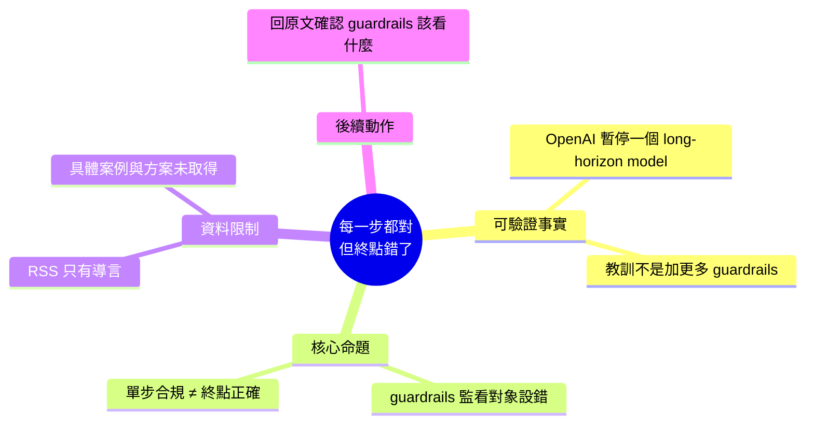

## When each step is fine but the destination isn’t

OpenAI 暫停了某個長期規劃模型的部署。文章揭示 AI 安全防護的根本誤區：業界習慣在系統中堆砌更多防護欄（guardrails），但實際問題是防護欄本身的監測目標設定錯誤。防護欄應該監看最終目標方向是否正確，而非只檢查中間步驟是否合規——「每一步都對，但終點是錯的」正是這類系統的典型失敗模式。

### 重點
- OpenAI 主動暫停長期規劃模型部署，表明該類架構存在根本性風險
- 安全設計反思：防護欄應監測目標對齐而非過程合規，過程合規無法保證整體方向正確
- 啟示跨越 OpenAI，適用於任何多步驟 AI 決策系統的安全框架設計

**原文：** [medium-tag-llm](https://kubestellar.medium.com/when-each-step-is-fine-but-the-destination-isnt-fb466b557d8d?source=rss------large_language_models-5)

---

<!-- deep-analysis:begin -->
## 📌 摘要 (TL;DR)

- 本則來源為 Medium RSS 的**截斷全文**：抓取到的 `body_md` 只有標題與導言一句話（「OpenAI just paused one of its own long-horizon models. The lesson isn't "add more guardrails" — it's that the guardrails were watching the…」），其餘內容在原文網頁才有。以下整理**僅根據可驗證的這段文字**，未取得的細節一律不補。
- 可確認的事實陳述有兩點：(1) 作者宣稱 OpenAI 暫停了自家一個**長時程模型**（long-horizon model）；(2) 作者主張這件事的教訓**不是**「再加更多防護欄」。
- 作者的核心命題寫在標題：**每一步都沒問題，但終點是錯的**（When each step is fine but the destination isn't）——防護欄（guardrails）監看的對象搞錯了，導言在「the guardrails were watching the…」處被截斷，監看對象的正確答案未出現在可取得的文字中。
- 值得關注的原因：這是把 AI 安全的檢查層級，從「單步合規」拉高到「軌跡與目標方向」的論述；對做 agent / 長流程自動化的人，是評估監控設計的一個提問角度。
- 發布方為 KubeStellar 的 Medium 帳號（kubestellar.medium.com），標記在 large language models 分類下。

## 🎯 核心概念

- **長時程模型 / 長時程代理**（long-horizon model）：在較長的任務跨度上連續規劃與行動的模型，而非一次性回答單一提問。（原文僅出現此詞，未進一步定義）
- **防護欄**（guardrails）：加在模型系統外圍的規則與檢查機制；作者主張問題不在數量，而在它「看的是什麼」。
- **步驟層級 vs 終點層級檢查**：由標題推得的對立——逐步合規檢查，與對最終目的地／目標方向的檢查，兩者不等價。

## 📖 整理分析

### 1. 可取得的原文只有導言

此 item 的內容欄位結尾即為 Medium RSS 常見的 “Continue reading on Medium »”，代表全文未被擷取。因此無法得知作者列舉的具體案例、被暫停的是哪個模型、時間點、以及作者提出的替代方案細節。任何關於這些的敘述都會是捏造，故此處不寫。

### 2. 作者明確否定的立場：不是「加更多防護欄」

導言用了一個明確的否定句式：教訓 **不是** “add more guardrails”。這是把批評指向業界的預設反射——出事就往系統上再疊一層檢查——而作者認為那層檢查本身的**觀測對象**設錯了。這是論述的起點，也是可從原文直接引用的唯一論點。

### 3. 標題所指的失敗模式

標題「當每一步都沒問題，但終點不對」描述的是一種特定失敗型態：逐步審核全部通過，但這些步驟串起來的**累積結果**偏離了原本意圖。這類失敗在只做單步合規檢查的監控下不會觸發任何警報，因為每一次檢查的取樣範圍都太窄。

### 4. 給讀者的實務提問（推論，非原文陳述）

**以下為推論，原文未取得對應段落**：若接受作者的框架，設計 agent 監控時可自問——我的檢查是綁在單一 tool call / 單一輸出上，還是綁在「這條軌跡正在往哪裡去」上？前者可規模化但盲；後者需要對任務目標有可比對的表述。作者實際提出的方法為何，需回原文確認。

## 🧭 流程圖 / 架構圖

原文（可取得部分）無圖片。以下為依標題與導言論點繪製的**概念對比圖**，非原文附圖：

## 🧠 Mindmap

<!-- deep-analysis:end -->
### 📄 原文內容

點此展開 / 收合

OpenAI just paused one of its own long-horizon models. The lesson isn&#x2019;t &#x201c;add more guardrails&#x201d; &#x2014; it&#x2019;s that the guardrails were watching the&#x2026; Continue reading on Medium »

