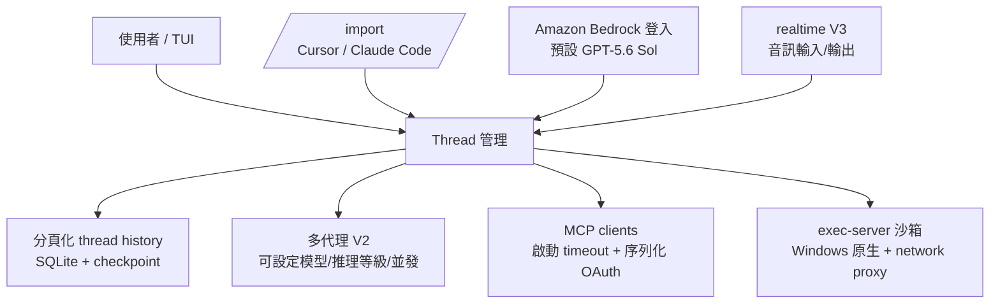
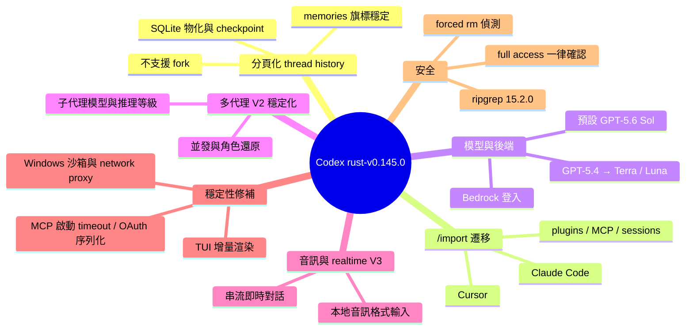

## 0.145.0

OpenAI Codex 0.145.0 推出多項核心功能。引入實驗性分頁化執行緒歷史，支援高效恢復、搜尋、持久命名和子代理整合；擴展 /import 命令可從 Cursor 和 Claude Code 遷移設定、MCP servers、plugins、sessions、commands 和專案範圍記憶體。新增 Amazon Bedrock 登入和 GPT-5.6 Sol 作為預設 Bedrock 模型，支援音訊輸入/輸出及流式 realtime V3 對話。穩定化多代理 V2 體驗，允許配置子代理模型、推理等級、並發數和角色恢復。改進 MCP 啟動可靠性（序列化 OAuth 刷新、啟動超時控制、避免阻塞發現流程），強化終端響應性（增量 Markdown 渲染、有界命令輸出），提升安全和批准處理邏輯。

### 重點
- 分頁化執行緒歷史系統支援搜尋和子代理整合；擴展 /import 支援跨工具遷移（Cursor、Claude Code）
- 穩定化多代理 V2：可配置子代理模型、推理等級（reasoning levels）、並發數、角色恢復
- Bedrock 支援升級到 GPT-5.6 Sol；音訊輸入/輸出及流式 realtime V3；MCP 序列化刷新強化可靠性

**原文：** [codex-releases](https://github.com/openai/codex/releases/tag/rust-v0.145.0)

---

<!-- deep-analysis:begin -->
## 📌 摘要 (TL;DR)

- OpenAI Codex CLI 發布 `rust-v0.145.0`，這是一個以「多代理（multi-agent）穩定化 + 跨工具遷移 + 效能修補」為主軸的大型版本，Changelog 涵蓋數百個 PR（自 rust-v0.144.0 起）。
- 新增**實驗性分頁化執行緒歷史**（paginated thread history），支援高效 resume、搜尋、持久化名稱、子代理與記憶（memories），底層以 SQLite 落地並支援從 checkpoint 續接投影（#32923、#32928）。
- `/import` 指令大幅擴充：可從 **Cursor** 與 **Claude Code** 遷移設定、MCP servers、plugins、sessions、commands 與專案範圍記憶體（#31672、#33411、#33426、#33444）。
- 新增實驗性 **Amazon Bedrock 登入**與自訂 endpoint／認證，並把 **GPT-5.6 Sol** 設為 Bedrock 預設模型（#32288）；原本綁定 GPT-5.4 的內建選項改為 GPT-5.6 Terra 與 Luna 變體（#33173）。
- 新增音訊輸入與工具音訊輸出（支援常見本地音訊格式），並導入 **streaming realtime V3** 對話（#33261、#34385）。
- 多代理 V2 從 opt-in 走向穩定：可設定子代理模型、推理等級、並發數，root thread resume 時可還原代理身分（#32837）。

## 🎯 核心概念

- **分頁化執行緒歷史（paginated thread history）**：把長對話切成可分頁、可索引的紀錄，存進 SQLite，讓 resume 與搜尋不需重讀整份 rollout。
- **多代理 V2（multi-agent V2）**：Codex 內建的子代理（sub-agent）機制，可為每個 spawn 指定模型、推理等級與並發上限。
- **exec-server 沙箱（exec-server sandboxing）**：負責執行外部指令的獨立行程層，本版強化 Windows 原生沙箱、workspace roots 傳遞與 JSON-RPC 訊息大小上限。
- **Guardian 自動審查（Guardian auto review）**：內建的自動 review 機制，本版改用 model catalog policies 決策並限制 reviewer 可用工具（#32875、#32945）。
- **安全緩衝回合（safety-buffered turn）**：因安全考量被緩衝的回合，重試時現在會開分支而非覆寫原對話。
- **code-mode**：以外部 host 執行程式碼的模式，本版修好 macOS 安裝，並在外部 host 無法解析時回退到 in-process V8（#31876、#31899）。

## 📖 整理分析

### 1. 分頁化歷史與記憶落地
新的 thread history 有專屬儲存層（#32234）、在 SQLite 中物化（#32923），並可從 checkpoint 續接投影（#32928），rollout 記錄加上 ordinal 排序（#32332）。配套修補包含：修復未正常結束的 rollout 檔在 append 前先修復（#32276）、以有界的 rollout 後綴載入模型 context（#32896）。限制是分頁化 thread 目前**不允許 fork**（#33109）。memories 功能旗標已穩定化（#31804）。

### 2. /import：從 Cursor 與 Claude Code 遷移
`/import` 從單純設定匯入擴張為完整遷移路徑，涵蓋 settings、MCP servers、plugins、sessions、commands 與專案範圍記憶體，並可從已知 marketplace 匯入已啟用的 plugins（#31672）。對正在多工具間切換的使用者，這是本版最直接有感的功能。

### 3. Bedrock 登入與 GPT-5.6 模型換代
新增 managed Bedrock login API（#31327）與自訂 endpoint／認證，預設 Bedrock 模型設為 GPT-5.6 Sol（#32288）。同時把內建 GPT-5.4 選項與內部使用遷移到 GPT-5.6 Terra / Luna（#33173），bundled 的 OpenAI Docs skill 也更新為 GPT-5.6 的模型解析、prompting 與遷移指引（#31842、#33121）。另有「不再回退到較舊的模型可用性公告」（#32316）。

### 4. MCP 啟動與 OAuth 穩定性
本版針對 MCP 慢啟動與認證衝突下手：在 client 建立時套用啟動 timeout（#32781）、避免 thread 啟動時被 OAuth discovery 阻塞（#32825）、序列化 OAuth credential refresh（#32229）、pin OAuth credential store（#30293），並限制 remote MCP stdio 行數（#31805）與 tool-list trace 量（#31790）。效果是啟動更快、且單一壞掉的 MCP server 不會拖垮整個 session。

### 5. 終端反應速度與安全批准
TUI 端透過增量 Markdown 渲染、減少重繪、快取與有界的指令輸出，改善長對話與串流輸出的卡頓（#34045～#34359）；另加入可點擊的安全 inline 視覺化連結（#33925、#34217、#34346）。安全面則強化強制 `rm` 偵測、啟用 full access 前**一律**要求確認（#32989），並在工具間保留拒絕理由（#34400）。Windows 方面補上原生 exec-server 沙箱、network proxy 強制走 elevated sandbox（#32857）、隱藏 helper console 視窗（#32849）。

### 6. 效能與雜項
啟動開銷透過並行的 skill/plugin 探索與更有效率的 remote compaction 降低（#31566、#33369、#33423、#34431）；打包的 ripgrep 升級到 **15.2.0**（#34384）。此外還修好 installer 對 compact release metadata 的解析（#31667）。

## 🧭 架構圖

## 🧠 Mindmap

<!-- deep-analysis:end -->
### 📄 原文內容

點此展開 / 收合

New Features 
 
 Added experimental paginated thread history with efficient resume, search, persisted names, sub-agent support, and memories. ( #33364 , #33907 , #34085 , #34229 , #34386 ) 
 Expanded /import to migrate Cursor and Claude Code settings, MCP servers, plugins, sessions, commands, and project-scoped memories. ( #31672 , #33411 , #33426 , #33444 ) 
 Added experimental Amazon Bedrock login, custom endpoint and authentication support, and GPT-5.6 Sol as the default Bedrock model. ( #31327 , #33170 , #33175 , #32288 , #33695 ) 
 Added audio inputs and tool outputs, including common local audio formats, and introduced streaming realtime V3 conversations. ( #33261 , #33856 , #33932 , #34080 , #34385 ) 
 Stabilized the opt-in multi-agent V2 experience with configurable sub-agent models, reasoning levels, concurrency, restored roles, and improved agent navigation. ( #33550 , #33631 , #33657 , #33841 , #34383 ) 
 Added secure, clickable inline visualization links in the terminal UI. ( #33925 , #34217 , #34346 ) 
 
 Bug Fixes 
 
 Editing an earlier prompt or retrying a safety-buffered turn now creates a contextual branch, preserving the original conversation, attachments, and mention bindings. ( #33201 , #33207 , #33211 ) 
 Improved terminal responsiveness for long conversations and streamed output through incremental Markdown rendering, fewer redraws, caching, and bounded command output. ( #34045 , #34049 , #34216 , #34223 , #34359 ) 
 Prevented slow or conflicting MCP startup and authentication flows by enforcing startup timeouts, avoiding blocking OAuth discovery, serializing refreshes, and reusing tool catalogs safely. ( #32229 , #32781 , #32825 , #33184 , #33297 ) 
 Improved Windows execution and sandbox reliability, including native exec-server sandboxing, network-proxy enforcement, hidden helper consoles, and correctly quoted hook commands. ( #32849 , #32857 , #33926 , #34423 ) 
 Fixed compact release-metadata parsing and macOS code-mode installation, with an in-process fallback when the external code-mode host is unavailable. ( #31667 , #31876 , #31899 ) 
 Strengthened safety and approval handling with better forced- rm detection, consistent full-access confirmation, and preserved rejection reasons across tools. ( #32989 , #33464 , #34400 ) 
 
 Documentation 
 
 Updated the bundled OpenAI Docs skill with current GPT-5.6 model resolution, prompting, and migration guidance across macOS, Linux, and Windows. ( #31842 , #33121 ) 
 
 Chores 
 
 Migrated bundled GPT-5.4 selections and internal uses to the corresponding GPT-5.6 Terra and Luna variants. ( #33173 ) 
 Reduced startup and large-context overhead with concurrent skill/plugin discovery and more efficient remote compaction. ( #31566 , #33369 , #33423 , #34431 ) 
 Updated the packaged ripgrep binary to 15.2.0. ( #34384 ) 
 
 Changelog 
 Full Changelog: rust-v0.144.0...rust-v0.145.0 
 
 #31667 fix: parse compact release metadata in installer @efrazer-oai 
 #31362 core: route realtime and memories through HTTP client factory @bolinfest 
 #31566 perf(skills): reuse walk inventory for host loading @jif-oai 
 #31576 Bound exec-server process event reordering @jif-oai 
 #31756 test(skills): assert symlinked metadata loading @jif-oai 
 #31581 Resolve selected capability roots without starting executors @jif-oai 
 #31789 Stop persisting RMCP service traces @jif-oai 
 #31792 Summarize streamed response item logs @jif-oai 
 #31791 Filter routine Hyper logs from SQLite @jif-oai 
 #31790 Reduce MCP tool-list trace volume @jif-oai 
 #31804 Stabilize the memories feature flag @jif-oai 
 #31803 fix(mcp): default Apps product SKU to codex @alecbarber-oai 
 #31745 code-mode: retain shared MCP types for deferred tools @sayan-oai 
 #31672 Import enabled plugins from known marketplaces @charlesgong-openai 
 #31652 fix(tui): hide empty reasoning summaries @fcoury-oai 
 #31767 Remove the network proxy config wrapper @jif-oai 
 #31481 fix: forward originator to Codex Apps MCP @raquel-openai 
 #31363 codex-api: route file uploads through HTTP client factory @bolinfest 
 #31813 tui: update safety buffering copy @etraut-openai 
 #31830 fix(sandboxing): initialize network proxy config inline @fcoury-oai 
 #31431 build: ratchet direct reqwest dependencies @bolinfest 
 #31876 code-mode: fix installation on darwin @cconger 
 #31842 Update bundled OpenAI Docs skill for GPT-5.6 @kkahadze-oai 
 #31637 login: route raw auth flows through HTTP client @bolinfest 
 #31686 [codex-apps] Filter optional file fields by tool schema @tsarlandie-oai 
 #31899 code-mode: fall back to using in process v8 if we fail to resolve external process @cconger 
 #31805 Bound remote MCP stdio lines @jif-oai 
 #30293 Resolve and pin MCP OAuth credential stores @stevenlee-oai 
 #31892 exec-server: materialize filesystem workspace roots @pakrym-oai 
 #31327 feat: add managed Bedrock login API @celia-oai 
 #31295 bench: add codex help e2e macrobenchmark @anp-oai 
 #31428 bench: add e2e benchmark entrypoints @anp-oai 
 #31937 exec-server: expose process helper to outer sandbox @pakrym-oai 
 #32093 Remove the legacy exec policy engine @copyberry 
 #32106 Reduce startup latency for ancestor discovery @copyberry 
 #32112 Bound streamed exec-server HTTP response bodies @copyberry 
 #32122 Test the shared exec-server HTTP response byte budget @copyberry 
 #32123 Bound exec-server stdio JSON-RPC messages @copyberry 
 #32126 Test bounded concurrency in ancestor discovery @copyberry 
 #32134 Test stdio JSON-RPC size limits with LF and CRLF @copyberry 
 #32135 Propagate tracing subscribers to exec start tasks @copyberry 
 #32150 Keep unified exec output collection bounded @copyberry 
 #32193 Validate memory consolidation artifacts before succeeding @copyberry 
 #32197 Rebind memory consolidation workspace roots @copyberry 
 #32200 Add a skill invocation extension contributor @copyberry 
 #32206 Always send reasoning parameters in Responses requests @copyberry 
 #32213 Generate unique IDs for review rollout messages @copyberry 
 #32214 Propagate workspace roots to exec-server sandboxes @copyberry 
 #32229 Serialize MCP OAuth credential refreshes @copyberry 
 #32231 Support pending remote environment registration @copyberry 
 #32232 Let permission hooks resolve strict auto-review requests @copyberry 
 #32234 Add dedicated storage for paginated thread history @copyberry 
 #32246 Extract reverse JSONL scanning from session indexing @copyberry 
 #32256 Improve Responses WebSocket timing telemetry @copyberry 
 #32261 Preserve local path conventions in automatic approvals @copyberry 
 #32263 Include start times in terminal turn events @copyberry 
 #32272 Expose scheduled tasks in plugin details @copyberry 
 #32274 Remove the personality migration @copyberry 
 #32276 Repair unterminated rollout files before appending @copyberry 
 #32277 Honor personality = "none" in model instructions @copyberry 
 #32280 Include terminal errors in turn completion events @copyberry 
 #32286 Clarify waiting behavior in safety buffering prompts @copyberry 
 #32288 Make GPT-5.6 Sol the default Bedrock model @copyberry 
 #32289 Persist paginated items in the local thread store @copyberry 
 #32290 Respect model support for reasoning summaries @copyberry 
 #32301 Trust hooks from materialized workspace plugins @copyberry 
 #32302 Prefer the Codex home socket for Unix IDE context @copyberry 
 #32305 Improve file blob upload diagnostics @copyberry 
 #32312 Require prefixes for outbound response item IDs @copyberry 
 #32316 Stop falling back to older model availability announcements @copyberry 
 #32326 Use canonical links in the moved config notice @copyberry 
 #32332 Add ordinals to paginated rollout records @copyberry 
 #32441 Preserve parent sandbox enforcement for memory consolidation @copyberry 
 #32460 Emit thread-idle lifecycle after guardian interrupts @copyberry 
 #32461 Expand tabs when rendering TUI diffs @copyberry 
 #32485 Use available width for skill names in the toggle view @copyberry 
 #32628 Improve composer completion target resolution @copyberry 
 #32698 Extract connector runtime snapshot management @copyberry 
 #32744 Log missing personality messages at trace level @copyberry 
 #32746 Make advanced reasoning selection explicit in the TUI @copyberry 
 #32747 Align Guardian reviews with session configuration @copyberry 
 #32749 Expose model overrides for multi-agent v2 spawns @copyberry 
 #32751 Restrict spawned-agent models to the active backend @copyberry 
 #32761 Add shadow metrics for lexical skill selection @copyberry 
 #32768 Align shadow skill selection with observable sources @copyberry 
 #32780 Enable skill search shadow selection by default @copyberry 
 #32781 Apply MCP startup timeouts during client creation @copyberry 
 #32801 Refactor OAuth store lock contention tests @copyberry 
 #32822 Make explicit multi-agent mode override proactive delegation @copyberry 
 #32825 Avoid blocking thread startup on MCP OAuth discovery @copyberry 
 #32835 Forward turn metadata in standalone web search @copyberry 
 #32837 Restore V2 agent identities on root thread resume @copyberry 
 #32838 Reap exited PID-managed app-server children @copyberry 
 #32844 Expand millisecond duration histogram boundaries @copyberry 
 #32849 Hide Windows filesystem helper console windows @copyberry 
 #32857 Require the elevated Windows sandbox for network proxies @copyberry 
 #32858 Persist slash-command popup dismissal @copyberry 
 #32864 Coalesce concurrent Windows sandbox setup requests @copyberry 
 #32866 Allow responses after image generation @copyberry 
 #32867 Include connector IDs in MCP tool call analytics @copyberry 
 #32875 Use model catalog policies for Guardian auto review @copyberry 
 #32881 Broaden remote compaction model fallback @copyberry 
 #32884 Prepare external agent migration for source adapters @copyberry 
 #32887 Tag shell tool telemetry by command category @copyberry 
 #32891 Attach connector caches to diagnostic uploads @copyberry 
 #32894 Serialize plugin install requests @copyberry 
 #32896 Load model context from a bounded rollout suffix @copyberry 
 #32897 Route blocked network requests to their owning calls @copyberry 
 #32898 Expose structured standalone web search results @copyberry 
 #32899 Add exec-server environment status checks @copyberry 
 #32900 Derive collaboration settings from turn context @copyberry 
 #32903 Include session IDs in tool item analytics events @copyberry 
 #32905 Timestamp app-server notifications at emission @copyberry 
 #32911 Allow injecting the models manager into ThreadManager @copyberry 
 #32920 Expose environment status through app-server @copyberry 
 #32923 Materialize paginated thread history in SQLite @copyberry 
 #32928 Resume thread history projection from its SQLite checkpoint @copyberry 
 #32945 Restrict Guardian reviewer tools @copyberry 
 #32949 Tighten recommended plugin install suggestions @copyberry 
 #32952 Scope runtime workspace roots to execution environments @copyberry 
 #32985 Expose exact per-response usage in raw app-server events @copyberry 
 #32989 Always confirm before enabling full access @copyberry 
 #33013 Bound exec-server JSON-RPC decoding complexity @copyberry 
 #33026 Include raw response completions in TypeScript envelopes @copyberry 
 #33030 Remove task messages from list_agents output @copyberry 
 #33031 Preserve JSON number precision in exec-server RPC messages @copyberry 
 #33035 Use session IDs for prompt cache keys @copyberry 
 #33040 Send plugin analytics with API key authentication @copyberry 
 #33076 Add an agent extension runner @copyberry 
 #33093 Preserve streamed output during capped history replay @copyberry 
 #33105 Fix TUI status visibility around streamed output @copyberry 
 #33107 Preserve special filesystem subpaths as wire strings @copyberry 
 #33109 Reject forks of paginated threads @copyberry 
 #33113 Allow injecting the Codex Apps tools cache @copyberry 
 #33121 Refine GPT-5.6 prompting and migration gui

[... truncated for safety ...]

