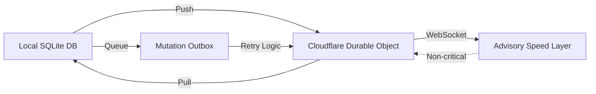

## v13.12.0

claude-mem v13.12.0 發布兩層雲端同步架構（Two-Lane Cloud Sync），支援本機 SQLite 資料庫與 cmem.ai sync hub 間的雙向同步。新增功能包括：Cloudflare Worker Durable Object 架構（每用戶隔離）、確定性的本機變更應用與 schema 遷移 v41、變更隊列與離線容錯、WebSocket 加速層（不依賴長連接保證正確性）、完整 E2E 監控與守衛機制。同步預設關閉；需自行配置 hub URL。

### 重點
- Cloudflare Durable Object per-user sync hub，每用戶隔離資料與狀態
- Deterministic SQLite 應用 + Mutation Outbox，離線時自動隊列與重試，容錯力強
- WebSocket 為非關鍵路徑——correctness 由 deterministic replay 保證，連接掉線不影響同步正確性

**原文：** [claude-mem-releases](https://github.com/thedotmack/claude-mem/releases/tag/v13.12.0)

---

### 📄 原文內容

點此展開 / 收合

Two-Lane Cloud Sync (cmem.ai Pro) 
 This release ships the complete two-lane sync architecture between your local claude-mem database and the cmem.ai sync hub (PR #3333 ): 
 
 Per-user Durable Object sync hub — a Cloudflare Worker ( workers/sync-hub ) serving isolated HTTP push/pull lanes per user (Phase 1) 
 Client apply path + schema migration v41 — deterministic application of remote changes into the local SQLite store (Phase 2) 
 Hub push/pull transport + mutation outbox — local mutations queue durably and survive offline periods and retries (Phase 3) 
 Advisory WebSocket speed layer — near-real-time sync nudges; correctness never depends on the socket staying up (Phase 4) 
 Guardrails + monitoring — kill switch, watchdog, canary, and a full sync-matrix E2E suite (Phase 5) 
 Canonical v2 projection pipeline and SyncHub-only client cutover 
 Hardened verifier authentication on the sync hub 
 
 Sync is OFF by default. CLAUDE_MEM_CLOUD_SYNC_HUB_URL defaults to empty — nothing leaves your machine unless you configure a hub URL (see the cloud-sync skill or https://docs.claude-mem.ai/cloud-sync ). 
 Fixes 
 
 Restored process-global mock.module cleanup that broke CI under Linux readdir ordering

