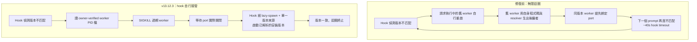
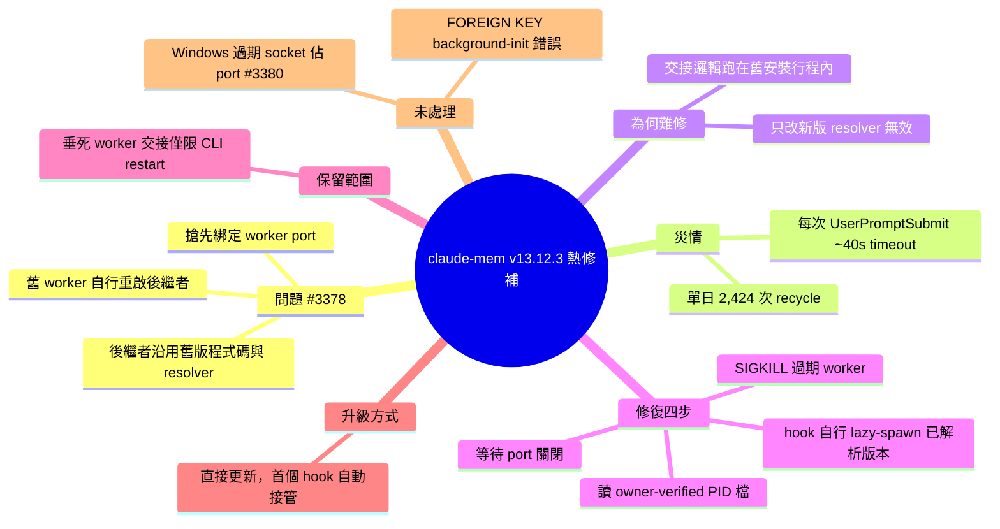

## v13.12.3

claude-mem v13.12.3 熱修補修復自製 worker 重啟迴圈。當版本不匹配時，hook 請求執行中的舊 worker 自行重啟，而舊 worker 用自己安裝的代碼和 resolver 重新生成，導致 ≤13.11.0 worker 再次綁定 port 前於 hook 正確解析的懶生成，版本不匹配無限重發。一份報告測量一天 2,424 次迴圈，每個 UserPromptSubmit 結束於 ~40s hook timeout。根本修復：hook 不再委託屍體進程，改為讀 owner-verified worker PID、SIGKILL 舊 worker、等待 port 關閉、hook 通過既有懶生成路徑生成已解析版本。

### 重點
- 舊進程自我重啟導致無限迴圈，修復新版本代碼無濟於事（邏輯在舊進程內執行）→ 必須 SIGKILL 舊進程確保零舊代碼
- 測量數據：一天 2,424 次迴圈，每個 prompt 掛起 ~40s，主機進程表耗盡
- 根本修復：SIGKILL + hook 接管懶生成，CLI-only 回退保留用於 claude-mem restart（running install = resolved install）

**原文：** [claude-mem-releases](https://github.com/thedotmack/claude-mem/releases/tag/v13.12.3)

---

<!-- deep-analysis:begin -->
## 📌 摘要 (TL;DR)

- claude-mem v13.12.3 是一則熱修補（hotfix），修掉 issue #3378 回報的「自我延續的過期 worker 回收迴圈」（self-perpetuating stale-worker recycle loop）。
- 舊行為：版本不匹配時，hook 會請「快死掉的」舊 worker 自己重啟；但這個交接程式跑在舊安裝的行程裡，於是舊 worker 用自己的程式碼與 resolver 生出同版本的後繼者，再度搶先綁定 worker port，不匹配狀態每次 prompt 都重演。
- 實測災情：單日 2,424 次 recycle，每個 `UserPromptSubmit` 都以約 40 秒的 hook timeout 收場。
- 新做法：hook 不再委託屍體行程，改為讀取 owner-verified 的 worker PID 檔 → `SIGKILL` 舊 worker → 等 port 真的關閉 → 由 hook 自己透過既有的 lazy-spawn 路徑與單一版本來源（single version oracle）啟動已解析的安裝版本。
- 使用者只要更新即可脫困，不需手動清理；本次**未**處理 #3378 裡的 `FOREIGN KEY constraint failed` background-init 錯誤，以及 #3380 的 Windows 過期 socket 佔住 port 問題。

## 🎯 核心概念

- **過期 worker**（stale worker）：仍在執行、但版本與目前已安裝版本不一致的常駐背景行程。
- **懶生成**（lazy-spawn）：hook 在需要時才啟動 worker 的既有路徑，會用正確解析出的安裝版本。
- **單一版本來源**（single version oracle）：判定「該跑哪個版本」的唯一權威來源，避免各行程各自解析。
- **owner-verified PID 檔**：帶有擁有者驗證的 PID 檔案，確保 kill 的是自己該管的那個 worker，而非誤殺無關行程。
- **後繼者交接**（successor handoff）：舊 worker 在結束前負責生出新 worker 的交接機制。

## 📖 整理分析

### 1. Bug 的自我延續機制

問題出在「誰來重啟」。版本不匹配時，hook 把 recycle 的工作交給正在跑的舊 worker，但舊 worker 是用**自己安裝目錄的程式碼與 resolver** 去生出後繼者。一個 ≤13.11.0 的 worker 因此只會再生出一個 13.11.0 的 worker，並在 hook 那條「正確解析版本的 lazy-spawn」搶到 port 之前先綁定 worker port，於是不匹配狀態在每一個 prompt 重複發生，永無止境。

### 2. 為何只改新版 resolver 無效

Release note 明確指出：因為有問題的交接邏輯是跑在**舊安裝的行程裡**，單單修好新版的 resolver 永遠打不破這個迴圈——新版程式碼根本沒有機會被執行。這也是這版被歸類為需要改變控制權歸屬（而非改參數）的根本修復（root fix）的原因。

### 3. 災情量化

一份回報測到單日 **2,424 次** recycle，且每一次 `UserPromptSubmit` 都卡到約 **40 秒的 hook timeout** 才結束。換言之，受影響使用者每送出一則 prompt 就先付 40 秒等待成本，這是把「版本不匹配」從一次性告警放大成持續性可用性事故。

### 4. 修復的四個步驟

新版 hook 在偵測到版本不匹配時，依序執行：(1) 讀取 owner-verified 的 worker PID 檔；(2) 對過期 worker 送 `SIGKILL`——這是唯一保證「零行舊版程式碼被執行」的拆除方式；(3) 等待 port 真正關閉；(4) 由 hook 自己經由既有 lazy-spawn 路徑與單一版本來源，啟動已解析的安裝版本。原本的「垂死 worker 交接後繼者」機制被保留，但**只服務 CLI 主動觸發的 `claude-mem restart`**——因為在那個情境下，正在跑的安裝版本就等於已解析的安裝版本。

### 5. 升級與已知遺留問題

若目前正卡在迴圈中，官方說法是「直接更新即可」：安裝新版後第一個執行的 hook 就會殺掉常駐的過期 worker 並接管，不需手動清理。仍未處理的兩項：#3378 中同時回報的 `FOREIGN KEY constraint failed` background-init 錯誤，以及 #3380 的 Windows 過期 socket 佔住 port 問題。

## 🧭 流程圖 / 架構圖

## 🧠 Mindmap

<!-- deep-analysis:end -->
### 📄 原文內容

點此展開 / 收合

Hotfix: self-perpetuating stale-worker recycle loop ( #3378 ) 
 The bug. On a version mismatch, hooks asked the running (stale) worker to restart itself — and the dying worker spawned its successor using its own install's code and resolver. A ≤13.11.0 worker would respawn its own version, re-bind the worker port before the hook's correctly-resolved lazy-spawn could, and the mismatch recurred on every prompt, forever. One report measured 2,424 recycles in a single day , with every UserPromptSubmit ending in a ~40s hook timeout. Because the buggy handoff ran inside the old install's process, fixing the new version's resolver alone could never break the loop. 
 The fix. Hooks no longer delegate the recycle to the corpse. On version mismatch the hook now: 
 
 reads the owner-verified worker PID file, 
 SIGKILL s the stale worker — the only teardown guaranteed to execute zero stale-version code, 
 waits for the port to actually close, and 
 spawns the resolved installed version itself, via the existing lazy-spawn path and the single version oracle. 
 
 The dying-worker successor handoff now serves only CLI-initiated claude-mem restart , where the running install is the resolved install. 
 If you're currently stuck in the loop: just update. The first hook that runs after this version installs will kill the resident stale worker and take over — no manual cleanup needed. 
 Not addressed in this release (still open): the FOREIGN KEY constraint failed background-init error also reported in #3378 , and the Windows stale-socket port hold in #3380 .

