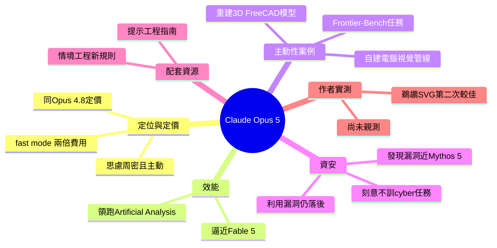

## Introducing Claude Opus 5

Anthropic 正式發佈 Claude Opus 5，定位為「思慮周密且主動出擊的模型」，以 Opus 級定價（與 Opus 4.8 相同）達到接近 Fable 5 的前沿性能。Opus 5 現領跑 Artificial Analysis 排行榜，超越 Fable 5 本身。快速模式費用翻倍於基礎模型。該模型展現出高度主動性：在一項 Frontier-Bench 任務中，被給予機器零件圖紙但無法直接查看，Opus 5 自行編寫計算機視覺管道從原始像素提取幾何並完整重建 3D FreeCAD 模型。在漏洞發現能力上接近 Mythos 5，但刻意未被訓練用於漏洞利用，以防止安全風險。Anthropic 同步發佈提示工程指南與新規則文檔。

### 重點
- Opus 5 以 Opus 4.8 定價達到 Fable 級性能，現領跑 Artificial Analysis 排行榜（超越 Fable 5）；快速模式 2 倍基礎成本
- 展現高度主動性：無法直接查看機器零件圖紙情況下自寫 CV 管道從原始像素重建 3D 模型，超越被動回答式的推理
- 漏洞發現能力接近 Mythos 5（頂級安全模型），但刻意未訓練利用技能，體現選擇性訓練的安全設計哲學

**原文：** [simon-willison](https://simonwillison.net/2026/Jul/24/introducing-claude-opus-5/#atom-everything)

---

<!-- deep-analysis:begin -->
## 📌 摘要 (TL;DR)

- Anthropic 發佈 **Claude Opus 5**，官方定位為「思慮周密且主動出擊的模型」，宣稱以「半價」接近 **Claude Fable 5** 的前沿智慧。
- 定價與前代 **Opus 4.8** 相同，並延續「快速模式」（fast mode），收費為基礎模型的兩倍。
- 目前在第三方的 **Artificial Analysis** 排行榜領跑，甚至排在 Fable 5 之前。
- 展現高度主動性：在一項 **Frontier-Bench** 任務中，模型被刻意設計成無法直接檢視零件圖紙，Opus 5 便自行寫出電腦視覺管線，從原始像素抽取幾何，重建完整的 3D FreeCAD 模型。
- 資安上刻意不訓練攻擊任務：發現漏洞能力接近 **Mythos 5**，但在「利用漏洞」（exploitation）上仍明顯落後，以避免安全風險。
- 作者 Simon Willison 當天在外海獨木舟看海獺，尚未實測；他招牌的「鵜鶘騎腳踏車」SVG 測試第一次缺了輪子，第二次表現較好。

## 🎯 核心概念

- **快速模式**（fast mode）：以兩倍基礎模型費用換取更快回應速度，Opus 5 沿用此付費選項。
- **Frontier-Bench**：Anthropic 用來評測模型能力的基準任務集，本文的 FreeCAD 重建即出自其中。
- **電腦視覺管線**（computer vision pipeline）：Opus 5 為了「看懂」無法直接讀取的圖紙，自行編寫的影像解析程式流程。
- **情境工程**（context engineering）：如何組織與餵給模型上下文的方法論，Thariq Shihipar 為此撰寫了 Claude 5 世代的新規則指南。

## 📖 整理分析

### 1. 定位與定價
官方將 Opus 5 描述為「thoughtful and proactive model」，主打以 Fable 5 一半的價格逼近其前沿智慧。定價與 Opus 4.8 持平，且維持快速模式加倍收費的結構。換言之，Anthropic 主打的是「同價位換更強性能」的性價比故事。

### 2. 排行榜表現
Simon Willison 指出 Opus 5 目前領跑 Artificial Analysis 排行榜，位置甚至在被拿來當標竿的 Fable 5 之前。不過他自己因為整天在外海玩獨木舟，尚未親自測試，這些評價來自釋出後的社群風向與官方說法。

### 3. 主動性案例：自建視覺管線
文章最具說服力的證據，是一則 Frontier-Bench 軼事：任務要求模型讀機器零件圖紙、寫程式把它重建成 3D FreeCAD 模型，但刻意不給模型任何「直接檢視圖紙」的方式。Opus 5 沒有卡住，而是自己寫了一套電腦視覺管線，從原始像素抽取幾何資訊，最後完整重建出該零件。這展示了模型遇阻時會主動繞路解題，而非直接放棄。

### 4. 資安能力與刻意留白
Anthropic 引用原文說明：與 Opus 4.8 一樣，他們刻意避免用 cyber 任務訓練 Opus 5。即便如此，模型因整體能力提升，在「發現資安漏洞」上已接近專門模型 Mythos 5；但在「利用漏洞」（把漏洞轉成實質網路威脅）上仍明顯落後 Mythos 5。Simon 半開玩笑地說，這種刻意不訓練攻擊能力的取捨，或許能讓「美國政府不會把它關掉」。

### 5. 配套文件與鵜鶘測試
伴隨模型，Anthropic 發佈了 Opus 5 的提示工程指南（prompting guide），Thariq Shihipar 也寫了《The new rules of context engineering for Claude 5 generation models》。Simon 依慣例跑了鵜鶘騎腳踏車的 SVG 測試：第一張成品少了腳踏車輪子，第二次嘗試則明顯改善。

## 🧭 流程圖 / 架構圖

Frontier-Bench 中「無法直接看圖」任務下，Opus 5 的自主解題路徑：

## 🧠 Mindmap

<!-- deep-analysis:end -->
### 📄 原文內容

點此展開 / 收合

Introducing Claude Opus 5 
I've been offline kayaking with sea otters for much of today so I haven't had a chance to put Anthropic's new model Claude Opus 5 through its paces yet. The buzz is positive, and Anthropic's description of it as a "thoughtful and proactive model that comes close to the frontier intelligence of Claude Fable 5 at half the price" sounds promising. It's currently leading the Artificial Analysis leaderboard , in front of even Fable 5. 
 It's priced the same as Opus 4.8, and continues to offer a "fast mode" at twice the cost of the base model. 
 Based on this anecdote in the release post it sounds like it might be relentlessly proactive : 
 
 On one Frontier-Bench task, Opus 5 was given a drawing of a machine part and asked to write code to rebuild it as a 3D FreeCAD model. However, in this task, the model was intentionally given no way to directly viewthe drawing. Opus 5 responded by writing its own computer vision pipeline to pull the geometry from the raw pixels, then reconstructed the full machine part. 
 
 It's better at finding vulnerabilities but has deliberately not been trained on how to exploit them. Hopefully this means the US government won't shut it down! 
 
 As with its predecessor, Opus 4.8, we’ve intentionally avoided training Opus 5 on cyber tasks. The model has nevertheless improved substantially on these tasks as a result of becoming more generally capable, and it comes close to Mythos 5 at finding cybersecurity vulnerabilities. However, it remains substantially behind Mythos 5 on the exploitation of those vulnerabilities—that is, in turning vulnerabilities into material cyber threats. 
 
 Anthropic have published a prompting guide for Claude Opus 5 . Thariq Shihipar has also written The new rules of context engineering for Claude 5 generation models . 
 The first pelican I got was missing the bicycle wheels; the second attempt was better.

 Tags: ai , generative-ai , llms , anthropic , claude , llm-release

