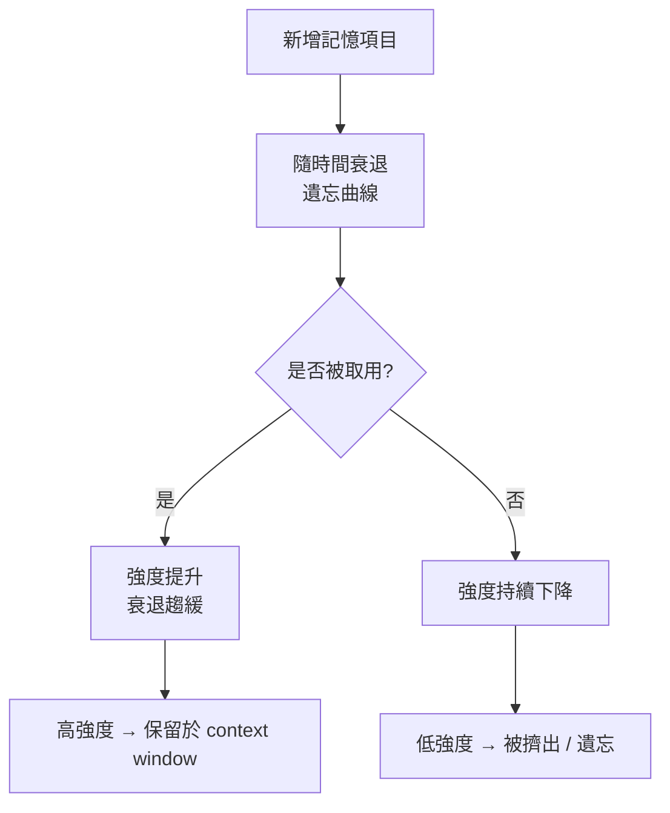
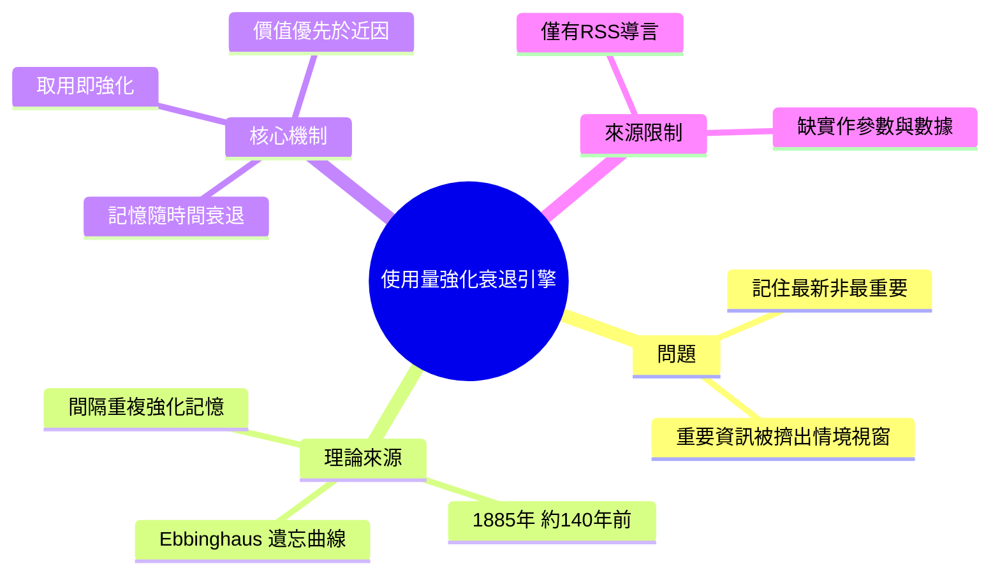

## Context Windows Forget What Matters — I Built a Usage-Reinforced Decay Engine for AI Agent Memory

傳統 AI 記憶系統傾向保留最新訊息而非最重要訊息；作者利用 Ebbinghaus 遺忘曲線（1880 年代心理學研究）設計「使用量強化衰退引擎」，為 LLM 和 AI agent 構建更聰慧的長期記憶。該方法將心理學原理與現代上下文管理相結合，優化 context window 的訊息優先級排序，解決新資訊堆積導致重要訊息被擠出的困局。

### 重點
- Ebbinghaus 遺忘曲線應用原則：重要性 > 新近性，根據使用頻率動態調整記憶權重
- 解決 LLM context window 常見問題：新資訊持續侵佔空間導致關鍵歷史資訊丟失
- 框架可跨應用套用於長對話 agent、知識庫檢索排序、記憶優先化等場景

**原文：** [medium-towards-data-science](https://towardsdatascience.com/context-windows-forget-what-matters-i-used-a-140-year-old-psychology-paper-to-fix-ai-memory/)

---

<!-- deep-analysis:begin -->
## 📌 摘要 (TL;DR)

- 作者主張多數 AI 記憶系統的核心缺陷是「保留最新、而非最重要」的資訊，導致關鍵內容隨新訊息累積而被擠出情境視窗（context window）。
- 解法命名為「使用量強化衰退引擎」（Usage-Reinforced Decay Engine）：讓每個記憶項目隨時間自動衰退，但每次被取用就獲得強化、延緩遺忘。
- 理論基礎是 Ebbinghaus 遺忘曲線（Ebbinghaus forgetting curve），源自 Hermann Ebbinghaus 於 1885 年發表的記憶實驗研究，距今約 140 年。
- 記憶保留量隨時間呈指數衰減，而重複提取（spaced repetition）會強化記憶、拉平曲線——這正對應「使用量強化」的設計直覺。
- ⚠️ 來源限制：本次提供的原文內容僅為 RSS 摘要／導言段落，**未包含完整文章與實作細節**（無程式碼、無公式參數、無實測數據）。以下分析以原文標題、導言與 summary，加上已被公認的 Ebbinghaus 心理學知識為依據；引擎的具體演算法、門檻與實驗數字無法從所提供來源確認，需回原文核對。

## 🎯 核心概念

- **遺忘曲線 (Ebbinghaus forgetting curve)**：描述記憶保留量隨時間近似指數下降的心理學曲線，源自 1885 年的實驗心理學研究。
- **使用量強化衰退 (usage-reinforced decay)**：記憶項目預設會隨時間衰退，但每次被存取／檢索即提升其「強度」，延緩被淘汰的速度。
- **情境視窗 (context window)**：LLM 單次可處理的 token 上限，超出後必須捨棄部分內容——這是「該保留什麼」問題的物理來源。
- **近因偏誤 (recency bias)**：以「最新優先」策略管理記憶時，重要但較舊的資訊會被新進資訊排擠掉。

## 📖 整理分析

### 1. 問題：按時間排序，不按重要性
原文核心論點是：常見的 AI 記憶／上下文管理策略偏向近因偏誤，把最新訊息塞進有限的情境視窗。當對話或任務持續累積，早期出現、但對當前任務更關鍵的資訊反而先被丟棄。這是「記住最新」與「記住最重要」兩種目標的衝突。

### 2. 靈感：140 年前的遺忘曲線（已知事實）
作者借用的 Ebbinghaus 遺忘曲線是心理學公認結論：Hermann Ebbinghaus 在 1885 年出版《Über das Gedächtnis》（論記憶），透過無意義音節的記憶實驗，發現保留率隨時間呈指數式下滑；而透過間隔重複（spaced repetition）／重複提取，可以強化記憶、使曲線變平緩。這部分屬既有科學知識，非原文獨創。

### 3. 設計理念：把「使用」當成強化訊號（推論）
這是我依標題「Usage-Reinforced Decay」與導言重建的概念對應（推論，非原文明文）：把每筆記憶視為會衰退的個體，衰退對應遺忘曲線；每次「被取用」等同於一次重複提取，提高其強度、壓低衰退速率。結果是——常被用到的重要資訊被自然保留，久未使用的雜訊逐漸淡出情境視窗。這讓保留策略從「以時間為準」轉為「以價值×使用頻率為準」。

### 4. 來源限制與待補資訊
所提供內容不足以還原引擎的具體實作：包括強度如何量化、衰退函數與參數、每次使用加多少權重、如何與向量檢索或摘要結合、以及對比 baseline 的實測效果。這些若要「不看原文也能懂」，必須取得完整文章正文後再補；目前**寧可標明缺口，不臆測數字**。

## 🧭 流程圖（概念示意）

以下為依原文論點與遺忘曲線原理重建的**概念示意圖**，非原文提供之架構圖：

## 🧠 Mindmap

<!-- deep-analysis:end -->
### 📄 原文內容

點此展開 / 收合

Most AI memory systems keep the newest information—not the most important. Here's how I used the Ebbinghaus forgetting curve to build a better memory engine for LLMs. 
 The post Context Windows Forget What Matters — I Built a Usage-Reinforced Decay Engine for AI Agent Memory appeared first on Towards Data Science .

