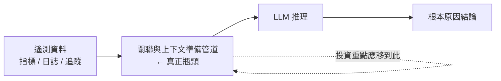
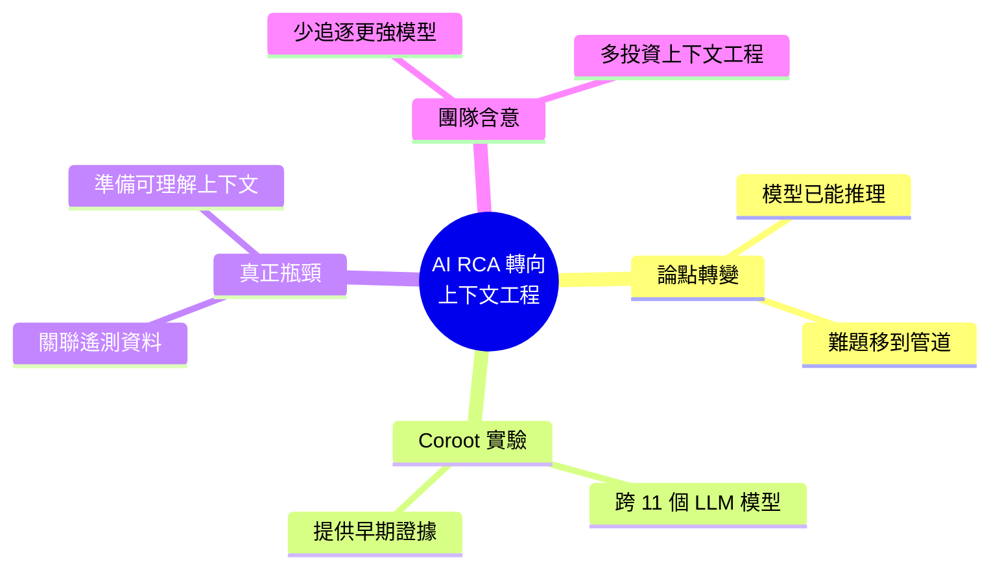

## AI Root Cause Analysis Shifts from Model Reasoning to Context Engineering

Coroot 對 11 個 LLM 模型的實驗表明，現代大語言模型在獲得正確準備的上下文後，已能有效執行根本原因分析（RCA）；真正的瓶頸並非模型推理能力，而是關聯遙測資料的管道。這一發現改變了工程師對 AI 輔助 RCA 的看法，從追求更強大的模型轉向優化資料準備和管道架構。團隊應優先投資於上下文工程而非模型選擇。

### 重點
- 11 個模型測試顯示：RCA 的關鍵不在 LLM 推理，而在上下文準備質量
- 遙測關聯管道（telemetry correlation pipeline）是真正的硬瓶頸
- 團隊應優先投資於資料管道與上下文工程，而非單純追求更強模型

**原文：** [infoq-main](https://www.infoq.com/news/2026/07/ai-rca-context-engineering/?utm_campaign=infoq_content&utm_source=infoq&utm_medium=feed&utm_term=global)

---

<!-- deep-analysis:begin -->
## 📌 摘要 (TL;DR)

- 工程師社群的主流觀點正在轉變：現代大型語言模型（Large Language Model，簡稱 LLM）只要拿到「正確準備好的上下文」，就已能推理出系統故障的根本原因，難題因此從「模型推理能力」轉移到「關聯遙測資料的管道」。
- 可觀測性團隊 Coroot 針對 **11 個 LLM 模型** 進行了一項根本原因分析（Root Cause Analysis，簡稱 RCA）實驗，為上述論點提供了早期證據。
- 核心 insight：模型間的差異不是決定 RCA 成敗的關鍵，餵給模型的**上下文品質**才是——真正困難的是把分散的遙測資料關聯成模型能理解的敘事。
- 對讀者的意義：若論點成立，團隊應把投資重點從「追逐更強的模型」轉向「上下文工程」（資料準備與管道架構）。
- 本文為 InfoQ 新聞，作者 Mark Silvester；此處僅涵蓋原文提供的概述內容，各模型的逐項分數未包含在原始摘要中。

## 🎯 核心概念

- **根本原因分析** (Root Cause Analysis，簡稱 RCA)：找出系統故障或事件背後真正成因的分析流程，是可觀測性與維運（SRE）的核心工作。
- **上下文工程** (context engineering)：為 LLM 篩選、準備並組織正確資料的工程實務，讓模型在推理時擁有足夠且精準的輸入。
- **遙測資料** (telemetry)：系統運行時產生的指標（metrics）、日誌（logs）、追蹤（traces）等監測資料，是 RCA 的原始素材。
- **Coroot**：文中進行跨 11 個模型 RCA 實驗的一方（可觀測性領域）。

## 📖 整理分析

### 1. 論點轉向：從模型推理到上下文
過去關於 AI 輔助 RCA 的討論多聚焦於「模型夠不夠聰明」。本文指出的轉變是：越來越多工程師主張，現代 LLM 在獲得正確準備的上下文後，已能有效推理出根本原因，因此「困難的問題」已經從模型端，轉移到「關聯遙測資料的管道」端。

### 2. Coroot 的 11 模型實驗
為支持這一論點，Coroot 對 **11 個 LLM 模型** 進行了實驗，提供早期證據。（原文為新聞概述，未在提供的內容中列出各模型的具體分數。）其導向的結論是：不同模型之間的表現差異並非決定性因素，關鍵反而在於輸入上下文的品質是否到位。

### 3. 真正的瓶頸：遙測關聯管道
RCA 需要把散落在指標、日誌、追蹤等多個來源的遙測資料**關聯**起來，整理成模型可以理解的因果敘事。這個「關聯與上下文準備」的管道，才是問題的難點所在，而不是模型本身的推理能力。換言之，模型已「夠用」，缺的是把正確資料送到它面前的工程。

### 4. 對工程團隊的含意
若論點成立，團隊的資源配置邏輯需要調整：與其把預算與精力投入「挑選或等待更強的模型」，不如投入**上下文工程**——優化資料準備、關聯邏輯與管道架構。實務上代表模型選擇的邊際效益下降，而資料管道與遙測關聯的邊際效益上升。

## 🧭 流程圖 / 架構圖

下圖呈現 AI 輔助 RCA 的資料流，以及本文主張的瓶頸位置：

## 🧠 Mindmap

<!-- deep-analysis:end -->
### 📄 原文內容

點此展開 / 收合

Engineers are increasingly arguing that modern LLMs can already reason through root cause analysis once given correctly prepared context, shifting the hard problem to the pipelines that correlate telemetry. A Coroot experiment across eleven models offers early evidence for the claim. By Mark Silvester

