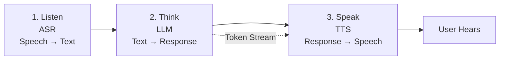

## The Secret Sauce Behind Real-Time AI Voice Agents

文章解釋現代實時 AI 語音代理的核心技術棧，採用三層架構：聽（語音辨識 ASR）→ 思（LLM 推理）→ 說（語音合成 TTS）。其中 LLM 層採用流式 token 傳輸技術並行啟動 TTS，是降低端到端延遲的關鍵。文章適合初學者快速理解語音應用的工作流程，但未涉及具體延遲優化、並發控制或成本估算。

### 重點
- 實時語音代理採用 ASR → LLM → TTS 三階段管道
- LLM 層關鍵優化：流式 token 傳輸同步觸發 TTS，避免串列等待
- 涵蓋「聽、思、說」全棧但深度有限，適合架構入門

**原文：** [medium-tag-llm](https://medium.com/@rummansiddiqui1990/the-secret-sauce-behind-real-time-ai-voice-agents-2c46b6e132a4?source=rss------large_language_models-5)

---

### 📄 原文內容

點此展開 / 收合

A simple guide to understanding how modern voice applications listen, think, and speak. Continue reading on Medium »

