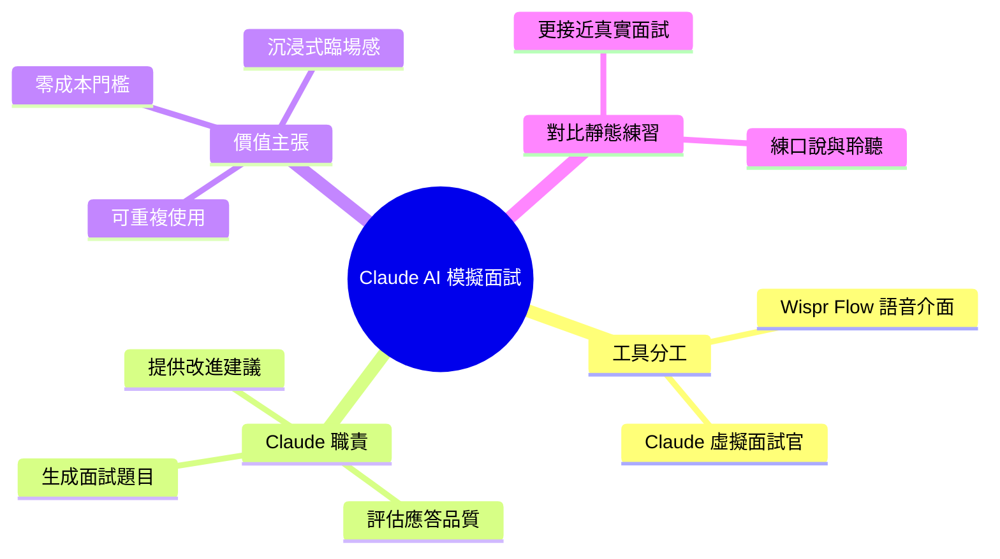

## Meet Claude, Your AI Mock Interviewer

文章提供逐步指南，教使用者如何結合 Claude 和 Wispr Flow 進行求職面試模擬練習。Wispr Flow 作為語音介面供使用者練習口頭表達和聆聽，Claude 作為虛擬面試官生成面試題目、評估應答品質並提供改進意見。該組合方案為求職者提供可重複使用、無成本門檻的沉浸式面試練習環境，相比靜態文本練習更接近真實面試場景。

### 重點
- Claude 充當虛擬面試官生成題目與即時反饋，Wispr Flow 提供語音互動介面
- 該工具組合為求職者提供可重複練習、低成本的面試準備方案
- 適合需要真實互動、語音表達練習的求職者，補充傳統文字練習的不足

**原文：** [medium-tag-claude](https://medium.com/@kyawsawhtoon/meet-claude-your-ai-mock-interviewer-ad29b2f88d0d?source=rss------claude-5)

---

<!-- deep-analysis:begin -->
> ⚠️ **來源說明**：此篇為 Medium RSS 僅提供標題與導言（standfirst），完整內文需點擊原文閱讀。以下整理基於文章導言與先前 brief 摘要所描述的概念，未擷取到逐步操作細節，故不虛構具體步驟、提示詞或數據。

## 📌 摘要 (TL;DR)

- 文章是一份逐步指南（step-by-step guide），教讀者結合 Claude 與 Wispr Flow 打造能實際運作的求職面試模擬練習。
- 分工設計：**Wispr Flow** 擔任語音介面，讓使用者用「說」的方式練習口頭表達與聆聽；**Claude** 擔任虛擬面試官，負責出題、評估回答並給改進建議。
- 價值主張：這套組合提供可重複使用、零成本門檻的沉浸式練習環境，比對著靜態文字稿練習更貼近真實面試的臨場感。
- 適合對象：正在求職、想在無壓力環境反覆演練口語應答的人，尤其是需要練習即時反應與口說流暢度者。

## 🎯 核心概念

- **模擬面試（mock interview）**：由 AI 扮演面試官，模擬真實面試的問答與回饋流程，供求職者反覆演練。
- **Wispr Flow**：文中作為語音介面工具，將使用者口說內容轉為輸入，讓練習聚焦在「開口說」而非打字。
- **Claude**：Anthropic 的 AI 助手，在此擔任面試官角色，生成問題、判讀回答品質並提出改進意見。

## 📖 整理分析

### 1. 靜態練習的侷限
根據摘要，傳統對著文字稿或題庫練習屬於靜態文本練習，缺乏臨場的來回互動與即時回饋，難以模擬真實面試中「聽問題、當場組織語言、口頭回答」的壓力情境。

### 2. 雙工具分工設計
文章的核心做法是把兩個工具分工：Wispr Flow 負責語音端（讓使用者練口說與聆聽），Claude 負責智慧端（出題、評估、給建議）。這種拆分讓練習同時涵蓋「表達技巧」與「內容品質」兩個維度。

### 3. 可重複、零成本的閉環
摘要強調此方案「可重複使用、無成本門檻」，形成一個練習閉環：使用者口說作答 → Claude 評估並回饋 → 依建議調整後再練一輪，可無限次演練不同題目與情境。

> 註：文章標題點名這是「actually works（真的有效）」的指南，暗示重點在於實際可落地的操作流程；但完整逐步細節未包含在本次擷取的來源中。

## 🧭 流程圖 / 架構圖

以下依摘要描述的分工與練習閉環繪製（原文未附圖）：

## 🧠 Mindmap

<!-- deep-analysis:end -->
### 📄 原文內容

點此展開 / 收合

A step-by-step guide to using Claude and Wispr Flow for job interview practice that actually works. Continue reading on Medium »

