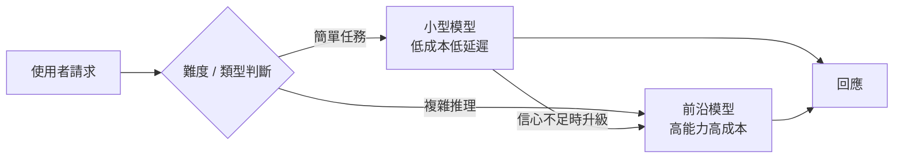
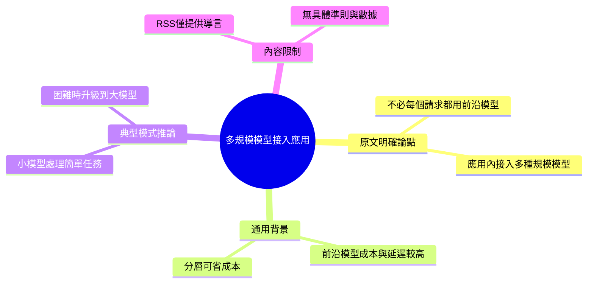

## Wiring multiple AI model sizes into a simple application

文章探討如何在單一應用中整合多種規模的 AI 模型。核心論點為：生產環境的 LLM 應用無須在所有請求上部署最前沿（frontier）模型，透過分層模型策略（小型處理簡單任務 + 大型模型處理複雜推理）可降低推理成本並維持整體效能表現。該方案代表 LLM 應用架構的務實轉向，但 RSS 摘要未展開具體實現方式、模型選擇決策準則或案例驗證。

### 重點
- 生產 LLM 應用應採用多尺度模型混合策略，避免所有請求均調用最前沿模型
- 小型模型處理低複雜度任務，大型模型保留於高價值推理，實現成本與效能均衡
- 該架構模式適用於客服、推薦、內容生成等分層推理場景

**原文：** [medium-tag-llm](https://medium.com/@axdliu/wiring-multiple-ai-model-sizes-into-a-simple-application-603819854b54?source=rss------large_language_models-5)

---

<!-- deep-analysis:begin -->
> ⚠️ **內容可得性說明**：本則來自 Medium 的 RSS 只包含標題與一句導言（「Most production LLM apps do not need a frontier model on every request. Continue reading on Medium »」），正文需點擊原文才能閱讀。以下整理**明確標示**哪些是文章原文論點、哪些是為了幫助理解而補充的一般性背景知識，避免捏造文章實際未提供的細節。

## 📌 摘要 (TL;DR)

- **文章唯一可確認的核心論點**：多數生產環境的 LLM 應用，並不需要對每一個請求都動用最前沿（frontier）模型。
- **可推得的主張方向**（依標題「Wiring multiple AI model sizes into a simple application」）：作者主張在單一應用中同時接上「多種規模」的模型，而非只用一個大模型。
- **RSS 未提供的部分**：具體的模型選擇準則、路由（routing）判斷邏輯、成本 / 效能數據、以及案例驗證，皆不在可取得的內容中。
- **為什麼值得關注**：這反映 LLM 應用架構從「一律用最強模型」轉向「按任務難度分配模型」的務實成本考量，是實務工程常見的趨勢。

## 🎯 核心概念

- **前沿模型（frontier model）**：指當前能力最強、通常也最昂貴、延遲較高的旗艦級大型模型（例如各家的旗艦推理模型）。
- **模型路由 / 模型分層（model routing / model cascade）**：依請求的難度或類型，把任務分派給不同規模模型的架構模式；此為業界通用術語，非本文獨創（此段為一般背景補充）。

## 📖 整理分析

### 1. 文章明確主張（原文）
本文標題與導言傳達的唯一明確立場是：**「不是每個請求都值得用前沿模型」**。導言原句為「Most production LLM apps do not need a frontier model on every request.」這是一個關於成本與資源配置的判斷，暗示應用內應同時存在大小不同的模型。

### 2. 這個論點的實務背景（一般背景補充，非原文細節）
前沿模型在單位 token 成本、延遲與吞吐量上，通常明顯高於小型模型。若一個應用中有大量「簡單、格式化、可預測」的請求（如分類、抽取、簡短改寫），對這些請求動用旗艦模型多半是資源浪費。這是「多模型分層」在成本工程上的普遍動機。**以上為協助理解的通用知識，本文正文是否如此論述無法從 RSS 確認。**

### 3. 常見的分層實作模式（一般背景補充，推論）
業界常見做法是：先用小型 / 便宜模型處理簡單任務，遇到判定為困難或低信心的情況再升級（escalate）到大型模型；有時也用一個輕量分類器先判斷請求難度再路由。**這是對標題「wiring multiple model sizes」的合理推論方向，但具體作者採用哪一種、以什麼指標判斷，RSS 未揭露，不做臆測。**

### 4. 可取得內容的限制
由於 RSS 僅提供導言，本文無法確認：作者用了哪些具體模型、路由決策準則（如信心分數門檻、規則式或模型式判斷）、實際成本下降幅度、以及是否有基準測試或案例。若需這些細節，必須閱讀 Medium 原文。

## 🧭 流程圖 / 架構圖

> 下圖為「多模型分層路由」的**典型概念示意（一般模式，非本文具體描述）**，用以幫助理解標題意涵；請勿視為文章實際架構。

## 🧠 Mindmap

<!-- deep-analysis:end -->
### 📄 原文內容

點此展開 / 收合

Most production LLM apps do not need a frontier model on every request. Continue reading on Medium »

