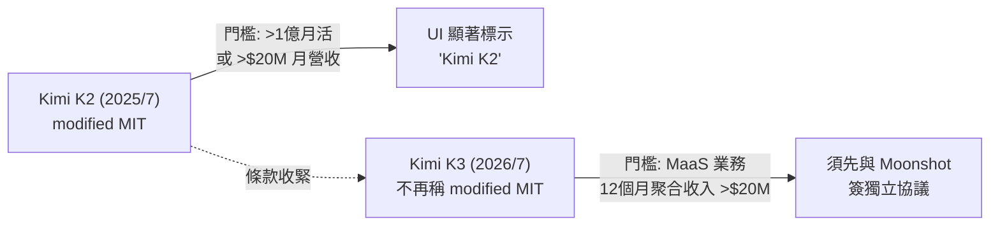
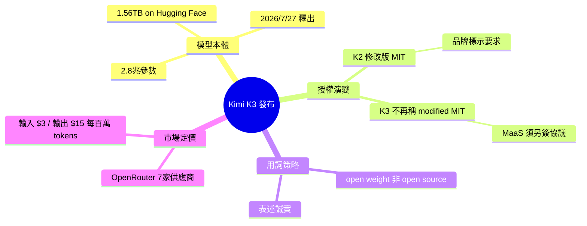

## moonshotai/Kimi-K3

Moonshot 於 7 月 27 日公開發布 Kimi K3（2.8 兆參數）的模型權重，檔案大小 1.56TB，已上架 Hugging Face。K3 的商用許可條款較 K2 更為嚴格：新增要求大型「模型即服務」(MaaS) 業務（年聚合收入超 2,000 萬美元）需與 Moonshot 簽訂獨立協議，且不再聲稱基於 MIT。商用產品如超過 1 億月活用戶或月收入 2,000 萬美元以上，須在 UI 上顯著註明「Kimi K2」品牌。Moonshot 明確使用「開放權重」(open weight) 而非「開源」標籤。OpenRouter 已聯繫 7 家服務商提供 K3，定價與官方相同（輸入 $3/百萬 tokens，輸出 $15/百萬 tokens）。

### 重點
- Kimi K3 達 2.8 兆參數，權重檔案 1.56TB，已在 Hugging Face 開放下載
- MaaS 業務年收入超 $2,000 萬需與 Moonshot 簽獨立協議；產品超 1 億 MAU 或月收 $2,000 萬需在 UI 署名
- OpenRouter 7 家提供商統一定價 $3/M input tokens、$15/M output tokens，與官方持平

**原文：** [simon-willison](https://simonwillison.net/2026/Jul/27/kimi-k3/#atom-everything)

---

<!-- deep-analysis:begin -->
## 📌 摘要 (TL;DR)

- Moonshot 於 2026 年 7 月 27 日在 Hugging Face 釋出 Kimi K3 的模型權重，參數規模 2.8 兆（2.8 trillion），檔案體積達 1.56TB，屬先前本月稍早的承諾兌現。
- K3 授權條款比 2025 年 7 月的 K2 更嚴格：新增規定「模型即服務」(Model as a Service，簡稱 MaaS) 業者若連續任 12 個月聚合收入超過 2,000 萬美元，須先與 Moonshot AI 簽訂獨立協議才能將其用於任何商業用途。
- K3 授權**不再自稱「modified MIT」**，且 Moonshot 在自家文件中一貫使用「open weight」而非「open source」，對外表述誠實。
- OpenRouter 已上架來自 7 家供應商的 K3，多數定價與官方相同：輸入 $3/百萬 tokens、輸出 $15/百萬 tokens。
- 值得關注點：這反映中國開放權重大模型在「釋出權重」與「保護商業收益」之間，逐步收緊授權策略的趨勢。

## 🎯 核心概念

- **開放權重 (open weight)**：僅公開模型權重供下載與使用，但不等同於符合 OSI 開源定義的「開源」，Moonshot 刻意使用此詞以避免誤稱。
- **模型即服務 (Model as a Service，MaaS)**：以 API 或雲端形式對外提供模型推論的商業模式，正是 K3 新條款重點鎖定的對象。
- **修改版 MIT 授權 (modified MIT license)**：K2 採用的授權，在標準 MIT 之上加註了品牌歸屬要求；K3 已不再使用此標籤。

## 📖 整理分析

### 1. 模型規模與發布
Moonshot 兌現本月稍早的承諾，公開 Kimi K3 的權重。該模型為 2.8 兆參數，在 Hugging Face 上檔案龐大，達 1.56TB。這是繼 2025 年 7 月 K2 之後的新一代旗艦模型，延續其「釋出可下載權重」的路線。

### 2. K2 的修改版 MIT 條款
Moonshot 在 2025 年 7 月為 K2 引入自製、稍嫌粗糙（janky）的修改版 MIT 授權。其唯一修改是加入一段歸屬要求：若軟體（或其衍生作品）被用於**月活躍用戶超過 1 億**、或**月營收超過 2,000 萬美元**的商業產品或服務，該產品／服務的使用者介面上必須顯著標示「Kimi K2」。

### 3. K3 授權明顯趨嚴
K3 授權不再稱自己為「modified MIT」，並更進一步限制大型業者。新增條款針對 MaaS 業務：若被授權方或其關聯企業經營 MaaS 業務，且雙方在**任何連續 12 個月**內的**聚合收入超過 2,000 萬美元**，則必須在將軟體或其衍生作品用於任何商業目的之前，**先與 Moonshot AI 簽訂獨立協議**。相較 K2 以「月營收」為門檻的品牌標示要求，K3 的 MaaS 條款改以「12 個月聚合收入」為基準，並從「標示品牌」升級為「須另行簽約」。

### 4. 「open weight」用詞與市場定價
值得肯定的是，Moonshot 並未嘗試在自家材料中將此授權描述為「open source」，而是一致使用「open weight」一詞，避免混淆。市場面上，OpenRouter 已從 7 家供應商提供 K3，多數供應商定價與 Moonshot 官方相同——輸入每百萬 tokens 3 美元、輸出每百萬 tokens 15 美元。

## 🧭 授權演變對比

## 🧠 Mindmap

<!-- deep-analysis:end -->
### 📄 原文內容

點此展開 / 收合

moonshotai/Kimi-K3 
As promised earlier this month , Moonshot have released the weights for their excellent 2.8 trillion parameter Kimi K3. They're a hefty 1.56TB on Hugging Face. 
 Kimi introduced their own janky modified version of the MIT license with K2 back in July 2025. That license just added this paragraph requiring attribution beyond a certain size of commercial entity: 
 
 Our only modification part is that, if the Software (or any derivative works thereof) is used for any of your commercial products or services that have more than 100 million monthly active users, or more than 20 million US dollars (or equivalent in other currencies) in monthly revenue, you shall prominently display "Kimi K2" on the user interface of such product or service. 
 
 The K3 license no longer calls itself "modified MIT" and goes further, requiring a separate agreement with Moonshot for large "Model as a Service" businesses: 
 
 If the Licensee or any of its affiliates operates a Model as a Service business, and the aggregate revenue of the Licensee and its affiliates exceeds 20 million US dollars (or the equivalent in other currencies) in total over any consecutive 12 months, the Licensee must enter into a separate agreement with Moonshot AI before using the Software or its derivative works for any commercial purpose. 
 
 To Kimi's credit, they make no attempt to describe this as an "open source" license in their own materials, consistently using the term "open weight" in its place. 
 OpenRouter is already offering K3 from 7 providers , most of which are at the same $3/million input and $15/million output as Moonshot AI themselves.

 Tags: ai , generative-ai , llms , llm-pricing , llm-release , ai-in-china , moonshot , kimi , janky-licenses

