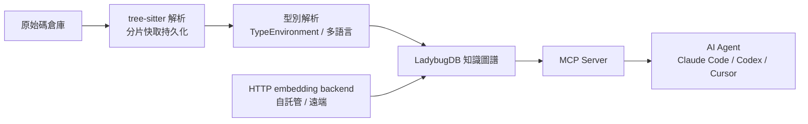

## Release Candidate v1.6.10-rc.119

GitNexus v1.6.10-rc.119 發佈，聚焦多語言支援與性能優化。新增完整 Swift（iOS）支援與 Docker 容器化、HTTP embedding backend 可對接自託管端點、新增 CLI 的「index」命令加速現有專案索引註冊。性能方面，Go 語言模塊消除了 O(n²) 的 scope-capture re-walks 瓶頸，大型倉庫透過分片快取持久化改善掃描效能。MCP 啟動相容性與懶加載 CLI 命令增強了代理整合。新增 Spring 自動配置支援、Ruby/PHP/Kotlin 完整語言支援，以及跨 8+ 語言的類型解析能力（包括構造函數推理、方法解析、返回類型推理）。

### 重點
- 完整 Swift/iOS 支援 + SPM 導入解析、Docker 容器化部署、HTTP embedding backend 自託管
- Go O(n²) scope-capture 消除、分片快取持久化改善大型倉庫索引效能
- 新增 Spring auto-configuration、Ruby/PHP/Kotlin 語言支援，跨 8+ 語言的構造函數推理與返回類型推理

**原文：** [gitnexus-releases](https://github.com/abhigyanpatwari/GitNexus/releases/tag/v1.6.10-rc.119)

---


<!-- deep-analysis:begin -->
## 📌 摘要 (TL;DR)

- GitNexus 發佈候選版本 v1.6.10-rc.119，來源 commit `ff86ccf`，可透過 `npm install gitnexus@rc` 安裝；RC 為預發佈測試版，穩定版仍在最新 dist-tag。
- 本次 RC 主打功能：完整 Swift（iOS）支援（#408）、Docker 容器化支援（#848）、可對接自託管端點的 HTTP embedding backend（#395）、CLI 新增 `index` 命令註冊既有 `.gitnexus/` 資料夾（#402），以及 git commit 後自動重建索引並保留 embeddings（#205）。
- 性能面：Go 語言模塊消除 O(n²) 的作用域捕捉重走訪（scope-capture re-walks，#1915），大型倉庫改用分片解析快取持久化（shard parse cache，#1580）。
- 穩定性與安全：改善 MCP 啟動相容性並將 CLI 命令改為懶加載（#207）、修復 KuzuDB fork 崩潰（#209），並修掉全域升級時的 `ENOTEMPTY` 與快取目錄權限問題（#843、#845、#846）。
- 從累積變更看，GitNexus 已從 KuzuDB 遷移到 LadybugDB v0.15（#275），並完成跨 10–11 種語言的多階段型別解析（Phase 4–9 與 Milestone D）。

## 🎯 核心概念

- **GitNexus**：把整個程式碼倉庫解析成知識圖譜（knowledge graph），讓 AI agent 能透過查詢理解專案結構、呼叫關係與影響範圍的工具。
- **模型情境協定**（Model Context Protocol，簡稱 MCP）：GitNexus 對外暴露給 Claude Code、Codex、Cursor 等 agent 的整合協定，本次改善其啟動相容性。
- **HTTP embedding backend**：把向量化（embedding）運算導向自託管或遠端 HTTP 端點，讓使用者不必在本機跑模型（#395）。
- **作用域捕捉重走訪**（scope-capture re-walks）：Go 解析階段中反覆走訪語法樹造成的 O(n²) 瓶頸，本次被移除（#1915）。
- **分片解析快取**（shard parse cache）：把解析結果分片持久化，改善大型倉庫重新掃描的效能（#1580）。
- **LadybugDB**：GitNexus 現用的圖資料庫，由原本的 KuzuDB 遷移而來（#275，後續升級至 0.15.2）。

## 📖 整理分析

### 1. 本次 RC 的功能亮點
這版最實質的新增集中在四塊：Swift 完整支援（修正查詢、匯出偵測、隱式匯入、建構子解析）、Docker 支援、HTTP embedding backend，以及 CLI 的 `index` 命令——後者能直接把既有的 `.gitnexus/` 資料夾註冊進來，省去對已索引專案重跑完整分析。搭配 `feat(hooks)` 在 git commit 後自動重建索引並保留 embeddings，讓知識圖譜能隨提交持續同步。

### 2. 性能優化：消除 O(n²) 與分片快取
性能改動最關鍵的是 `perf(go)` 移除作用域捕捉的重複走訪（#1915，解決 #1848 的 quarantine 問題），把原本隨檔案規模平方成長的成本壓下來。另一項 `fix` 針對大型倉庫將解析快取分片持久化（#1580），避免每次掃描都從零重建，兩者共同改善大專案的索引體驗。

### 3. Agent 整合與 MCP 穩定性
GitNexus 的定位是餵給 AI agent 的程式碼情境來源，因此 MCP 穩定性被歸類在 Security 區塊：本次改善 MCP 啟動相容性並讓 CLI 命令懶加載（#207），降低啟動失敗與載入負擔。整合測試補強與 KuzuDB fork 崩潰修復（#209）也一併納入，強化在 agent 環境下的可靠度。

### 4. 安裝與升級可靠性修復
多個 bug fix 圍繞全域安裝／升級的 `ENOTEMPTY` 問題：preinstall 清理（#843）、把 `env.cacheDir` 設到使用者可寫入位置（#845），以及 devendor `tree-sitter-proto` 安裝生命週期（#846）。CI/CD 也把 macOS 加入跨平台測試矩陣（#208），提升多平台一致性。

### 5. 累積演進：多語言與多階段型別解析
從完整變更清單可看出 GitNexus 的長期主線：資料層從 KuzuDB 遷移至 LadybugDB v0.15（#275），語言支援擴張至 Swift、Ruby（#111）、PHP 8+/Laravel（#64）、Kotlin（#84）等；型別解析以 Phase 4 到 Phase 9（#310、#315、#318、#341、#354、#379）逐步推進，涵蓋 nullable 解包、for-loop 型別、鏈式呼叫、模式匹配、欄位／屬性解析與回傳型別感知的變數綁定，Milestone D 更做到 11 語言整合測試（#387）與多型／方法多載支援（#392）。LLM provider 也擴充到 DeepSeek（#217）、MiniMax（#224）、GLM（Z.AI，#468）等。

## 🧭 架構圖

以下依本次 release 提及的元件整理 GitNexus 的處理流程：



## 🧠 Mindmap

```mermaid
mindmap
  root((GitNexus rc.119))
    新功能
      Swift 完整支援
      Docker 支援
      HTTP embedding backend
      CLI index 命令
      commit 後自動 reindex
    性能
      消除 O(n²) re-walk
      分片快取持久化
    Agent 整合
      MCP 啟動相容性
      CLI 懶加載
    安裝可靠性
      修 ENOTEMPTY 升級問題
      cacheDir 權限修正
    累積演進
      KuzuDB 遷 LadybugDB v0.15
      Phase 4-9 型別解析
      多語言與多 LLM provider
```
<!-- deep-analysis:end -->
### 📄 原文內容

<details>
<summary>點此展開 / 收合</summary>

Automated release candidate build from main .\n\n npm: npm install gitnexus@rc \n Version: 1.6.10-rc.119 \n Target base: 1.6.10 (rc #119 )\n Source commit (main): ff86ccf \n Release commit (versioned tree): 3729b13 \n\nRelease candidates are pre-stable builds intended for early testing. Stable releases remain on the latest dist-tag. 

 What's Changed 
 🚨 Security 
 
 Improve MCP startup compatibility and lazy-load CLI commands by @Shockang in #207 
 test: add integration test coverage and fix KuzuDB fork crashes by @magyargergo in #209 
 
 🚀 Features 
 
 feat(hooks): auto-reindex after git commit with embeddings preservation by @L1nusB in #205 
 feat: HTTP embedding backend for self-hosted/remote endpoints by @zm2231 in #395 
 feat: complete Swift support — query fix, export detection, implicit imports, constructor resolution by @marxo126 in #408 
 feat(cli): add 'index' command to register existing .gitnexus/ folder by @adonisdoda in #402 
 feat: add docker support by @BRAINIFII in #848 
 
 🐛 Bug Fixes 
 
 fix: add preinstall cleanup to prevent ENOTEMPTY on global upgrade by @magyargergo with @Copilot in #843 
 fix: set env.cacheDir to user-writable location by @enihcam in #845 
 fix: devendor tree-sitter-proto install lifecycle to prevent ENOTEMPTY on global upgrade by @magyargergo in #846 
 fix: shard parse cache persistence on large repos by @BlackOvOoo in #1580 
 
 🏎️ Performance 
 
 perf(go): kill O(n2) scope-capture re-walks (resolves #1848 quarantine) by @magyargergo in #1915 
 
 👷 CI/CD 
 
 ci: add macOS to cross-platform test matrix by @magyargergo in #208 
 workflow: triage reporting by @zander-raycraft in #421 
 
 📝 Other Changes 
 
 readme by @abhigyanpatwari in #3 
 
 Embeddings pipeline by @abhigyanpatwari in #4 
 
 Embeddings pipeline by @abhigyanpatwari in #5 
 
 highlight tool for agent, prompt enhancements by @abhigyanpatwari in #6 
 
 highlight tool fixes by @abhigyanpatwari in #7 
 
 prompt enhancements, azure ai provider fixes by @abhigyanpatwari in #8 
 
 Embeddings pipeline by @abhigyanpatwari in #9 
 
 Embeddings pipeline by @abhigyanpatwari in #10 
 
 prompt changes by @abhigyanpatwari in #14 
 
 Schema experiments by @abhigyanpatwari in #16 
 
 Minor prompt fix by @abhigyanpatwari in #17 
 
 Agent UI improved. Prompt injected with repo directory structure, hot... by @abhigyanpatwari in #18 
 
 better regex for grounding, UI improvements by @abhigyanpatwari in #19 
 
 Agent and UI improvements by @abhigyanpatwari in #20 
 
 fixed settings icon and added openai provider support by @abhigyanpatwari in #21 
 
 readme updated by @abhigyanpatwari in #22 
 
 minor change in readme by @abhigyanpatwari in #23 
 
 Schema experiments by @abhigyanpatwari in #24 
 
 blast radius tool implemented by @abhigyanpatwari in #25 
 
 readme mermain fix by @abhigyanpatwari in #26 
 
 Mcp bridge by @abhigyanpatwari in #28 
 
 Leidens algorithm and processmap by @abhigyanpatwari in #31 
 
 Leidens algorithm and processmap by @abhigyanpatwari in #33 
 
 Leidens algorithm and processmap by @abhigyanpatwari in #34 
 
 updated readme by @abhigyanpatwari in #35 
 
 Gitnexus cli by @abhigyanpatwari in #36 
 
 Add Claude Code GitHub Workflow by @abhigyanpatwari in #46 
 
 fix: use cross-platform npx command in .mcp.json by @abhigyanpatwari in #48 
 
 fix: disable embeddings by default, fix segfault on macOS/Linux by @abhigyanpatwari in #51 
 
 feat: local backend mode for web UI by @paulrobello in #49 
 
 feat(plugin): self-contained Claude Code plugin with bundled MCP, hooks, and skills by @L1nusB in #68 
 
 feat(ui): Add a copy button to the Nexus AI and copy the md result by @CrazyBunQnQ in #75 
 
 feat(php): full PHP 8+ / Laravel support with Eloquent model tracking by @gunesbizim in #64 
 
 Probe for CUDA before attempting GPU embeddings by @BlockSecCA in #58 
 
 feat: remote server connection mode and multi-repo switching by @baconwasr1ght in #66 
 
 fix(mcp): don't crash server when no repos are indexed by @abhigyanpatwari in #96 
 
 fix: lazy-import embeddings to avoid onnxruntime crash on Node v24+ by @abhigyanpatwari in #99 
 
 fix: ensure exec usage does not allow poisoning by @strazzere in #61 
 
 feat(ingestion): add AST decorator-based entrypoint hints by @PurpleNewNew in #102 
 
 fix(web): map API path field to repoPath in fetchRepoInfo by @christopheralex-cc in #105 
 
 feat(swift): full Swift / iOS language support with SPM import resolution by @jandyx in #94 
 
 feat: add Kotlin language support by @magyargergo in #84 
 
 Feat/php laravel support by @gunesbizim in #133 
 
 feat: inline imperative instructions in CLAUDE.md/AGENTS.md by @abhigyanpatwari in #190 
 
 chore: bump version to 1.3.7 by @abhigyanpatwari in #191 
 
 fix(cli): force-exit after analyze to prevent KuzuDB hang by @abhigyanpatwari in #192 
 
 chore: bump version to 1.3.8 by @abhigyanpatwari in #193 
 
 fix(ingestion): align CALLS edge sourceId with node ID format by @abhigyanpatwari in #194 
 
 fix: guard createASTCache against zero maxSize to prevent LRU cache crash by @magyargergo in #144 
 
 fix(ci): harden CI/CD workflows with security fixes and reliability improvements by @magyargergo with @Copilot in #222 
 
 fix(ci): move PR report to workflow_run for fork PR support by @magyargergo in #225 
 
 fix: skip unavailable native Swift parsers in sequential ingestion by @Gujiassh in #188 
 
 fix: consolidate C/C++/C#/Rust language support from 6 overlapping PRs by @magyargergo in #237 
 
 feat(models): add DeepSeek model configurations by @JasonOA888 in #217 
 
 FEAT: Added support for optional skill generation based on KuzuDB after initial repo analysis (npx gitnexus analyze --skills) by @zander-raycraft in #171 
 
 feat: language-aware code intelligence — symbol resolution, MRO, constructor discrimination by @magyargergo in #238 
 
 fix(cli): dynamically discover and install agent skills by @cnighut in #270 
 
 feat(ruby): Add Ruby language support for CLI and web by @candidosales in #111 
 
 fix(ruby): method-level call resolution, HAS_METHOD edges, and dispatch table by @magyargergo in #278 
 
 feat: TypeEnvironment API with constructor inference, self/this/super resolution by @magyargergo in #274 
 
 refactor: migrate from KuzuDB to LadybugDB v0.15 by @candidosales in #275 
 
 feat: return type inference, doc-comment parsing, and per-language type extractors by @magyargergo in #284 
 
 feat(ingestion): respect .gitignore and .gitnexusignore during file discovery by @ivkond in #231 
 
 feat: Phase 4 type resolution — nullable unwrapping, for-loop typing, assignment chains, code review fixes by @magyargergo in #310 
 
 feat: Phase 5 type resolution — chained calls, pattern matching, class-as-receiver by @magyargergo in #315 
 
 docs: add Codex MCP configuration to README by @ZakAnun in #236 
 
 fix(resolver): fix for same-directory python imports by @cnighut in #328 
 
 feat: Phase 6 type resolution — for-loop Tier 1c, pattern matching, container descriptors, 10-language coverage by @magyargergo in #318 
 
 fix: add postinstall permission fix for CLI and hook scripts ( #330 ) by @ShunsukeHayashi in #348 
 
 fix(impact): add HAS_METHOD and OVERRIDES to VALID_RELATION_TYPES by @karesansui-u in #350 
 
 fix(cli): write tool output to stdout via fd 1 instead of stderr ( #324 ) by @ShunsukeHayashi in #346 
 
 fix(impact): return structured error + partial results instead of crashing ( #321 ) by @ShunsukeHayashi in #345 
 
 feat: Phase 7 type resolution — return-aware loop inference &amp; PHP class-property iterables by @magyargergo in #341 
 
 fix: MCP server crashes under parallel tool calls ( #326 ) by @RyuzakiH in #349 
 
 fix: add Python enumerate() for-loop support with nested tuple patterns by @cnighut in #356 
 
 Fix undefined parsing error on languages missing from call routers by @demirciberk in #364 
 
 feat: Phase 8 field/property type resolution by @magyargergo in #354 
 
 feat: ACCESSES edge type with read/write field access tracking by @magyargergo in #372 
 
 feat: upgrade @ladybugdb/core to 0.15.2 and remove segfault workarounds by @abhigyanpatwari in #374 
 
 feat: Phase 9 — Return-type-aware variable binding with unified fixpoint chain propagation by @magyargergo in #379 
 
 feat(type-resolution): Milestone D — Phases A, B, C + Kotlin fix + 11-language integration tests by @magyargergo in #387 
 
 FIX - Claude review fork 403 for PR reviews by @zander-raycraft in #388 
 
 CI sticky notes by @zander-raycraft in #391 
 
 SEC/ spam guards for the PR and issue claude-review workflow for contributions by @zander-raycraft in #394 
 
 feat(type-resolution): polymorphism and method overloading support by @magyargergo in #392 
 
 fix: sequential enrichment queries + stale data detection ( #285 , #290 , #292 , #297 ) by @hiromima in #396 
 
 feat: add MiniMax provider support by @ximiximi423 in #224 
 
 feat(cli): add Codex MCP + skills support to setup by @x0m4ek in #69 
 
 feat: add markdown file indexing (headings + cross-links) by @abhigyanpatwari in #399 
 
 fix: register Section in NODE_TABLES and NODE_SCHEMA_QUERIES by @abhigyanpatwari in #401 
 
 fix: hydrate worker DB in server mode + fix LadybugDB getAll API mismatch by @fabianhug in #404 
 
 feat(type-resolution): cross-file binding propagation by @magyargergo in #397 
 
 refactor: unify language dispatch with compile-time exhaustive tables by @magyargergo in #409 
 
 fix: prevent native crash when CUDA libs present but ORT lacks provider by @jim80net in #300 
 
 docs(schema): add Community and Process node properties to cypher tool description ( #411 ) by @ShunsukeHayashi in #428 
 
 fix(analyze): allow indexing folders without a .git directory ( #384 ) by @ShunsukeHayashi in #426 
 
 fix(server): allow private/LAN network origins in CORS ( #390 ) by @ShunsukeHayashi in #424 
 
 fix(lbug): retry withLbugDb on BUSY/lock error from external process ( #325 ) by @ShunsukeHayashi in #425 
 
 fix(impact): use per-relation-type confidence floor instead of fixed 1.0 ( #412 ) by @ShunsukeHayashi in #427 
 
 update method for labeling prs by @zander-raycraft in #464 
 
 Fix gitnexus-web server-mode repo switching and query readiness by @JayceeB1 in #400 
 
 feat(ui): ship HelpPanel — because great tools don't make you google how to use them by @che3zcake in #465 
 
 fix(python): resolve module-qualified constructor calls — 0 CALLS edges (Issue #337 ) by @ShunsukeHayashi in #463 
 
 fix(web): LadybugDB getAllRows, loadServerGraph, BM25, highlight clearing by @jreakin in #474 
 
 fix(ingestion): resolve Python import-alias CALLS edges by @ShunsukeHayashi in #461 
 
 fix(web): Cypher injection guards, DOMPurify SVG, readOnly executeQuery by @jreakin in #475 
 
 fix(web): resolve Vercel build errors from security hardening PR by @abhigyanpatwari in #483 
 
 fix(web): 18 multi-language CSV tables, RFC 4180, schema sync by @jreakin in #476 
 
 perf(web): O(1) lookups, memoization, bundle optimizations, React fixes by @jreakin in #477 
 
 feat: deep flow detection — consumer access tracking, middleware chains, error shapes, api_impact tool by @marxo126 in #482 
 
 Updating claude mcp init for window and adding OS detection when installing by @zander-raycraft in #490 
 
 fix(ui): use actual repository name instead of top-level folder for GitHub clones by @che3zcake in #491 
 
 feat(web): add GLM (Z.AI) as LLM provider by @huyphung1602 in #468 
 
 ci: E2E workflow, web typecheck job, pre-commit hook, test suite by @jreakin in #486 
 
 refactor: SICP-informed LanguageProvider architecture by @magyargergo in #488 
 
 fix( #480 ): resolve impact/context returning empty results for Java cl... by @Yashgarg2928 in #489 
 
 docs: agent development framework, GitHub templates, eval refactor by @jreakin in #479 
 
 feat: PHP response shape extraction for json_encode patterns by @marxo126 in #502 
 
 feat: add Expo Router file-based route detection by @marxo126 in #503 
 
 feat(wiki): add Cursor CLI as LLM provider option by @cnighut in #381 
 
 ch

[... truncated for safety ...]

</details>