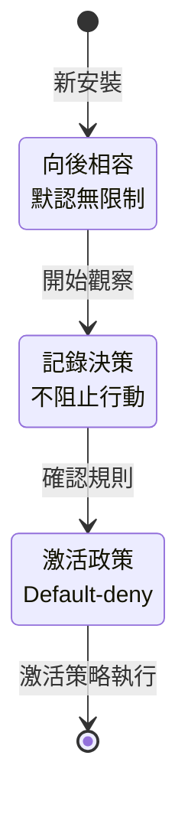
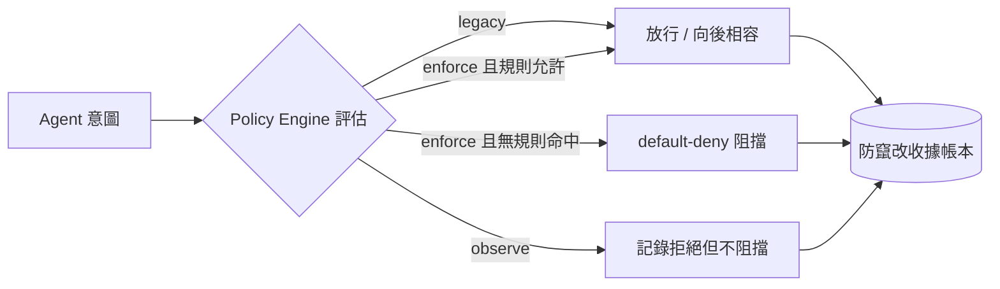
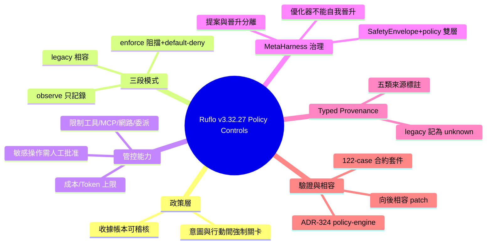

## Ruflo v3.32.27 — Policy Controls for Autonomous Agents

Ruflo v3.32.27 引入「Policy Controls for Autonomous Agents」，在 agent 意圖和實際行動間插入可強制執行的 policy 層。核心功能支持 daily cost/token ceiling、敏感操作需人工批准、限制 tools/MCP servers/network access 等；bounded concurrent Codex 開發允許每個 worker 獨立 worktree 和降低能力包；完整 audit trail 通過 tamper-evident receipt ledger；支持 typed provenance（user_claim, agent_output, system_observation, tool_result, unknown）。採用漸進啟用模式：legacy（向後相容）→ observe（記錄不阻止）→ enforce（激活阻止）。Legacy records 保守分類為 unknown，防止信任無意提升；policy 和 observe/enforce 層均為 default-deny。MetaHarness 優化器無法授權自身晉升，飛輪 SafetyEnvelope 與 agentic policy 雙層約束。通過 ADR-324 policy-engine 和 122-case MetaHarness contract suite 測試驗證。

### 重點
- Legacy → Observe → Enforce 三階段漸進模式，允許 observe 記錄決策但不阻止，review 後再 enforce
- Typed provenance 分類：user_claim/agent_output/system_observation/tool_result/unknown，legacy records 保守為 unknown 以防信任提升
- Optimizer 無法授權自身晉升：「Darwin proposes; Ruflo disposes」，飛輪 SafetyEnvelope + agentic policy 雙層約束

**原文：** [ruflo-releases](https://github.com/ruvnet/ruflo/releases/tag/v3.32.27)

---

<!-- deep-analysis:begin -->
## 📌 摘要 (TL;DR)

- Ruflo v3.32.27 推出「自主 agent 的政策管控（Policy Controls for Autonomous Agents）」，在 agent 的「意圖」與「實際具後果的行動」之間插入一層可強制執行的 policy 層。
- 團隊可用它定義 agent 能做什麼、限制花費與並行度、對敏感操作要求「經驗證的人工批准」，並透過防竄改的收據帳本（tamper-evident receipt ledger）稽核每個決策。
- 採漸進三段式啟用：`legacy`（向後相容不阻擋）→ `observe`（記錄但不阻擋）→ `enforce`（正式阻擋），可先彩排再開啟。
- 具體能力：對 `model.call`／工具呼叫設每日成本與 token 上限（範例 maxCostUsd 10、maxTokens 500000、週期 86400000ms）；限制 tools／MCP servers／namespace／環境／網路／委派權限。
- MetaHarness 可並行評測候選，但「提案」與「晉升（promotion）」被拆成兩筆交易——優化器無法自己授權晉升自己（Darwin proposes; Ruflo disposes）。
- 這是向後相容的 patch 版本，通過 ADR-324 policy-engine 測試套件與 122-case MetaHarness 合約測試，並新增 ADR-323 的 typed provenance。

## 🎯 核心概念

- **政策層 (policy layer)**：橫在 agent 意圖與後果行動之間的可強制規則層，先評估再放行。
- **能力包 (capability envelope)**：委派給 worker 的權限上限；違反一律阻擋，且委派權限「只能縮小不能擴大」。
- **收據帳本 (receipt ledger)**：防竄改的稽核紀錄，可偵測被修改或重新排序的收據。
- **型別化來源 (typed provenance)**：為 AgentDB 檢索結果標註證據來源類型。
- **default-deny**：`observe` 與 `enforce` 模式下，沒有規則命中時預設拒絕。
- **SafetyEnvelope**：flywheel 既有的安全邊界，與新的 policy engine 形成雙層約束。

## 📖 整理分析

### 1. 意圖與行動間的 policy 層
核心設計是在 agent「想做」和「真的做」之間加一道可強制執行的關卡。團隊可宣告 agent 允許的操作、封頂花費與並行度、對 production 部署／破壞性動作／flywheel 晉升要求已驗證的批准，並約束被委派的 worker。每個決策都會寫入防竄改收據帳本以供事後稽核與偵測竄改。

### 2. 三段式漸進啟用（legacy / observe / enforce）
既有安裝一律以向後相容的 `legacy` 模式遷移，不會被打斷。`ruflo policy init --mode observe` 會記錄「本來會被拒絕」的決策但不實際阻擋，讓團隊先看真實決策紀錄；審閱收據並定義明確規則後，再用 `ruflo policy init --mode enforce` 開啟阻擋。安裝方式是把 policy runtime、CLI 與 ruflo wrapper 三個已簽章的 `.tgz`（`claude-flow-security-3.0.0-alpha.13`、`claude-flow-cli-3.32.27`、`ruflo-3.32.27`）一起 `npm install --global`；一般的 `ruflo@3.32.27` 路徑要等 npm trusted-publisher 授權完成後才開放，且不需重編原始碼。

### 3. 預算、批准與能力包約束
可用 `ruflo policy budget set` 設定每日模型預算（動作 `model.call`、maxCostUsd 10、maxTokens 500000、periodMs 86400000）；`ruflo policy evaluate` 可對一筆帶身分（如 `codex-worker-1`，roles=developer）與動作（resource、environment、costUsd、tokens、concurrency、network）的請求做評估。安全預設值明確：受預算約束的請求必須回報成本或 token 用量，缺少計量不會繞過上限；能力包違規一律阻擋；本機政策管理需互動式終端；批准的簽發需要「經驗證的人類身分轉接器」，本機 TTY 不被當成身分證明。

### 4. Policy-governed MetaHarness（提案與晉升分離）
候選評估現在同時受 flywheel 的 SafetyEnvelope 與 agentic policy engine 雙重約束。`ruflo metaharness flywheel run`（範例 `--sample 40 --max-concurrency 2 --timeout-ms 120000`，搭配私鑰／公鑰）允許並行 benchmark，但晉升是另一筆獨立、明確、需 policy 授權的交易：`ruflo metaharness flywheel promote <receipt-id>` 必須帶 `--approval-id <經驗證的批准 id>` 與 `--confirm`。設計原則是優化器無法授權自己晉升，避免自我提權。

### 5. Typed provenance 與相容性
本版納入 ADR-323，為 AgentDB 檢索加上型別化來源：`user_claim`、`agent_output`、`system_observation`、`tool_result` 與 `unknown`。舊有紀錄仍可讀取，並被保守地歸類為 `unknown`；未簽章的呼叫方主張永遠不會被悄悄升級為「可信證據」，防止信任無意間被抬升。整體為向後相容 patch，保留 v3.32.26 的 flywheel 交易與收據格式，只在特權操作外圍加上 policy 授權。MetaHarness、Darwin、Flywheel 皆為選用相依，缺少時不影響本機 policy engine 與既有 AgentDB 流程。

## 🧭 流程圖 / 架構圖

## 🧠 Mindmap

<!-- deep-analysis:end -->
### 📄 原文內容

點此展開 / 收合

Ruflo v3.32.27 — Policy Controls for Autonomous Agents 
 Agents can now move quickly without receiving unlimited authority. 
 Ruflo v3.32.27 adds an enforceable policy layer between an agent's intent and a 
consequential action. Teams can define what an agent may do, cap spend and 
concurrency, require authenticated approval for sensitive actions, constrain 
delegated workers, and audit every decision through a tamper-evident receipt 
ledger. 
 Existing installations remain compatible. Start in legacy , rehearse the 
policy in observe , and enable blocking with enforce after reviewing the 
recorded decisions. 
 What you can use it for 
 
 Put daily cost and token ceilings around model or tool calls. 
 Require approval for production deploys, destructive actions, or flywheel 
promotion. 
 Limit tools, MCP servers, namespaces, environments, network access, and 
delegated authority. 
 Run bounded concurrent Codex development with a separate worktree and reduced 
capability envelope for every writing worker. 
 Allow MetaHarness to benchmark candidates concurrently without allowing the 
optimizer to promote itself. 
 Audit policy decisions and detect modified or reordered receipts. 
 Filter AgentDB retrieval by typed provenance without breaking legacy records. 
 
 Install or upgrade 
 The verified GitHub release artifacts are available now. Their embedded helper 
manifest is signed. Install the policy runtime, CLI, and Ruflo wrapper together: 
 npm install --global \
 https://github.com/ruvnet/ruflo/releases/download/v3.32.27/claude-flow-security-3.0.0-alpha.13.tgz \
 https://github.com/ruvnet/ruflo/releases/download/v3.32.27/claude-flow-cli-3.32.27.tgz \
 https://github.com/ruvnet/ruflo/releases/download/v3.32.27/ruflo-3.32.27.tgz
ruflo --version
ruflo policy status 
 The normal npm install --global ruflo@3.32.27 path will become available 
after npm trusted-publisher authorization is completed. No source rebuild is 
required. 
 Safe rollout 
 Inspect or migrate the local policy state: 
 ruflo policy init
ruflo policy status
ruflo policy verify 
 Observe policy decisions without blocking normal actions: 
 ruflo policy init --mode observe 
 Add a daily model budget: 
 ruflo policy budget set ' { 
 "id": "daily-model-budget", 
 "action": "model.call", 
 "maxCostUsd": 10, 
 "maxTokens": 500000, 
 "periodMs": 86400000 
 } ' 
 Evaluate an action: 
 ruflo policy evaluate ' { 
 "identity": { 
 "id": "codex-worker-1", 
 "type": "agent", 
 "roles": ["developer"] 
 }, 
 "action": { 
 "type": "model.call", 
 "resource": "openrouter", 
 "environment": "development", 
 "costUsd": 0.12, 
 "tokens": 8000, 
 "concurrency": 2, 
 "network": true 
 } 
 } ' 
 After reviewing receipts and defining explicit rules: 
 ruflo policy init --mode enforce 
 The end-user quick start walks through rules, budgets, delegated 
capability envelopes, concurrent Codex workflows, MetaHarness promotion, and 
troubleshooting. 
 Policy-governed MetaHarness 
 Candidate evaluation is now bounded by both the flywheel SafetyEnvelope and the 
agentic policy engine: 
 ruflo metaharness flywheel run \
 --project-root . \
 --proposer local \
 --sample 40 \
 --max-concurrency 2 \
 --timeout-ms 120000 \
 --private-key /path/to/flywheel-private.pem \
 --public-key /path/to/flywheel-public.pem 
 Promotion remains a separate, explicit, policy-authorized transaction: 
 ruflo metaharness flywheel promote &lt; receipt-id &gt; \
 --project-root . \
 --public-key /path/to/flywheel-public.pem \
 --approval-id &lt; authenticated-approval-id &gt; \
 --confirm 
 Darwin proposes; Ruflo disposes. The optimizer cannot authorize its own 
promotion. 
 Safe defaults 
 
 Existing projects migrate in backward-compatible legacy mode. 
 observe records denials but does not block ordinary actions. 
 Capability-envelope violations are always blocked; delegated authority cannot 
expand. 
 observe and enforce are default-deny when no rule matches. 
 Budgeted requests must report cost or token usage; missing metering does not 
bypass a ceiling. 
 Local policy administration requires an interactive terminal. 
 Approval issuance requires an authenticated human identity adapter. A local 
TTY is not treated as identity proof. 
 MetaHarness, Darwin, and Flywheel remain optional dependencies. 
 Missing optional packages do not break the local policy engine or existing 
AgentDB workflows. 
 
 AgentDB provenance 
 This release also includes ADR-323 typed provenance across AgentDB retrieval: 
 user_claim , agent_output , system_observation , tool_result , and 
 unknown . Legacy records remain readable and are conservatively classified as 
 unknown ; unsigned caller claims are never silently promoted to trusted 
evidence. 
 Compatibility 
 This is a backward-compatible patch release. Existing Ruflo and AgentDB 
installations continue to work without opting into enforcement. The release 
preserves the v3.32.26 flywheel transaction and receipt formats while adding 
policy authorization around privileged operations. 
 Release artifacts: 
 claude-flow-security-3.0.0-alpha.13.tgz
claude-flow-cli-3.32.27.tgz
claude-flow-3.32.27.tgz
ruflo-3.32.27.tgz
SHA256SUMS
 
 Validation 
 The implementation passed: 
 
 the complete ADR-324 policy-engine and security test suites; 
 atomic budget, approval, delegation, evidence, and receipt-ledger tests; 
 concurrent Codex worktree coordination tests; 
 governed in-process MetaHarness evaluation and promotion tests; 
 the 122-case MetaHarness contract suite; 
 operation without AgentBBS or MetaHarness installed; 
 MCP discoverability, install-safety, type-check, package, CodeQL, and 
cross-platform CI gates; 
 policy-engine performance benchmarks. 
 
 Learn more 
 
 End-user quick start 
 ADR-324 architecture 
 ADR-323 typed provenance 
 ADR-322 governed flywheel 
 Policy-engine PR #2822 
 Typed-provenance PR #2820 
 Full changelog

