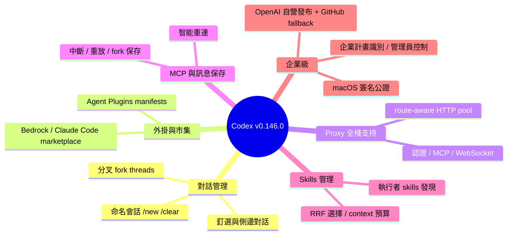

## 0.146.0

OpenAI Codex v0.146.0 發布，引入多項企業級和穩定性功能。新功能包括：通過 /new 和 /clear 命名會話、釘選對話、側邊對話切換；支持 Agent Plugins manifests 和 workspace plugin 發佈至 Amazon Bedrock、Claude Code 等 marketplace；實現 fork threads 功能（分頁歷史、暫時 forks）；App-server 通過 WebSocket 連接遠端 Code Mode hosts；獨立 web search 支持自訂 model providers；執行者提供的 skills 發現和資源讀取。Bug 修復涵蓋：proxy 全棧支持（認證、plugin 下載、MCP 授權、遠端執行、WebSocket、LM Studio）；MCP 連接重新連接邏輯；消息/回應/時戳保留（中斷/重放/import/fork 時）；Terminal 響應性；Windows 導航鍵；process tree 終止；緊湊 context 下 skills 保留。新增 macOS helper executables 簽名和企業計畫認可功能。

### 重點
- Plugin marketplace 擴展至 Amazon Bedrock、Claude Code 等，支持 Agent Plugins manifests
- Proxy 支持全棧路徑：認證、MCP、remote execution、WebSocket、LM Studio 連接的一致性處理
- Fork threads 分頁歷史保留，消息/回應/批准設定即使中斷/重放/import 時保留

**原文：** [codex-releases](https://github.com/openai/codex/releases/tag/rust-v0.146.0)

---

<!-- deep-analysis:begin -->
## 📌 摘要 (TL;DR)

- OpenAI **Codex**（Rust 版 CLI/agent）發布 **v0.146.0**，六大新功能聚焦企業級部署與對話（thread）管理。
- 可用 `/new` 或 `/clear 命名會話、釘選（pin）重要對話，並在多個側邊對話間切換而不需關閉（#34605、#34840、#35011）。
- 新增 **Agent Plugins** manifests 與 workspace plugin 發布，marketplace 擴展至 **Amazon Bedrock** 與 **Claude Code**（#35105、#35254、#34931、#34979）。
- 代理伺服器（proxy）支持全面補齊：橫跨認證、外掛下載、MCP 授權、遠端執行、WebSocket、重定向與 LM Studio 連線。
- 企業導向：新增企業計畫識別與管理員控制、macOS helper 執行檔簽名公證，並改用 OpenAI 自營基礎設施（Cloudflare R2、releases.openai.com）發布、GitHub 作為備援。

## 🎯 核心概念

- **Agent Plugins**：可發布的外掛程式清單（manifest）機制，讓 workspace 能把外掛推送到不同 marketplace。
- **分叉對話**（fork threads）：從既有對話分岔出新歷史，支援分頁載入，並可建立不出現在對話列表的暫時性 fork。
- **Code Mode**：可透過 WebSocket 連接的遠端執行主機，由 app-server 對接。
- **MCP**（Model Context Protocol）：外部工具/資源連線協定，本版強化重連與授權。
- **倒數排名融合**（Reciprocal Rank Fusion，RRF）：用於在有限 context 預算下挑選 skills 的排序融合方法（#34547、#34581）。

## 📖 整理分析

### 1. 會話命名與對話組織
本版把 CLI 的會話管理往「多對話工作台」推進：`/new`、`/clear` 可為會話命名，重要 thread 可釘選並持久化到 app server（#34840），側邊對話能保留切換。搭配 **fork threads**（#35220、#35251）——支援分頁歷史與暫時性 fork——讓使用者能從某個節點分岔嘗試不同路徑，且 fork 時保留審批（approval）reviewer 設定（#34664）。

### 2. Agent Plugins 與 marketplace 擴展
Codex 開始支援 Agent Plugins manifests 與 workspace 層級的外掛發布，並把 marketplace 擴展到 **Amazon Bedrock** 與 **Claude Code**（#34931 使用 API plugin marketplace 對接 Bedrock）。相關強化包含：依 scope 快取遠端外掛目錄（#34849）、外掛啟動同步時遵守系統 proxy（#34506）、以及驗證 Git plugin 的 SHA checkout（#34644）。

### 3. Proxy 全棧支持（企業網路）
這是本版修復量最大的主題：代理設定被貫穿到認證、外掛下載、MCP 授權、遠端執行、WebSocket、重定向與 LM Studio 連線（#34479、#34509、#34655、#34678 等）。底層導入了 route-aware 的共用 HTTP client pool（#34447、#34630），並在重定向時重新解析系統 proxy 路由（#34479），安全審查（security review）期間也保留 proxy 設定（#35036）。

### 4. MCP 連接與訊息保存穩定性
MCP 連線在認證或設定變更時會保持最新，並僅重連已關閉的伺服器、不重啟健康連線（#34952、#35028 等）。訊息層面則強化了跨中斷（interruption）、重放（replay）、匯入（import）與 fork 的保存：已送出訊息、最終回應、失敗回合錯誤、匯入時戳與審批設定都會被保留（#34839、#35524 等），並確保 response item 一律指派 ID（#34645）。

### 5. Skills 發現與 context 預算管理
新增探索執行者（executor）提供的 skills 並安全讀取其關聯資源（#35184、#35198）。在 context 吃緊時，會保留更多可用 skills，並在 skill catalog 必須被截斷時發出警告（#34732、#34738、#34997）；skill 詮釋資料（metadata）預算會隨模型 context window 縮放（#34626），挑選則採用 RRF 與 lexical routing-card 機制。

### 6. 企業功能與發布基礎設施
新增企業計畫識別與 in-app 更新的管理員控制（#35238、#35537）。發布流程改由 OpenAI 自營基礎設施處理——release artifacts 鏡像到 Cloudflare R2、發布 channel metadata 與 installer 別名，並以 GitHub 作為 fallback（#34505、#34508、#34910）。macOS bundled helper 執行檔在打包前完成簽名與公證（#35264）。此外 Free 方案帳號被停用圖片生成（#34850）。

## 🧠 Mindmap

<!-- deep-analysis:end -->
### 📄 原文內容

點此展開 / 收合

New Features 
 
 Name new sessions with /new or /clear , pin important threads, and switch between side conversations without closing them. ( #34605 , #34840 , #35011 ) 
 Support Agent Plugins manifests, workspace plugin publishing, and additional plugin marketplaces for Amazon Bedrock and Claude Code. ( #35105 , #35254 , #34931 , #34979 ) 
 Fork threads with paginated history, including temporary forks that do not appear in thread listings. ( #35220 , #35251 ) 
 Connect app-server to remote Code Mode hosts over WebSocket. ( #35078 , #35098 ) 
 Enable standalone web search for compatible custom model providers. ( #34846 ) 
 Discover executor-provided skills and securely read their associated resources, including explicitly selected skills. ( #35184 , #35198 ) 
 
 Bug Fixes 
 
 Honor configured proxies across authentication, plugin downloads, MCP authorization, remote execution, WebSockets, redirects, and LM Studio connections. ( #34479 , #34509 , #34655 , #34678 , #35023 , #35056 , #35239 ) 
 Keep MCP connections and Apps tools current when authentication or configuration changes, reconnecting closed servers without restarting healthy connections. ( #34952 , #34957 , #35028 , #35144 , #35146 , #35151 ) 
 Preserve submitted messages, final responses, failed-turn errors, imported timestamps, and approval settings across interruptions, replay, imports, and forks. ( #34839 , #34777 , #35524 , #34989 , #34664 ) 
 Improve terminal responsiveness and rendering, including nonblocking interrupts, keyboard handling, narrow layouts, hyperlinks, and refreshed mention results. ( #35000 , #35021 , #34775 , #34778 , #35365 , #35375 ) 
 Fix Windows navigation keys, reliably terminate sandboxed process trees, and preserve proxy settings during security reviews. ( #34625 , #34624 , #35036 ) 
 Retain more available skills under tight context budgets and warn when skill catalogs must be truncated. ( #34732 , #34738 , #34997 ) 
 
 Documentation 
 
 Document shared HTTP-client usage, proxy-aware connection pooling, and safe outbound request handling. ( #34669 ) 
 Clarify Windows drive-letter canonicalization for PathUri values. ( #34667 ) 
 
 Chores 
 
 Publish release artifacts, channel metadata, and installer aliases through OpenAI-hosted release infrastructure, with GitHub fallback. ( #34505 , #34508 , #34729 , #34910 ) 
 Sign and notarize bundled macOS helper executables before packaging. ( #35264 ) 
 Reduce app-server serialization overhead and unnecessary request-building allocations. ( #34761 , #34766 , #34825 ) 
 Add enterprise-plan recognition and administrator controls for in-app updates. ( #35238 , #35537 ) 
 
 Changelog 
 Full Changelog: rust-v0.145.0...rust-v0.146.0 
 
 #34447 Add a route-aware HTTP client pool @copyberry 
 #34449 Make external session detection limits configurable @copyberry 
 #34451 Attribute external agent imports by provider @copyberry 
 #34463 Support alpha hotfix release versions @copyberry 
 #34469 Preserve thread settings for goal-first and forked threads @copyberry 
 #34476 Separate HTTP execution from request logging @copyberry 
 #34478 Honor CARGO_HTTP_CAINFO in managed proxy environments @copyberry 
 #34479 Re-resolve system proxy routes across redirects @copyberry 
 #34481 Add route-aware redirect test coverage @copyberry 
 #34483 Expand route-aware proxy redirect coverage @copyberry 
 #34490 Route backend requests through the HTTP client factory @copyberry 
 #34491 Route cloud environment discovery through the HTTP client pool @copyberry 
 #34495 Honor system proxy settings in the daemon updater @copyberry 
 #34497 Preserve custom arg0 for sandboxed exec-server processes @copyberry 
 #34505 Mirror Rust release artifacts to Cloudflare R2 @copyberry 
 #34506 Respect system proxies during plugin startup sync @copyberry 
 #34508 Publish release metadata to R2 channels @copyberry 
 #34509 Honor system proxy settings for remote plugins @copyberry 
 #34514 Add an optional releases.openai.com installer source @copyberry 
 #34516 Allow numer in codespell checks @copyberry 
 #34517 Pass empty inherited FDs in the Wine PTY test @copyberry 
 #34522 Split MCP connection manager into focused modules @copyberry 
 #34525 Add step-scoped data to extension contributors @copyberry 
 #34533 Centralize compacted rollout item construction @copyberry 
 #34540 Detach Git metadata commands from stdin @copyberry 
 #34544 Size Noise handshake buffers to their messages @copyberry 
 #34547 Add reciprocal rank fusion skill selection @copyberry 
 #34550 Test thread-scoped MCP refresh behavior @copyberry 
 #34551 Simplify TUI restoration for the external editor @copyberry 
 #34552 Remove unused RtOptions setters @copyberry 
 #34553 Remove the unused TUI shutdown app command @copyberry 
 #34558 Remove obsolete ignored tests @copyberry 
 #34559 Add backend client support for Codex user settings @copyberry 
 #34561 Extract MCP binding clients from the connection manager @copyberry 
 #34562 Record rollout boundaries for materialized turns @copyberry 
 #34563 Page through inherited thread history @copyberry 
 #34566 Protect fork history references during rollout cleanup @copyberry 
 #34570 Highlight CUDA files as C++ in the TUI @copyberry 
 #34573 Accept forceRefetch in plugin list requests @copyberry 
 #34578 Gate the TUI suspend restore helper on Unix @copyberry 
 #34581 Add routing-card lexical skill selection @copyberry 
 #34588 Bind MCP calls to captured catalog revisions @copyberry 
 #34590 Add keyed shell environment policy filters @copyberry 
 #34597 Enforce exact values from managed config requirements @copyberry 
 #34598 Skip missing paths in filesystem sandbox entries @copyberry 
 #34601 Sanitize skill names in injection metrics @copyberry 
 #34603 Allow explicitly permitted loopback proxy targets @copyberry 
 #34605 Allow naming sessions with /new and /clear @copyberry 
 #34611 Add compatibility policies for skill catalog rendering @copyberry 
 #34612 Detach non-interactive subprocesses from stdin @copyberry 
 #34613 Route Windows sandbox proxy traffic by restricting SID @copyberry 
 #34615 Initialize missing-path behavior in exec-server sandbox test @copyberry 
 #34620 Add exec-server network policy callback types @copyberry 
 #34621 Load paginated model context across rollout lineages @copyberry 
 #34622 Increase the auto-review model override test timeout @copyberry 
 #34624 Terminate Windows process trees with job objects @copyberry 
 #34625 Fix Windows TUI navigation key handling @copyberry 
 #34626 Scale skill metadata budgets with model context windows @copyberry 
 #34629 Harden Windows elevated sandbox startup @copyberry 
 #34630 Add a policy-aware HTTP client builder @copyberry 
 #34631 Migrate agent identity to the shared HTTP client @copyberry 
 #34636 Keep the TUI open when starting a turn fails @copyberry 
 #34637 Attribute review findings to repository rules @copyberry 
 #34640 Update Windows process-tree tests for inherited FDs @copyberry 
 #34641 Harden managed proxy setup for sandboxed executions @copyberry 
 #34643 Migrate login HTTP construction to HttpClient @copyberry 
 #34644 Verify Git plugin SHA checkouts @copyberry 
 #34645 Always assign response item IDs @copyberry 
 #34649 Propagate resolved proxy policy through auth routing @copyberry 
 #34650 Require auth managers to receive routing configuration @copyberry 
 #34651 Migrate core test support to the shared HTTP client @copyberry 
 #34654 Render turn diffs for foreign environment paths @copyberry 
 #34655 Honor configured proxy routes for auth refreshes @copyberry 
 #34664 Preserve approvals reviewer when forking threads @copyberry 
 #34667 Document PathUri drive letter canonicalization @copyberry 
 #34669 Expand codex-http-client usage guidance @copyberry 
 #34678 Route LM Studio requests through the shared HTTP client @copyberry 
 #34681 Add session headers to realtime conversation starts @copyberry 
 #34687 Configure Codex Auto Review model metadata @copyberry 
 #34708 Rename the MCP connection manager to McpConnectionSet @copyberry 
 #34713 Order unified exec lifecycle events reliably @copyberry 
 #34728 Skip Git enrichment for prewarm and Guardian turns @copyberry 
 #34729 Publish stable installer aliases to R2 @copyberry 
 #34732 Preserve skill catalog entries under metadata pressure @copyberry 
 #34733 Make MCP resource clients follow the latest runtime @copyberry 
 #34734 Remove step-scoped data from extension contributors @copyberry 
 #34738 Drop skill descriptions before omitting catalog entries @copyberry 
 #34744 Update skills budget tests for extension API changes @copyberry 
 #34746 Match core skill ordering in extension catalogs @copyberry 
 #34747 Register the MCP 2026-07-28 feature flag @copyberry 
 #34761 Reduce app-server JSON serialization overhead @copyberry 
 #34763 Retry websocket requests when the previous response is missing @copyberry 
 #34766 Reduce typed app-server request serialization overhead @copyberry 
 #34769 Add the git attribution extension @copyberry 
 #34770 Enable exec-server network policy callbacks @copyberry 
 #34771 Size unified mention popups to visible results @copyberry 
 #34772 Normalize whitespace-only lines in agent messages @copyberry 
 #34775 Clamp session headers to narrow terminal widths @copyberry 
 #34777 Include the final agent message in turn completion summaries @copyberry 
 #34778 Coalesce wrapped OSC 8 hyperlinks in the TUI terminal @copyberry 
 #34779 Use the live parent history mode when forking agents @copyberry 
 #34781 Upgrade Bazel Rust and LLVM dependencies @copyberry 
 #34784 Reject dynamic environments named local @copyberry 
 #34785 Report skill catalog truncation during rendering @copyberry 
 #34786 Simplify app-server integration test setup @copyberry 
 #34789 Avoid unnecessary post-sampling token estimates @copyberry 
 #34795 Remove obsolete step store from git attribution tests @copyberry 
 #34796 Skip syntax highlighting for lines over 4 KiB @copyberry 
 #34797 Suppress omission notices in core-compatible skill catalogs @copyberry 
 #34806 Use path URIs in shell approval keys @copyberry 
 #34808 Centralize SQLite connection configuration @copyberry 
 #34811 Fix network access rendering in sandbox prompts @copyberry 
 #34814 Consolidate thread startup around StartThreadOptions @copyberry 
 #34816 Support configurable realtime BEM channel prefixes @copyberry 
 #34819 Enable git attribution across Codex entry points @copyberry 
 #34823 Run code-mode tests in non-Windows Bazel CI @copyberry 
 #34824 Normalize Guardian review cwd reuse keys @copyberry 
 #34825 Reduce cloning when building Responses requests @copyberry 
 #34827 Remove Windows Bazel lint toolchain overrides @copyberry 
 #34831 Flush analytics before in-process app server shutdown @copyberry 
 #34835 Track compaction time in turn profiles @copyberry 
 #34839 Preserve user input when MCP startup is interrupted @copyberry 
 #34840 Add persisted thread pinning to the app server @copyberry 
 #34844 Remove first-party type from app metadata @copyberry 
 #34845 Track multi-agent mode in world state @copyberry 
 #34846 Allow custom providers to opt into standalone web search @copyberry 
 #34847 Use Guardian model limits for review sessions @copyberry 
 #34849 Cache remote plugin catalogs by scope @copyberry 
 #34850 Disable image generation for Free-plan accounts @copyberry 
 #34851 Use batch metadata for plugin app summaries @copyberry 
 #34852 Wake sleeping threads for queued agent mail @copyberry 
 #34877 Wait for local plugin cache refreshes in plugin/list @copyberry 
 #34883 Set a default user agent for MCP HTTP requests @copyberry 
 #34887 Allow disabling the multi-agent wait tool @copyberry 
 #34910 Prefer releases.openai.com in standalone installers @copyberry 
 #34930 Centralize thread MCP state in McpRuntime @copyberry 
 #34931 Use the API plugin marketplace for Amazon Bedrock @copyberry 
 #34940 Keep session defaults static during config batch writes @copyberr

[... truncated for safety ...]

