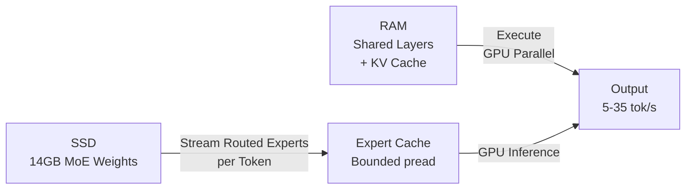

## Show HN: Open-source engine running Gemma 4 26B in 2 GB RAM on any M-series Mac

開源推理引擎 TurboFieldfare 實現在 M-series Mac 上用 2GB 內存運行 4-bit 量化的 Gemma 4 26B 模型。核心創新是將模型共享層與 KV cache 保留在 RAM，其餘 14GB 權重的 MoE 專家層按需從 SSD 流式傳輸。GPU 在等待 SSD 讀取期間執行共享層，通過受控並行讀取與專家 cache 避免持續瓶頸。M2 MacBook Air 達 5–6 tok/s，M5 MacBook Pro 達 31–35 tok/s。支援 OpenAI 相容 API、流式輸出、工具呼叫和 KV cache 前綴重用。

### 重點
- MoE 流式傳輸技術：將 SSD 上 14GB 的專家層按需讀取，GPU 同時執行共享層，僅用 2GB 內存突破傳統限制
- 性能量化驗證：M2 8GB MacBook Air 達 5–6 tok/s，M5 達 31–35 tok/s，相較傳統方案大幅提升
- Swift/Metal 實現、OpenAI 相容伺服器、工具呼叫、流式輸出和 KV 快取前綴重用支援

**原文：** [hackernews](https://github.com/drumih/turbo-fieldfare)

---

### 📄 原文內容

點此展開 / 收合

# Show HN: Open-source engine running Gemma 4 26B in 2 GB RAM on any M-series Mac

Hi HN, I built a specialized inference engine for running 4-bit Gemma 4 26B-A4B-IT on any M-series Mac using about 2 GB of RAM. It is called TurboFieldfare and is written in Swift and Metal. I have always adored on-device AI. It feels like magic that you can run a powerful NN on your Mac or iPhone. So I wanted to push the limits a bit and run a model whose weights don’t fit in memory. The model’s 4-bit quantized weights occupy roughly 14 GB, which makes running it with conventional inference tools almost impossible on an 8 GB or even 16 GB Mac once the OS, applications, and KV cache are included. The trick is to keep the shared part of the model and the KV cache in RAM, then stream only the routed experts needed for each token from SSD. An SSD is way slower than RAM, so the runtime uses a small expert cache and bounded parallel `pread`. While those reads are in flight, the GPU runs the shared part of the layer. I ran more than 100 experiments. Most didn’t work. A few got me here. The experiments are described in the GitHub repo. It currently generates 5–6 tok&#x2F;s on an 8 GB M2 MacBook Air and 31–35 tok&#x2F;s on an M5 MacBook Pro. I also added an experimental OpenAI-compatible local server. It supports streaming and tool calls, and reuses one prompt prefix from the KV cache. Try it! The Mac app is easy to install. On the first run, it will download 15 GB of weights from Hugging Face. The model is surprisingly capable. I would love any kind of feedback!

