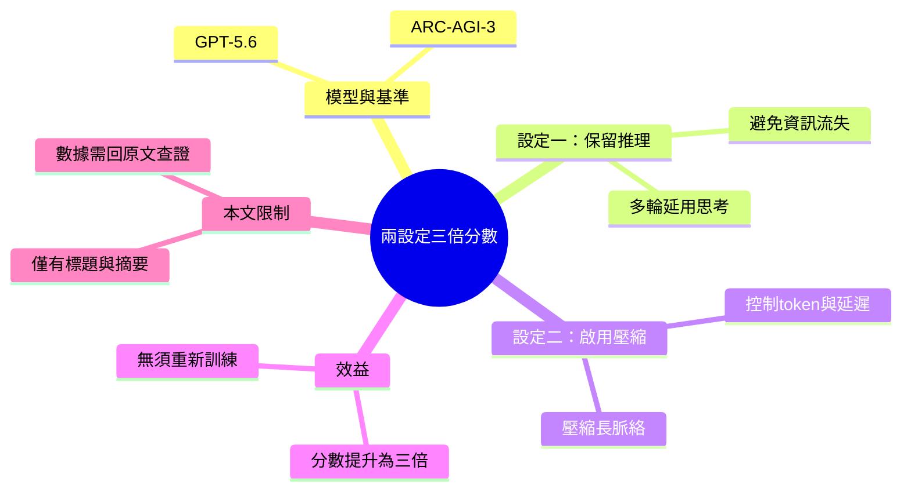

## How enabling two settings tripled our scores on the ARC-AGI-3 benchmark

OpenAI 發現在 GPT-5.6 上啟用兩個 API 設定——保留推理能力（retaining reasoning）與啟用壓縮（enabling compaction）——可將 ARC-AGI-3 基準測試分數提升 300%。此項技巧無須重新訓練，直接透過設定調整實現性能與效率的雙重改進，適用於需要強邏輯推理的應用場景。

### 重點
- 兩項 API 設定組合：保留推理 + 啟用壓縮，對 GPT-5.6 直接生效
- ARC-AGI-3 基準測試分數提升 3 倍（300%）
- 兼具性能改善與成本效率提升，無需模型重訓練

**原文：** [openai-blog](https://openai.com/index/how-two-settings-tripled-our-arc-agi-3-scores)

---

<!-- deep-analysis:begin -->
## 📌 摘要 (TL;DR)

- OpenAI 在官方部落格說明：在 GPT-5.6 上啟用兩個 API 設定——保留推理（retaining reasoning）與啟用壓縮（enabling compaction）——即可讓 ARC-AGI-3 基準測試分數提升為原本的三倍（tripled）。
- 這兩項改進**不需重新訓練模型**，純粹透過 API 設定調整就同時改善了分數與執行效率。
- 對照 brief 摘要的說法，此技巧特別適用於需要強邏輯推理的 agent / 長鏈任務場景。
- ⚠️ 限制聲明：本次可取得的原文內容僅有標題與一句話摘要，**未包含實際分數數字、實驗方法、對照組與圖表**；以下整理以此為限，精確數據請回到 OpenAI 原始頁面查證。

## 🎯 核心概念

- **保留推理（retaining reasoning）**：在多輪互動或 agent 迴圈中，把模型上一步產生的推理內容保留下來供後續延續使用，而非每一輪都丟棄重來（以下為此 API 詞彙的一般理解，原文未給機制細節）。
- **啟用壓縮（enabling compaction）**：對逐漸變長的脈絡（context）進行壓縮，用以控制 token 用量與延遲，維持長對話下的效率。
- **ARC-AGI-3**：ARC-AGI 系列的抽象與推理基準測試之一，用來衡量模型的邏輯推理與泛化能力（系列背景屬一般知識，本文未詳述其題型）。
- **GPT-5.6**：本文用來測試上述兩項設定的 OpenAI 模型版本。

## 📖 整理分析

### 1. 核心宣稱：兩設定，三倍分數
OpenAI 表示，只要在 GPT-5.6 上開啟「保留推理」與「啟用壓縮」兩個設定，ARC-AGI-3 的分數就能提升為原本的三倍。重點在於這是**設定層級（configuration-level）**的調整，不涉及重新訓練或更換模型權重，屬於「調參數就見效」的類型。

### 2. 兩個設定分別在做什麼
保留推理指的是讓模型在連續步驟間延用先前的思考過程，避免每輪重新推理造成的資訊流失；啟用壓縮則是在脈絡變長時做壓縮，兼顧成本與速度。兩者搭配的效果是「分數與效率雙升」——這也是標題強調 boosting *scores and efficiency* 的原因。（註：此段為這兩個 API 概念的一般性說明，原文未提供實作機制。）

### 3. 意義與本文限制
若宣稱屬實，代表在需要長鏈邏輯推理的任務中，善用既有 API 設定就能大幅拉高表現，而不必等待下一代新模型。但必須誠實指出：本次來源僅提供標題與摘要，缺乏實際分數、對照基準與圖表，因此無法在此重述具體數字或複現實驗。讀者若需引用數據，應以 OpenAI 原始頁面為準。

## 🧠 Mindmap

<!-- deep-analysis:end -->
### 📄 原文內容

點此展開 / 收合

How two API settings improved GPT-5.6 performance on ARC-AGI-3, boosting scores and efficiency by retaining reasoning and enabling compaction.

