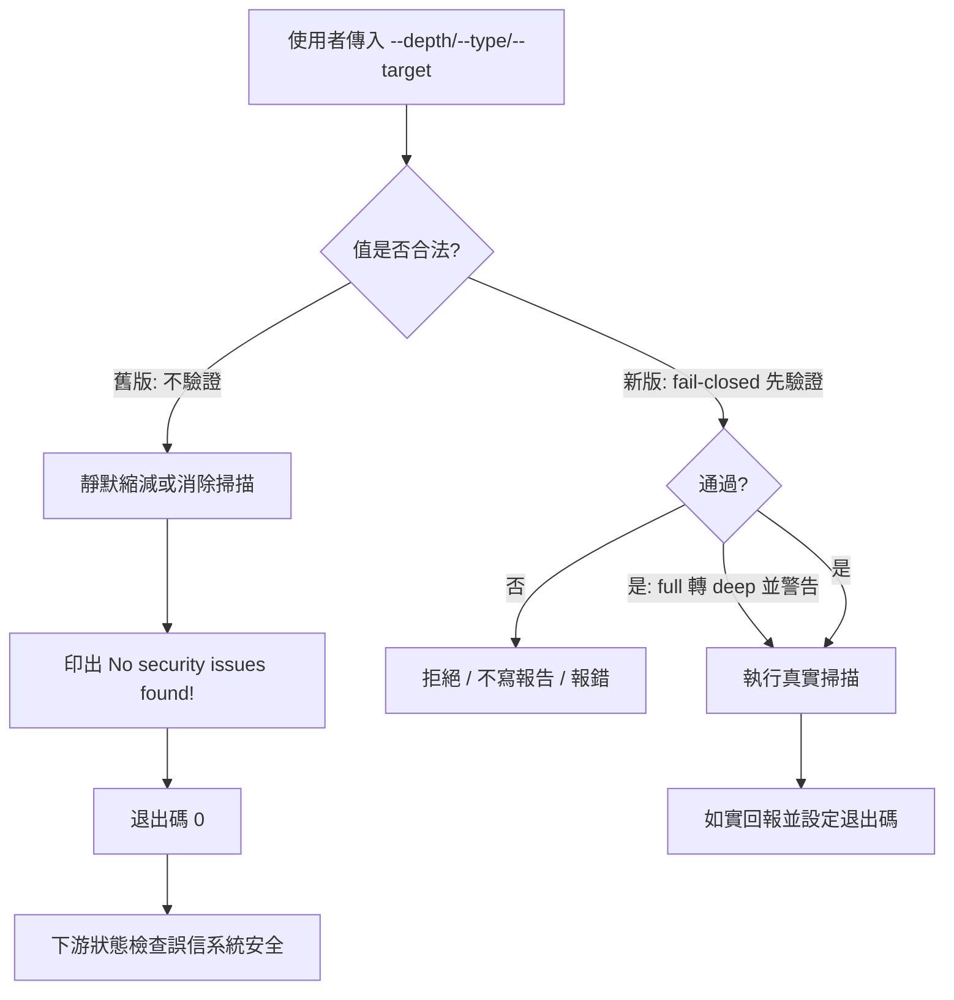
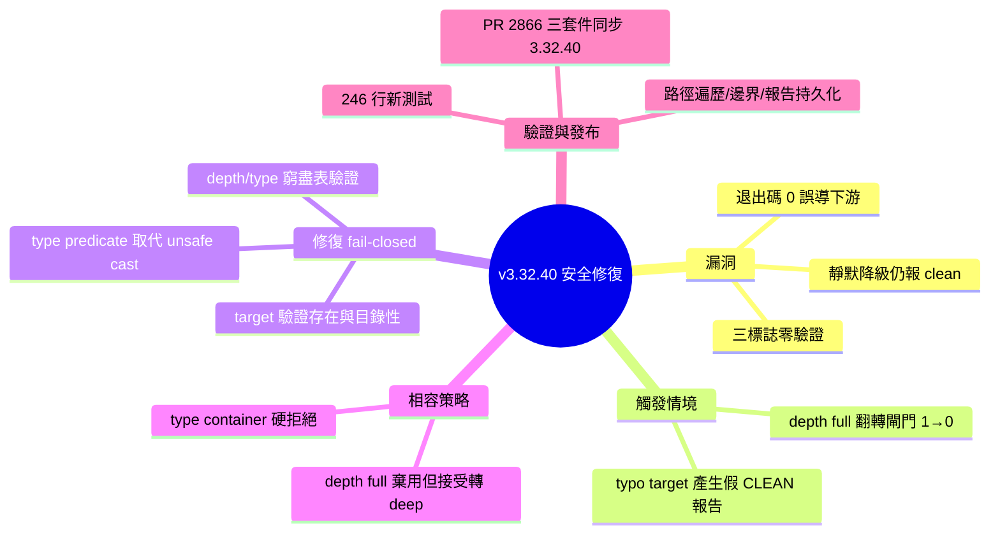

## v3.32.40 — security scan fail-closed on invalid --depth/--type/--target

Ruflo v3.32.40 修復安全掃描的嚴重驗證缺陷。security scan 命令對 --depth、--type、--target 標誌進行零驗證，未識別的值被默默接受，掃過後仍輸出虛假的「未發現安全問題」並以退出碼 0 結束，誘導下游狀態檢查認為系統安全。修復後三個標誌採用 fail-closed 驗證：--depth/--type 針對窮盡列表驗證，--target 驗證存在性和目錄性。--depth full 從 CLI 自有文字出現但非真實值，現改為棄用-但-接受並轉換為 deep。新增 246 行測試覆蓋深度預算邊界、路徑遍歷嘗試、拒絕後無持久化報告。

### 重點
- 安全掃描對 --depth/--type/--target 零驗證，未識別值虛報清潔退出碼 0，誘導下游檢查
- --depth full 因 CLI 公告誤傳，現棄用-但-接受並轉為 deep
- 246 行新測試，fail-closed 驗證覆蓋深度預算邊界、路徑遍歷和拒絕狀態

**原文：** [ruflo-releases](https://github.com/ruvnet/ruflo/releases/tag/v3.32.40)

---

<!-- deep-analysis:begin -->
## 📌 摘要 (TL;DR)

- Ruflo v3.32.40 修復 `ruflo security scan` 命令的嚴重安全缺陷：`--depth`、`--type`、`--target` 三個標誌完全未做驗證。
- 未識別的值不會報錯，反而靜默縮減或消除整個掃描，卻仍印出「No security issues found!」並以退出碼 0（exit 0）結束，誤導下游狀態檢查認定系統安全。
- 兩個實測情境：`--depth full`（CLI 自己輸出的假值）把 critical/high 退出碼閘門從 1 悄悄翻成 0；打錯字的 `--target` 產出被信任的 CLEAN 持久化報告。
- 修復後三個標誌一律 fail-closed：掃描或寫入任何內容之前先驗證，無效即拒絕。
- 新增 246 行測試（PR #2866）；`@claude-flow/cli`、`claude-flow`、`ruflo` 三套件同步至 3.32.40，`latest`／`alpha`／`v3alpha` dist-tags 全部指向此版。

## 🎯 核心概念

- **失效關閉／故障即拒**（fail-closed）：當輸入無效或無法確認時，系統選擇拒絕而非放行，避免因錯誤而默默降低防護。
- **退出碼閘門**（exit-code gate）：以退出碼 0/1 作為 CI/pipeline 判斷是否有嚴重問題的關卡；本漏洞讓它被繞過。
- **路徑遍歷**（path traversal）：透過構造路徑（如 `../`）跳出預期掃描範圍的攻擊手法，測試特別針對此驗證。
- **類型判定式**（type predicate）：TypeScript 中用來安全縮小型別的函式，取代可能靜默停用遞迴限制器的不安全轉型（unsafe cast）。

## 📖 整理分析

### 1. 漏洞本質：零驗證的靜默降級
`ruflo security scan` 對 `--depth`、`--type`、`--target` 三個標誌沒有做任何驗證。傳入無法識別的值時不會出錯，而是靜默地縮減甚至消滅掃描範圍，同時仍照常輸出「No security issues found!」並以退出碼 0 結束。結果是一次形同沒掃的掃描，卻對外呈現「乾淨」的假象。

### 2. 兩種被實測觸發的情境
第一種：在一個唯一的 HIGH 發現剛好落在淺層遍歷預算（shallow-traversal budget）之下的 fixture 上，使用 `--depth full`——這是 CLI 自己輸出的值，但實際上不是合法深度——使 critical/high 的退出碼閘門從 1 靜默翻轉成 0，等於漏報了嚴重問題。第二種：打錯字的 `--target` 產生一份被持久化的 CLEAN 報告，下游狀態檢查將其當作真實結果信任。

### 3. 修復設計：三標誌一律 fail-closed
修復後，三個標誌在掃描或寫入任何東西之前就先驗證，失敗即拒絕。`--depth`／`--type` 針對窮盡的 `Record<ScanDepth, number>` 對照表以真正的 type predicate 驗證，避免使用可能悄悄重新停用遞迴限制器的不安全轉型；`--target` 則驗證其存在性與是否為目錄。

### 4. `--depth full` 與 `--type container` 的差異處理
兩個「不存在的值」採取相反策略，考量的是相容性。`--depth full` 雖非真實值，卻散見於 CLI 自己的 statusline、公告、產生的 `CLAUDE.md` 與隨附 agents，因此改為「棄用但接受」——轉換成 `deep` 並發出警告，而不是讓所有被要求使用它的呼叫端全部壞掉。相對地，`--type container` 是曾宣傳卻從未實作的功能，現在改為硬拒絕（hard-reject），任何傳入它的 pipeline 都會失敗——這是刻意的破壞性變更，因為它先前會靜默回報乾淨並 exit 0。

### 5. 測試覆蓋與發布範圍
新增 246 行測試，涵蓋：依巢狀層級檢查深度預算邊界、大小寫敏感性、透過 `--type` 進行路徑遍歷的嘗試、stdout/stderr 分離，以及「被拒絕時不留下持久化報告」。此修復為私下透過 SECURITY.md 回報，並附外部重現與 patch。

## 🧭 流程圖 / 架構圖

## 🧠 Mindmap

<!-- deep-analysis:end -->
### 📄 原文內容

點此展開 / 收合

Fixed 
 Security (reported privately via SECURITY.md, external reproduction + patch): ruflo security scan validated none of its --depth , --type , or --target flags. An unrecognised value did not error — it silently reduced or eliminated the scan while still printing "No security issues found!" and exiting 0. On a fixture whose only HIGH finding sat below the shallow-traversal budget, --depth full → --depth full (the CLI's own emitted value) silently flipped the critical/high exit-code gate from 1 to 0, and a typo'd --target produced a persisted CLEAN report that downstream status checks trusted as genuine. 
 All three flags now fail closed before anything is scanned or written: 
 
 --depth / --type validated against exhaustive Record&lt;ScanDepth, number&gt; maps with real type predicates (no unsafe casts that could silently re-disable the recursion limiter) 
 --depth full (never a real value, but emitted by the CLI's own statusline/announcements/generated CLAUDE.md/shipped agents) is deprecated-but-accepted → deep , with a warning, rather than breaking every caller told to use it 
 --type container (advertised but never implemented) now hard-rejects instead of silently reporting clean — breaking for any pipeline passing it, previously exited 0 
 --target validated for existence and directory-ness 
 
 246 lines of new tests cover depth-budget boundaries by nesting level, case sensitivity, a path-traversal-via- --type attempt, stdout/stderr separation, and no-persisted-report-on-rejection. 
 PR: #2866 
 Packages 
 `@claude-flow/cli`, `claude-flow`, and `ruflo` are all at 3.32.40 ; `latest`, `alpha`, and `v3alpha` dist-tags all point to it.

