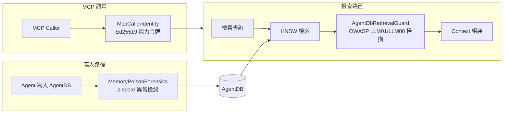
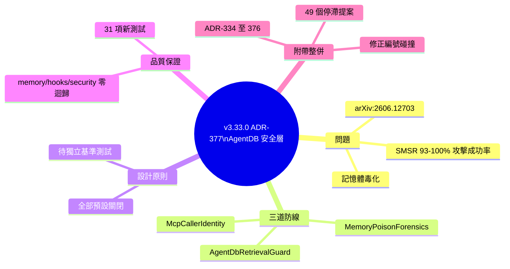

## v3.33.0 — ADR-377: AgentDB Retrieval Security Layer

Ruflo v3.33.0 發布 ADR-377 AgentDB 檢索安全層，針對 Agent 記憶體系統的毒化攻擊風險。根據 SMSR 研究（arXiv:2606.12703），AgentDB 檢索和寫入路徑未防禦時攻擊成功率達 93–100%。本版本實施三層防禦機制：AgentDbRetrievalGuard 在 HNSW 檢索後通過 OWASP LLM01/LLM08 pattern scan 過濾結果；MemoryPoisonForensics 對寫入序列進行滾動窗口 z-score 異常檢測；McpCallerIdentity 提供 Ed25519 逐次調用能力令牌。所有防禦層預設關閉，待獨立基準測試後啟用。新增 31 項測試，跨記憶體、hooks、security 三套件完整測試零迴歸（451+145+570 行）。同時整合 49 個停滯研究提案並解決 ADR 編號碰撞。

### 重點
- AgentDB 記憶體毒化攻擊成功率 93–100%，實施三層防禦框架：檢索過濾 + 異常檢測 + 身份認證
- 31 個新測試覆蓋三套件，零迴歸；整合 49 個停滯提案、解決 ADR 編號碰撞
- 全部防禦層預設關閉，待獨立基準測試驗證後才啟用

**原文：** [ruflo-releases](https://github.com/ruvnet/ruflo/releases/tag/v3.33.0)

---

<!-- deep-analysis:begin -->
## 📌 摘要 (TL;DR)

- Ruflo 發布 **v3.33.0**，落地 **ADR-377「AgentDB 檢索安全層」**，處理 Agent 記憶體系統的記憶體毒化（memory poisoning）風險（Closes #2516、追蹤於 #2873）。
- 根據 SMSR 研究（arXiv:2606.12703），AgentDB 的檢索與寫入路徑在未設防時，攻擊成功率高達 **93–100%**。
- 本版本以三階段（PR #2874）實作三道防線：`AgentDbRetrievalGuard`、`MemoryPoisonForensics`、`McpCallerIdentity`，且**全部預設關閉**，待獨立基準測試後才啟用。
- 新增 **31 項測試**、跨三個套件零迴歸（memory 451、hooks 145、security 570 行完整測試套件重跑通過）。
- 順帶整併 **49 個停滯的 dream-cycle 研究提案**（自 2026-05-29 起未合併）為 ADR-334～ADR-376，並解決 ADR-147/179/320 的編號碰撞。
- 發布套件：`@claude-flow/cli@3.33.0`、`claude-flow@3.33.0`、`ruflo@3.33.0`。

## 🎯 核心概念

- **記憶體毒化（memory poisoning）**：攻擊者向 Agent 的長期記憶寫入惡意內容，使其在日後被檢索並注入上下文時操縱模型行為。
- **AgentDB**：Ruflo 中儲存 Agent 記憶的向量資料庫，使用 **HNSW** 近似最近鄰演算法做相似度檢索。
- **ADR（Architecture Decision Record）**：架構決策紀錄，本次核心為編號 377。
- **OWASP LLM01/LLM08**：OWASP LLM 風險清單中的「提示注入」與「向量／嵌入弱點」類別，作為 pattern 掃描依據。
- **z-score 異常檢測**：以滾動窗口統計偏離程度，找出寫入序列中的離群行為。
- **Ed25519**：橢圓曲線數位簽章演算法，用於逐次調用的能力令牌。

## 📖 整理分析

### 1. 問題：檢索與寫入零防禦
在此版本之前，AgentDB 的檢索與寫入路徑沒有任何「經認證」的防禦機制。引用 SMSR（arXiv:2606.12703）的量化結果，在未設防狀態下記憶體毒化的攻擊成功率為 **93–100%**，等於幾乎必定被攻破，因此需要專門的安全層。

### 2. 第一道防線：AgentDbRetrievalGuard
位於 `@claude-flow/memory` 套件。它在 HNSW 檢索出結果後、組裝進上下文（context assembly）之前，讓結果通過 `ToolOutputGuardrail` 的 **OWASP LLM01/LLM08 pattern 掃描** 進行過濾。透過環境變數 `CLAUDE_FLOW_RETRIEVAL_GUARD` 啟用，`_STRICT` 為嚴格模式。

### 3. 第二道防線：MemoryPoisonForensics
位於 `@claude-flow/hooks` 套件。針對 AgentDB 的寫入序列做 **滾動窗口 z-score 異常檢測**，觀察指標包含寫入間隔（write-interval）與內容長度（content-length），用以偵測非正常的寫入模式。可設定 `CLAUDE_FLOW_POISON_FORENSICS=0` 關閉。

### 4. 第三道防線：McpCallerIdentity
位於 `@claude-flow/security` 套件，提供 **Ed25519 逐次調用（per-invocation）能力令牌**，用於驗證 MCP 呼叫方身分。以 `CLAUDE_FLOW_MCP_CALLER_AUTH` 控制，預設關閉，等待後續一份「金鑰分發」ADR 才完整啟用。

### 5. 其他整併與品質保證
除安全層外，PR #2871 把 **49 個自 2026-05-29 起始終未合併的 dream-cycle 研究提案** 整併為 ADR-334～ADR-376，並在過程中解決 ADR-147/179/320 的編號碰撞；PR #2872 則從一個未開 PR 的廢棄 dream-cycle 分支中「救回」ADR-377 本身。品質方面新增 **31 項測試**，三套件完整測試（memory 451、hooks 145、security 570）重跑皆乾淨、**零迴歸**。

## 🧭 架構圖

## 🧠 Mindmap

<!-- deep-analysis:end -->
### 📄 原文內容

點此展開 / 收合

AgentDB Retrieval Security Layer (ADR-377) 
 Closes #2516 / tracked in #2873 : AgentDB's retrieval and write paths had zero certified defenses against memory poisoning (undefended attack success 93–100% per SMSR, arXiv:2606.12703). Full 3-phase implementation shipped in #2874 , all off by default until independently benchmarked. 
 
 AgentDbRetrievalGuard ( @claude-flow/memory ) — filters HNSW retrieval results through ToolOutputGuardrail 's OWASP LLM01/LLM08 pattern scan before context assembly. CLAUDE_FLOW_RETRIEVAL_GUARD / _STRICT . 
 MemoryPoisonForensics ( @claude-flow/hooks ) — rolling-window z-score anomaly detection on AgentDB write sequences (write-interval, content-length). CLAUDE_FLOW_POISON_FORENSICS=0 to disable. 
 McpCallerIdentity ( @claude-flow/security ) — Ed25519 per-invocation capability tokens. CLAUDE_FLOW_MCP_CALLER_AUTH , off by default pending a follow-on key-distribution ADR. 
 
 Also in this release: 
 
 #2871 — consolidated 49 stale dream-cycle research proposals (open since 2026-05-29, never merged) into ADR-334 through ADR-376, resolving the ADR-147/ADR-179/ADR-320 numbering collisions along the way. 
 #2872 — recovered ADR-377 itself from an abandoned dream-cycle branch that never got a PR opened for it. 
 
 31 new tests across the three touched packages, zero regressions (memory 451, hooks 145, security 570 full suites re-run clean). 
 Packages 
 
 @claude-flow/cli@3.33.0 
 claude-flow@3.33.0 
 ruflo@3.33.0 
 
 🤖 Generated with Claude Code

