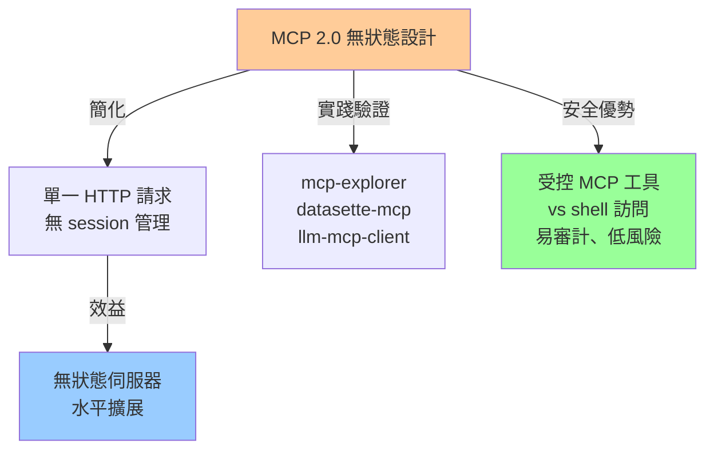
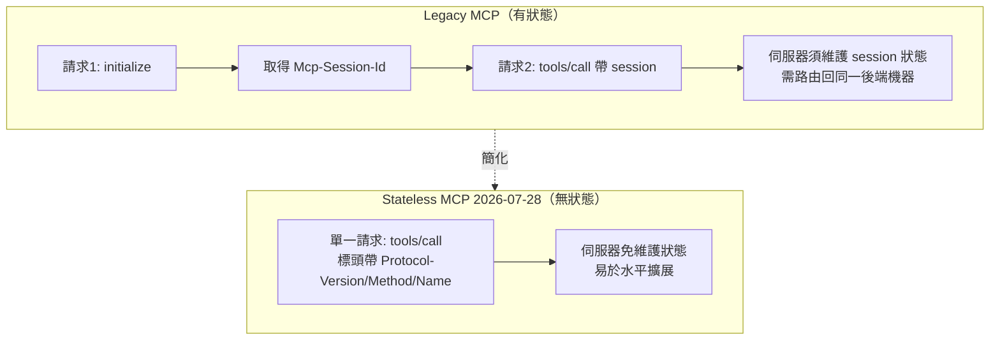
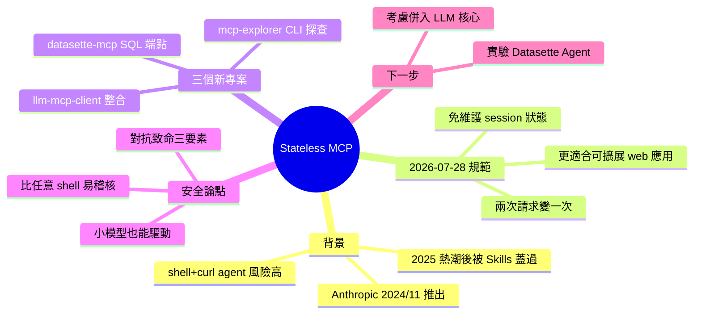

## Stateless MCP has recaptured my interest (and inspired mcp-explorer and datasette-mcp)

Simon Willison 深度分析 MCP 2.0（官方規範日期 2026-07-28）的無狀態設計革新，相比舊版本需要兩次 HTTP 請求（含 session ID 管理），新版本簡化為單一請求，大幅降低伺服器狀態管理複雜度，更適於可擴展 web 應用。Willison 在一週內實現三個新工具驗證此改進：mcp-explorer（交互式 CLI 工具探查 MCP 伺服器）、datasette-mcp（Datasette 插件提供 SQL 查詢能力）、llm-mcp-client（LLM 工具的 MCP 集成）。核心觀點是 MCP 相比任意 shell+curl 訪問更安全易審計、更適合小型模型，是構建敏感應用的更優選擇；無狀態設計也大幅簡化客戶端與伺服器實現。

### 重點
- MCP 2.0 無狀態設計將雙次 HTTP 往返簡化為單一請求，消除 session 管理負擔，使無狀態伺服器與水平擴展成為可能
- 三大開源工具實踐（mcp-explorer / datasette-mcp / llm-mcp-client）驗證無狀態 MCP 實現簡便性，可直接用 uvx 執行無需安裝
- MCP 相比任意 shell+curl 訪問更安全易審計，小型模型亦能有效驅動，更適用於敏感應用；無狀態設計大幅降低客戶端伺服器實現複雜度

**原文：** [simon-willison](https://simonwillison.net/2026/Jul/31/stateless-mcp/#atom-everything)

---

<!-- deep-analysis:begin -->
## 📌 摘要 (TL;DR)

- Simon Willison 認為 2026-07-28 版的 Model Context Protocol（俗稱 MCP 2.0 / Stateless MCP）是 MCP 自推出以來最重大的改動，也重新點燃了他對這個協定的興趣。
- 舊版「有狀態」MCP 呼叫工具需要兩次 HTTP 請求（先 `initialize` 取得 `Mcp-Session-Id`，再 `tools/call`）；新版「無狀態」設計把它壓縮成單一請求，客戶端與伺服器實作都大幅簡化。
- 無狀態代表伺服器不必再維護 session 狀態、也不用把同一 session 綁到同一台後端機器，更適合可擴展的 web 應用。
- Willison 一週內做了三個專案驗證：mcp-explorer（用 uvx 執行的 CLI 探查工具）、datasette-mcp（給 Datasette 加 `/-/mcp` 端點的 SQL 查詢外掛）、llm-mcp-client（給他的 LLM 工具做 MCP 整合）。
- 核心觀點：相比給 agent 任意 shell + curl 存取，MCP 更容易稽核與控制、連筆電上的小模型也能驅動，是建構敏感應用時更安全的選擇。

## 🎯 核心概念

- **模型情境協定（Model Context Protocol，簡稱 MCP）**：Anthropic 於 2024 年 11 月推出的標準，用來向 LLM agent 框架公開新工具。
- **無狀態 MCP（Stateless MCP）**：2026-07-28 規範，用單一 HTTP 請求完成工具呼叫，不再需要 session ID。
- **技能（Skills）**：Anthropic 另一發明；當發現「終端機 + curl 的 agent harness」能更彈性地做到 MCP 大部分功能後，一度蓋過 MCP 的風頭。
- **致命三要素（Lethal Trifecta）**：Willison 提出的資料外洩風險概念，指使用者自由混搭工具時，避免資料外洩的責任被推給使用者本身。
- **Datasette**：Willison 開發的資料探索工具；datasette-mcp 讓它能被 agent 透過 SQL 查詢。

## 📖 整理分析

### 1. MCP 從熱潮到被 Skills 蓋過
MCP 於 2024 年 11 月由 Anthropic 推出，在 2025 年大部分時間掀起熱潮，之後因為 Skills 出現而降溫——大家發現一個能存取終端機與 curl 的 agent harness，能以更彈性的方式完成 MCP 大部分工作。Willison 在他的 2025 年回顧文中寫過這件事。

### 2. 為何重新回頭看 MCP
他指出，給 agent 一個可連網的 shell 環境風險很高，而且需要能力夠強的模型才能有效驅動。相較之下，MCP 工具更容易稽核與控制，簡單到連在筆電上跑的小模型也能合理地驅動它們。這是他重新投入 MCP 的主要理由。

### 3. 無狀態設計：兩次請求變一次
最清楚的對比來自 5 月 21 日介紹新規範 RC 的文章。舊版（他稱為 legacy MCP）要兩次 HTTP 請求：第一次 `method: initialize`（protocolVersion `2025-11-25`）取得 `Mcp-Session-Id`，第二次才用該 session 呼叫 `tools/call`。新版只需一次請求，改用標頭 `MCP-Protocol-Version: 2026-07-28`、`Mcp-Method`、`Mcp-Name`，並把 `clientInfo` 放進 `_meta`。這讓伺服器端不必再追蹤 session ID，也不用擔心把同一 session 路由回同一台後端機器，更適合可擴展的 web 應用。

### 4. 三個一週內完成的專案
**mcp-explorer**：他找不到好用的互動式 MCP 探查 CLI，於是請 Codex 幫忙做了一個無狀態 Python CLI，免安裝即可用 uvx 執行，例如 `uvx mcp-explorer list https://agentic-mermaid.dev/mcp`（探查 Ade Oshineye 的示範 MCP），另有 `inspect`（看輸入輸出的 JSON schema）與 `call`（帶參數呼叫工具）指令。
**datasette-mcp**：一個給任何 Datasette 實例加上 `/-/mcp` 端點的外掛。這是他第四次嘗試做這個外掛，靠新規範才做出滿意版本。它提供三個工具：`list_databases()`、`get_database_schema(database_name)`、`execute_sql(database_name, sql)`（目前唯讀）。接到 ChatGPT 或 Claude 後即可對 Datasette 跑 SQL；他在一次分享的 Claude 對話中問「Simon 最近說了什麼關於 MCP」，Claude 跑了 7 次 SQL 查詢才答出來。
**llm-mcp-client**：替他的 LLM 工具做官方 MCP 整合的 alpha 外掛，例如 `llm -T 'MCP("https://datasette.simonwillison.net/-/mcp")' 'count the notes'`（使用 LLM 0.32rc2），會輸出推理過程並回答「有 151 篇 notes」。他考慮把它併入 LLM 核心，並想在 Datasette Agent、llm-coding-agent 中實驗。

### 5. MCP 是更安全的 agent 建構方式
MCP 剛推出幾個月後，Willison 曾寫〈Model Context Protocol has prompt injection security problems〉，指出讓終端使用者自由混搭工具，等於把防範資料外洩的責任推給使用者——那正是他後來命名為「致命三要素」的雛型。但比起這個，具備任意 shell 與 curl 存取的通用 agent 更難確保安全。他認為 MCP 讓人更容易推理「agent 有哪些能力、可能出什麼錯」，因此打算在建構敏感的 LLM 應用時大量倚重 MCP。

## 🧭 流程圖 / 架構圖

## 🧠 Mindmap

<!-- deep-analysis:end -->
### 📄 原文內容

點此展開 / 收合

Tuesday was Stateless MCP day - the rollout of MCP 2.0, or the 2026-07-28 Model Context Protocol specification to use the more formal but less memorable name. This is the most significant change to the MCP spec since it first launched, and has also served to reignite my personal interest in the protocol. 
 For background: MCP is the Model Context Protocol, which describes a standard way to expose new tools to LLM-powered agent frameworks. It was introduced by Anthropic back in November 2024 , had a huge spike of interest through much of 2025, and then became somewhat eclipsed by Skills (another Anthropic invention) when it became apparent that an agent harness with access to a terminal and curl could do most of what MCP did in a more flexible way. I wrote about that in my review of 2025 . 
 I'm coming back around to MCP now. Giving an agent a shell environment with the ability to access the internet is fraught with risk , and requires a strong model that is capable of effectively driving such an environment. MCP tools are easier to audit and control, and simple enough that smaller models that run on a laptop can still drive them reasonably well. 
 The new stateless MCP specification also greatly decreases the complexity of implementing both clients and servers for the protocol. I built three of those this week! 
 What's easier with stateless MCP 
 The best demonstration of the difference between stateful and stateless MCP is in this May 21st blog post that introduced the RC for the new specification. It included a clear before-and-after example. 
 The older stateful MCP (I'm going to call it "legacy MCP") required two HTTP requests - the first to initialize a session and obtain a Mcp-Session-Id , and the second to actually call the tool: 
 POST /mcp HTTP/1.1
Content-Type: application/json

{
 "jsonrpc": "2.0",
 "id": 1,
 "method": "initialize",
 "params": {
 "protocolVersion": "2025-11-25",
 "capabilities": {
 },
 "clientInfo": {
 "name": "my-app",
 "version": "1.0"
 }
 }
}

POST /mcp HTTP/1.1
Mcp-Session-Id: 1868a90c-3a3f-4f5b
Content-Type: application/json

{
 "jsonrpc": "2.0",
 "id": 2,
 "method": "tools/call",
 "params": {
 "name": "search",
 "arguments": {
 "q": "otters"
 }
 }
}
 
 The new stateless way uses a single HTTP request which looks like this: 
 POST /mcp HTTP/1.1
MCP-Protocol-Version: 2026-07-28
Mcp-Method: tools/call
Mcp-Name: search
Content-Type: application/json

{
 "jsonrpc": "2.0",
 "id": 1,
 "method": "tools/call",
 "params": {
 "name": "search",
 "arguments": {
 "q": "otters"
 },
 "_meta": {
 "io.modelcontextprotocol/clientInfo": {
 "name": "my-app",
 "version": "1.0"
 }
 }
 }
}
 
 This is so much cleaner from both a client- and server-side implementation perspective. It's also a better fit for building scalable web applications, since now you don't need to maintain server-side state to keep track of those session IDs, or worry about routing the same session to the same backend machine. 
 mcp-explorer 
 I couldn't find a great CLI tool for interactively probing an MCP server, so I had Codex help build my own. 
 mcp-explorer is the result. It's a stateless Python CLI tool, so you don't even need to install it to try it out - it works with uvx like this: 
 uvx mcp-explorer list https://agentic-mermaid.dev/mcp 
 This queries Ade Oshineye's agentic-mermaid.dev demo MCP. The above command returns the following list of tools: 
 execute(code: string, timeoutMs?: integer) - Execute Mermaid SDK code
 Run JavaScript in an isolated sandbox; return a value.

describe_sdk(family: string, detail?: string) - Describe Mermaid SDK operations
 Return version-matched mutation operations for one diagram family.

render_svg(source: string, options?: object) - Render Mermaid as SVG
 Render a Mermaid source string to themeable SVG. Returns { ok, svg }.

render_ascii(source: string, useAscii?: boolean, targetWidth?: integer, options?: object) - Render Mermaid as text
 Render a Mermaid source string to text. Returns { ok, text }.

render_png(source: string, scale?: number, background?: string, fitTo?: object, options?: object) - Render Mermaid as PNG
 Rasterize a Mermaid source string to PNG. Returns { ok, png_base64 }.
...
 
 Then to inspect a tool: 
 uvx mcp-explorer inspect render_svg 
 This outputs a whole bunch of information, including the JSON schema of the inputs and outputs. 
 To call that tool and pass arguments to it: 
 uvx mcp-explorer call \
 https://agentic-mermaid.dev/mcp \
 render_svg \
 -a source ' graph TD; A--&gt;B ' \
 -a options ' {"padding":24} ' 
 Which returns: 
 {"ok":true,"svg":"&lt;svg xmlns=\"http://www.w3.org/2000/svg\" width=...
 
 To get just the raw SVG try adding | jq .svg -r to that command. I got back this image : 
 
 There are a few more commands in the README, but you get the general idea. I find building CLI tools like this to be a really productive way to get familiar with a specification, even if an agent writes most of the actual code. 
 datasette-mcp 
 The second project is datasette-mcp , a Datasette plugin which adds a /-/mcp endpoint to any Datasette instance. 
 This is probably the fourth time I've tried building this plugin, but thanks to the new stateless MCP specification I finally have a version that feels good to release. 
 It provides just three tools: list_databases() , get_database_schema(database_name) , and execute_sql(database_name, sql) . They do exactly what you would expect them to do - though execute_sql() is read-only for the moment. 
 Wire these into an agent, or a chat tool like ChatGPT or Claude, and they'll gain the ability to run SQL queries against your hosted Datasette instance. 
 So far I'm running it on the Datasette mirror of my blog, at datasette.simonwillison.net/-/mcp . It took a bit of fiddling to figure out how to attach that to ChatGPT and Claude, but I got there in the end. Here's a new TIL showing exactly how to do that. 
 Here's a shared Claude session where I asked it: 
 
 list tables in simonwillison.net 
 
 And then: 
 
 what has Simon said recently about MCP? 
 
 It ran 7 separate SQL queries to figure out the answer. 
 llm-mcp-client 
 My LLM tool is long overdue for an official MCP integration. The new alpha llm-mcp-client plugin is my attempt at exactly that: 
 llm install llm-mcp-client
llm -T ' MCP("https://datasette.simonwillison.net/-/mcp") ' ' count the notes ' 
 Here's the output (including reasoning trace, I'm using LLM 0.32rc2 ): 
 
 Considering note count 
 I see the question "count the notes" is probably asking me to tally up blog notes. It could also mean published notes or drafts, so there's some ambiguity there. I'll need to figure out the total number of notes, likely by querying the count for both published notes and drafts to get a clear answer. Let's execute that count! 
 There are 151 notes . 
 
 And the output of llm logs for that prompt. 
 Once this is fully baked, I'm considering bringing it directly into LLM core. I'm excited to experiment with MCP in Datasette Agent and llm-coding-agent as well. 
 MCP is a safer way to build with agents 
 A few months after MCP was first released, I wrote Model Context Protocol has prompt injection security problems , where I noted that the pattern of having end users mix and match tools pushed responsibility for avoiding data exfiltration attacks out to the users themselves. I hadn't coined the Lethal Trifecta yet, but that was absolutely what I had in mind. 
 Then general agents with arbitrary shell and curl access came along, and that's so much harder to keep secure! 
 Something I've come to appreciate about MCP is that it's much easier to reason about agent capabilities and what might go wrong than with arbitrary command execution in an open network environment - the default for most of today's general and coding agent tools. 
 I plan to lean into MCP a whole lot more when I'm building sensitive applications on top of LLMs. 
 
 Tags: projects , ai , datasette , mermaid , generative-ai , llms , llm , anthropic , model-context-protocol

