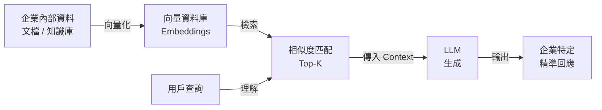

## Designing a Production-Ready RAG System: The Architecture Behind AI That Actually Knows Your Data

本文深入設計生產級 RAG（檢索增強生成）系統的架構原則。通用 LLM 如 ChatGPT 雖能解釋量子物理、編寫代碼，但無法理解企業內部資料。RAG 通過檢索–增強–生成的管道，使 AI 能存取和應用企業專有知識。本文揭示生產環境中必要的多層設計：數據準備、向量化、檢索優化、上下文管理、生成質量控制。

### 重點
- RAG 結合檢索和生成，使通用 LLM 具備企業知識訪問能力
- 生產級 RAG 需多層設計：數據集成、向量化、檢索排名、上下文優化、質量控制
- 克服通用模型無法理解專有資料的核心限制

**原文：** [medium-tag-llm](https://medium.com/@ronomahedi/designing-a-production-ready-rag-system-the-architecture-behind-ai-that-actually-knows-your-data-022ab66b728b?source=rss------large_language_models-5)

---

### 📄 原文內容

點此展開 / 收合

ChatGPT can explain quantum physics, write production-ready code, and summarize research papers. But ask it about your company&#x2019;s internal&#x2026; Continue reading on Medium »

