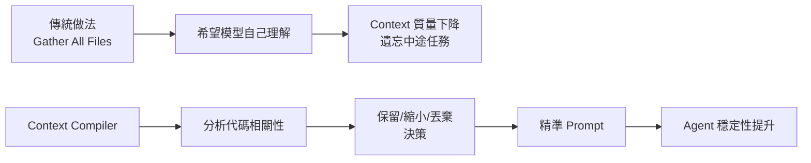

## Coding Agents Don’t Need Bigger Context Windows — They Need a Context Compiler

文章主張 coding agents 的瓶頸不在 context window 大小，而在 prompt 構造策略。傳統做法是盲目聚合代碼，導致無關信息與相關代碼搶奪模型注意力，最終 window 填滿時 agent 被迫壓縮自身記憶。新思路是將 prompt 構造視為編譯器：不是「加入所有代碼」，而是「決定保留什麼、縮小什麼、丟棄什麼」。這一框架從質量而非數量優化 context，避免了傳統「堆 token」方案的遞減收益。應用此原則可顯著改善 agent 在複雜任務中的穩定性和準確性。

### 重點
- Context compiler 框架：用編譯器邏輯決定 prompt 內容（保留/縮小/丟棄），而非堆疊所有代碼
- 問題根因：window 填滿時 agent 自我壓縮記憶，導致『遺忘』
- 質量優化 > 數量堆積：關鍵是內容選擇策略，不是更大的 window

**原文：** [medium-towards-data-science](https://towardsdatascience.com/coding-agents-dont-need-bigger-context-windows-they-need-a-context-compiler/)

---

### 📄 原文內容

點此展開 / 收合

# Coding Agents Don’t Need Bigger Context Windows — They Need a Context Compiler

Most coding agents treat prompt construction like retrieval: gather more files, add more context, hope the model figures it out. But that approach breaks down fast. As context grows, irrelevant code competes for attention, and when the window fills, agents start compressing their own memory—often mid-task. What looks like “forgetting” is usually just degraded context. This article explores a different approach: treating prompt construction like a compiler that decides what to keep, what to reduce, and what to discard entirely. 
 The post Coding Agents Don’t Need Bigger Context Windows — They Need a Context Compiler appeared first on Towards Data Science .

