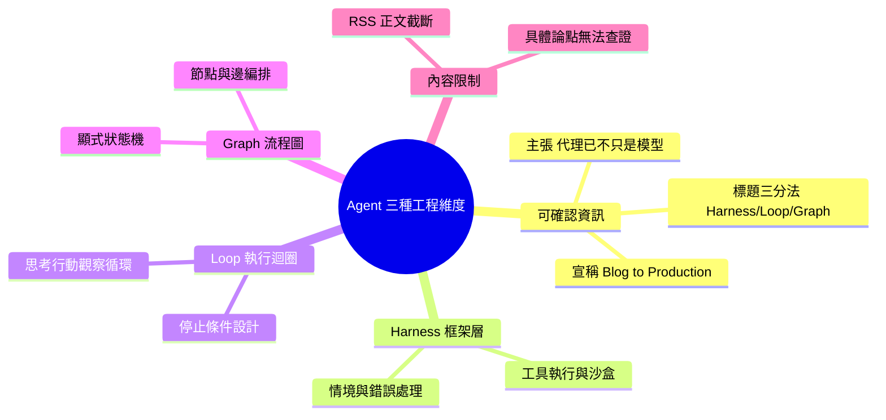

## Agent Harness Engineering vs Loop Engineering vs Graph Engineering: A Complete Blog to Production...

Medium 文章《Agent Harness Engineering vs Loop Engineering vs Graph Engineering: A Complete Blog to Production...》探討 AI Agent 系統的三種工程架構維度。核心觀點「AI Agents Aren't Just Models Anymore!」表示單純模型已不足以構建完整 Agent 系統，需整合 Harness（智能體框架）、Loop（執行循環）、Graph（數據流圖）等工程設計。文章宣稱提供從博客概念到生產部署的完整實現路徑。由於 RSS 摘要內容不足，完整分析需訪問原文。

### 重點
- AI Agent 架構涉及三個工程維度：Harness（框架）、Loop（執行循環）、Graph（圖結構）
- Agent 系統成熟度不僅取決於模型能力，工程化設計同樣關鍵
- 從概念到生產部署的完整實現路徑

**原文：** [medium-tag-llm](https://abhilashpuli.medium.com/agent-harness-engineering-vs-loop-engineering-vs-graph-engineering-a-complete-blog-to-production-882e0c2e083c?source=rss------large_language_models-5)

---

<!-- deep-analysis:begin -->
## ⚠️ 內容限制聲明

本則來源為 Medium 的 RSS 推送，`body_md` 僅擷取到標題與一句導言（「AI Agents Aren't Just Models Anymore! Continue reading on Medium »」），**正文內容遭 RSS 截斷、未能取得**。因此以下整理**無法引用文章的具體論點、數字、程式碼或架構圖**；為避免捏造，本文僅能：(1) 忠實呈現可確認的標題資訊，(2) 針對標題點名的三個名詞提供業界通用理解作為背景參考，並明確標註哪些屬於推測。若需完整分析，請點原文連結閱讀。

## 📌 摘要 (TL;DR)

- **可確認事實**：這是一篇由 Abhilash Puli 發表於 Medium 的文章，標題為《Agent Harness Engineering vs Loop Engineering vs Graph Engineering: A Complete Blog to Production...》，核心主張句為「AI Agents Aren't Just Models Anymore!」（AI 代理已不再只是模型）。
- **文章框架**：標題把 AI 代理（AI agent）系統的工程設計拆成三個維度對比——Harness（框架層）、Loop（執行迴圈）、Graph（狀態流程圖），並宣稱涵蓋「從部落格概念到生產部署」的完整路徑。
- **無法確認**：RSS 未提供正文，因此文章對這三者的具體定義、比較結論、範例程式碼與生產化建議**皆無法得知**，本文不予臆測。
- **為何值得關注（推論）**：這反映近期 AI 工程社群的共識趨勢——單靠放大模型參數已不足以構建可靠代理，圍繞模型的系統設計（工具執行、迴圈控制、流程編排）才是進入生產的關鍵。此為推論，非文章明述。

## 🎯 核心概念

> 以下三個定義為**業界通用理解**，用以協助讀者理解標題脈絡，**並非本文的具體主張**（正文已被截斷，無從查證作者如何定義）。

- **代理框架層（Agent Harness）**：包覆在大型語言模型（LLM）外層的基礎設施骨架，負責工具執行、情境管理、重試、沙盒與錯誤處理，把「模型」變成「代理」。Claude Code、各類 coding agent 的執行環境即屬此類。
- **迴圈工程（Loop Engineering）**：設計代理的思考—行動—觀察循環（如 ReAct 模式），決定迭代次數、停止條件，以及如何把工具回傳結果餵回模型。
- **流程圖工程（Graph Engineering）**：以顯式的狀態機或有向圖（如 LangGraph）建模代理工作流，將各節點（node）與邊（edge）明確化，換取可控性與可觀測性。

## 📖 整理分析

### 1. 唯一可確認的論點
文章標題與導言傳達的唯一明確訊息是：AI 代理系統的成敗，重心已從「模型本身」轉移到「圍繞模型的工程設計」。這與 2026 年 AI 工程圈的普遍論述一致，但**文章如何論證、給出哪些證據，因正文缺失無法呈現**。

### 2. 三種工程維度的對比意圖（推測）
標題以「vs」並列三者，暗示作者可能在比較它們的適用場景與取捨——例如 Harness 提供泛用能力、Loop 控制執行節奏、Graph 提供確定性編排。**但實際比較結論未知**，此段僅為對標題結構的合理解讀，非文章內容。

### 3. 「Blog to Production」的宣稱
標題結尾「A Complete Blog to Production」暗示文章走的是「概念→實作→上線」的教學路線，可能包含程式碼或部署範例。**具體實作細節、技術棧、部署平台皆無資料**，不予補完。

## 🧠 Mindmap

<!-- deep-analysis:end -->
### 📄 原文內容

點此展開 / 收合

AI Agents Aren&#x2019;t Just Models Anymore! Continue reading on Medium »

