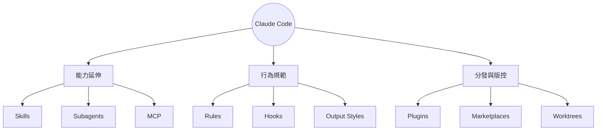
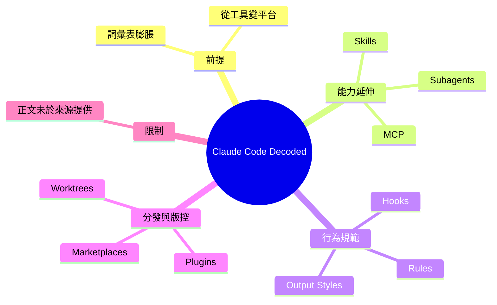

## Claude Code, Decoded

《Claude Code，解碼》介紹了 Claude Code 產品的快速演進和功能膨脹，已納入 Skills、Plugins、Hooks、Subagents、MCP、Rules、Output Styles、Worktrees 和 Marketplaces 等九大核心模組。這些功能的累積使 Claude Code 從單純的代碼編輯工具演變為功能豐富的開發生態系統。文章盤點了 Claude Code 詞彙表的擴張，反映了該平台從基礎工具向綜合開發平台的轉型。各模組之間的協作賦予了 Claude Code 支援複雜工程工作流的能力。

### 重點
- Claude Code 已整合 9 大功能模組：Skills、Plugins、Hooks、Subagents、MCP、Rules、Output Styles、Worktrees、Marketplaces
- 從單一代碼編輯器進化為多功能開發生態系統，支援複雜的工程協作流程
- MCP 集成使 Claude Code 能與外部工具和服務無縫協作，擴展平台能力

**原文：** [medium-tag-claude](https://medium.com/@m.kiran.prajapati/claude-code-decoded-39817fefbf6d?source=rss------claude-5)

---

<!-- deep-analysis:begin -->
> ⚠️ **資料來源限制**：本則 `body_md` 僅為 Medium 的 RSS 截斷摘要（結尾為「Continue reading on Medium »」），並未包含文章正文。以下整理中，**文章明確列出的 9 個名詞取自原文**；各名詞的定義說明則來自對 Claude Code 這些功能的既有認識，非原文逐字內容。文章對每項功能的具體論述、範例與結論**無法從來源取得**，故不臆測補寫。

## 📌 摘要 (TL;DR)

- 文章〈Claude Code, Decoded〉的核心前提：Claude Code 已累積出「龐大的詞彙表」（a massive vocabulary），從單一編碼工具演變為需要「解碼」理解的複雜體系。
- 原文明確點名 9 個關鍵詞：Skills、Plugins、Hooks、Subagents、MCP、Rules、Output Styles、Worktrees、Marketplaces。
- 這 9 個名詞橫跨「能力延伸、行為規範、分發生態、版控工作流」四個面向，反映 Claude Code 正從工具轉向開發平台。
- 讀者關注點：若要掌握 Claude Code，等於要理解這一整套術語如何互相搭配——而非只會下指令對話。
- ⚠️ 原文正文不在來源中，本文無法還原作者對每項功能的具體評論與案例。

## 🎯 核心概念

以下為原文列出的 9 個名詞之定義（依既有功能認識說明，非原文原句）：

- **技能（Skills）**：可重複使用的能力封裝（通常以 SKILL.md 描述），讓模型在需要時載入特定領域的專長。
- **外掛（Plugins）**：把指令、代理、hooks、MCP server 打包成可安裝的組件，方便分發與重用。
- **鉤子（Hooks）**：在 Claude Code 生命週期特定時點（如工具呼叫前後）自動執行的腳本，用於攔截、驗證或擴充行為。
- **子代理（Subagents）**：具獨立情境視窗與工具集的專責代理，主代理可將任務委派給它以保持主情境乾淨。
- **MCP**：模型情境協定（Model Context Protocol），連接 AI 與外部工具、資料來源的開放標準。
- **規則（Rules）**：以 CLAUDE.md 等形式提供的持久性指令，約束模型在專案中的行為。
- **輸出風格（Output Styles）**：自訂 Claude Code 回應的格式與語氣。
- **工作樹（Worktrees）**：對應 git worktree，支援在不同分支／目錄平行開發。
- **市集（Marketplaces）**：發現與安裝 plugins 的來源平台，構成生態系分發層。

## 📖 整理分析

> 以下依功能性質對 9 個名詞做分組歸納，屬結構化整理；原文對各項的具體論述無法從截斷摘要取得。

### 1. 標題「Decoded」的用意
原文開頭直言 Claude Code「已長出龐大的詞彙表」，並以「and…」暗示清單還在增長。標題〈解碼〉呼應此點：這些名詞多且相似，使用者容易混淆，文章的任務是把這套術語拆解清楚。

### 2. 能力延伸類：Skills、Subagents、MCP
這三者都在「讓 Claude 做更多事」。Skills 注入領域專長、Subagents 分派平行任務、MCP 接上外部工具與資料。三者共同把 Claude Code 的能力邊界從「對話生成程式碼」往外推。

### 3. 行為規範類：Rules、Hooks、Output Styles
這組控制「Claude 怎麼做、怎麼呈現」。Rules 給持久指令、Hooks 在流程節點強制執行檢查或動作、Output Styles 決定輸出樣貌。它們讓開發者能約束與客製化代理行為。

### 4. 分發與版控：Plugins、Marketplaces、Worktrees
Plugins 把上述能力打包，Marketplaces 提供發現與安裝管道，兩者構成生態系的分發層；Worktrees 則對接 git 的平行開發工作流。這說明 Claude Code 的擴張不只在功能，也在「如何被分享與整合進既有開發流程」。

## 🧭 架構圖

> 下圖為依功能性質對原文 9 個名詞做的歸類整理，非原文既有圖示。

## 🧠 Mindmap

<!-- deep-analysis:end -->
### 📄 原文內容

點此展開 / 收合

Claude Code has grown a massive vocabulary: Skills, plugins, hooks, subagents, MCP, rules, output styles, worktrees, marketplaces, and&#x2026; Continue reading on Medium »

