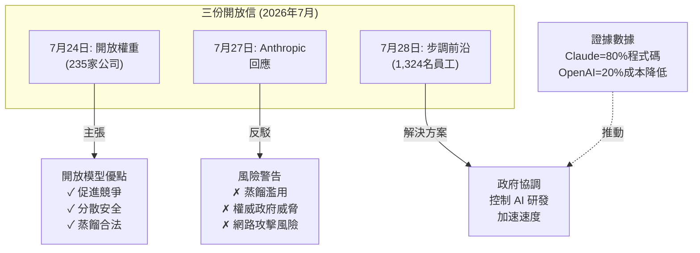

## Open letters about AI development

Microsoft 主導的開放信「開放權重與美國 AI 領導地位」（7月24日）獲235家公司簽署（含NVIDIA、Amazon、OpenAI等），主張開放權重模型不應被政府禁止，並支持蒸餾技術的合法性。三天後，Anthropic CEO Dario Amodei發表回應，反對大規模蒸餾，警告權威政府與模型濫用風險。7月28日，1,324名前沿AI公司員工（包括OpenAI的Pachocki、Anthropic的Amodei與Clark）發表「步調前沿」公開信，呼籲美國政府支持國際協作以控制自動化AI研發加速。背景包括Anthropic用Claude Code生成80%程式碼、OpenAI的Sol降低20%成本、Kimi K3為奈米模型設計晶片等，凸顯AI加速競爭風險。

### 重點
- 三方政策立場分歧：235家公司支持開放權重（含蒸餾），Anthropic與1,324名員工反對無限蒸餾，聚焦自動化AI研發加速風險
- 核心風險三角：自動化AI研發加速、國際競爭加劇、模型濫用（Anthropic 80%程式碼來自Claude Code，OpenAI Sol削減20%成本）
- 治理方案差異：開放陣營主張透明度與競爭促進安全，控制陣營主張政府介入調控前沿進展速度以防失控

**原文：** [simon-willison](https://simonwillison.net/2026/Aug/2/open-letters/#atom-everything)

---

### 📄 原文內容

點此展開 / 收合

# Open letters about AI development

Open letters about AI development 
 I wrote this summary of the past few weeks of open letters as a section of my sponsors-only newsletter but I've decided to share it here as well. 
 Open Weights and American AI Leadership was shepherded by Microsoft, dated July 24th, and signed by 235 AI-adjacent companies including NVIDIA (see Jensen's first ever tweet ), Amazon, Y Combinator, The Linux Foundation, and (a later signer) OpenAI. 
 It's clearly an argument designed to counter any instincts by the current US government to ban or limit open weight models over "safety" concerns - a reasonable consideration given what happened to Claude Fable 5 ! 
 
 Relying solely on closed models is not inherently safe: they can be breached, misused, or fail in ways that outsiders cannot detect. And concentrating advanced AI capabilities behind a small number of closed models compounds that risk. It results in a small number of single points of failure, weakens competition, and leaves critical technology in the hands of a few providers. Open weight models, on the other hand, allow a broad community of researchers and developers to examine their behavior, identify vulnerabilities, develop safeguards, and improve them over time. 
 
 The one surprising note in the letter is that it comes out in support of distillation, where models train on output from other models: 
 
 In shaping this ecosystem, policymakers should be careful not to conflate legitimate model-development techniques with misappropriation. Distillation, or the practice of using one model’s outputs to help train or improve another, is a widely used technique for model improvement, evaluation, and validation. It reflects a long tradition of learning from, building upon, and improving existing technologies, a tradition that has helped drive innovation since the rise of the open-source software movement. 
 
 Notably absent from the signatures: Anthropic, who published their own response Our position on open-weights models three days later. CEO Dario Amodei doubled down on the risk of authoritarian governments building "AI models that are more powerful than those built by the US", and models being "misused to carry out cyberattacks or biological attacks", and called for "a crack down on industrial-scale distillation operations ", while also stating that "Anthropic has never advocated for a ban on open-weights models". 
 Then on July 28th Pacing the Frontier was published, featuring signatures from "1,324 employees of frontier AI companies" - with names like Jakub Pachocki (Chief Scientist, OpenAI), Ilya Sutskever (Safe Superintelligence Inc, previously OpenAI), Dario Amodei (Anthropic), Jack Clark (Anthropic) and more. Their core message: 
 
 We request that the U.S. government support an international effort to develop the technical and governance tools needed to deliberately pace the frontier of automated AI development. 
 
 Their concern is intense competitive pressure combined with accelerated AI progress caused by automated AI research - and given that Anthropic produce 80% of their code with Claude Code , OpenAI had Sol reduce their end-to-end serving costs by 20% , and Kimi K3 designed a chip to serve a nano model built on its own architecture , you can see why people are taking that risk more seriously right now. 

 Tags: anthropic , generative-ai , openai , ai , llms , ai-ethics

