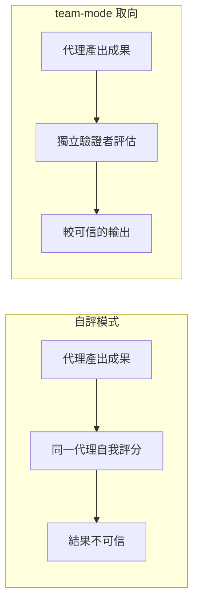
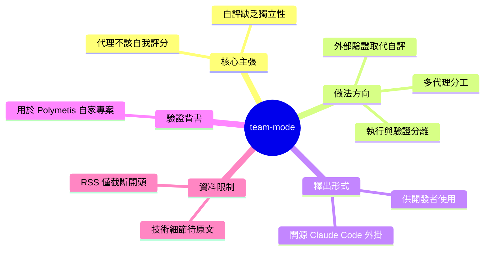

## Your AI Agent Shouldn’t Grade Its Own Homework

Polymetis Research 發布了 team-mode，一套多代理工程工作流程，已開放為 Claude Code 開源插件供開發者使用。Team-mode 直接解決了 AI 代理自我評分（self-grading）的可靠性問題，通過引入外部驗證機制替代自評，確保多代理協作的輸出品質。該工作流已在 Polymetis 自有生產項目中實戰驗證，證明了其實用性和健壯性。Team-mode 代表了從單代理工具向多代理協作框架的重要進展，為工程團隊提供了可信賴的多代理協調設計模式。此舉進一步豐富了 Claude Code 生態的企業級應用能力。

### 重點
- Team-mode 開源 Claude Code 插件解決核心難題：用外部驗證機制替代 AI 代理自評，確保品質
- 已在 Polymetis 生產環境驗證，提供可複製的多代理工程工作流參考實踐
- 樹立「多代理協作應採用第三方評驗」的設計原則，可跨場景應用於複雜工程系統

**原文：** [medium-tag-claude](https://polymetisresearch.medium.com/your-ai-agent-shouldnt-grade-its-own-homework-1e1a725c187b?source=rss------claude-5)

---

<!-- deep-analysis:begin -->
## 📌 摘要 (TL;DR)

- Polymetis Research 發布 **team-mode**，一套多代理（multi-agent）工程工作流程，並以開源 Claude Code 外掛（plugin）形式釋出。
- 文章核心主張來自標題比喻——「AI 代理不該自己批改自己的作業」，直指讓同一個代理自我評分（self-grading）的可靠性問題。
- team-mode 是 Polymetis 用來跑自家實際專案（production projects）的工作流程，代表從單代理工具走向多代理協作框架的方向。
- ⚠️ 來源限制：本文原文在 Medium，RSS 僅擷取到開頭一句（"...Continue reading on Medium »"）。以下整理以標題、開頭段與既有摘要為依據，未涵蓋原文完整技術細節；具體機制、角色設計與量化結果無法從可取得片段確認。

## 🎯 核心概念

- **自我評分 (self-grading / self-evaluation)**：讓產生輸出的同一個模型或代理去評判自己的成果，容易因偏好自身輸出、看不見自身錯誤而失準。
- **多代理工作流程 (multi-agent workflow)**：由多個分工角色的代理協作完成任務，可把「執行」與「驗證」拆開。
- **Claude Code 外掛 (plugin)**：把此工作流程包裝成可安裝進 Anthropic Claude Code 的擴充套件，供開發者直接取用。

## 📖 整理分析

### 1. team-mode 是什麼
Polymetis Research 發布 team-mode，並自述為「我們用來跑自家專案的多代理工程工作流程」，同時開源為 Claude Code 外掛。可從原文片段直接確認的資訊有三：它是多代理工作流、已用於自有專案、以開源外掛形式提供。

### 2. 標題的核心比喻
「不該自己批改自己的作業」是對 AI 代理自我評分的批評。當同一個代理既負責產出、又負責替自己打分，缺乏獨立性，評估結果自然不可信——這是全文的中心論點。

### 3. 方向：以外部驗證取代自評
依標題與既有摘要，team-mode 的設計取向是引入外部／獨立的驗證，取代單一代理的自我評分，藉由分工提升多代理協作的輸出品質。此為文章主張的方向，具體實作在可取得的片段中並未展開。

### 4. 資料限制說明
本次來源為截斷的 RSS 摘要，無法取得原文對 team-mode 角色設計、驗證流程、實作細節或成效數據的敘述。若需完整內容，請直接參考原始 Medium 文章。此處不對未出現於來源的技術細節做臆測。

## 🧭 概念對比圖

下圖為文章「自評 vs 外部驗證」核心比喻的概念示意（非 team-mode 官方架構圖）：

## 🧠 Mindmap

<!-- deep-analysis:end -->
### 📄 原文內容

點此展開 / 收合

We just published team-mode, the multi-agent engineering workflow we run our own projects on, as an open Claude Code plugin. Here is what&#x2026; Continue reading on Medium »

