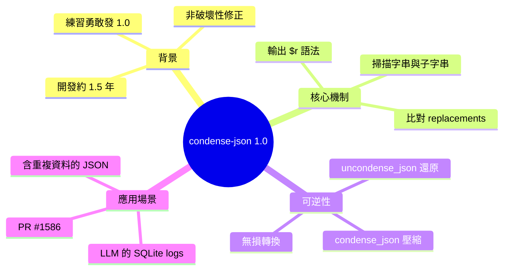

## condense-json 1.0

Simon Willison 發布了開發 1.5 年的 condense-json 函式庫 1.0 版本。此工具透過掃描 JSON 中與 replacements object 相符的字串片段，將其替換為特殊的 {"$r": ...} 語法格式，以達到無損壓縮重複資料的目的。使用者可透過 uncondense_json() 函式完全復原原始 JSON。該工具特別用於減少 LLM 生成的 SQLite 紀錄檔儲存空間（已在 PR #1586 中應用），適用於任何包含重複子串的 JSON 存儲場景。

### 重點
- condense-json 1.0 發布：用 {"$r": ...} 語法將相符字串替換為引用，實現無損壓縮，適用於高重複度 JSON
- 雙向操作：condense_json() 壓縮，uncondense_json() 還原，完全可逆，零資訊遺失
- 實務應用案例：Simon Willison 用於 LLM SQLite logs 壓縮，成功減少磁碟空間占用

**原文：** [simon-willison](https://simonwillison.net/2026/Aug/2/condense-json/#atom-everything)

---


<!-- deep-analysis:begin -->
## 📌 摘要 (TL;DR)

- Simon Willison 發布了 **condense-json 1.0**，這是一個已開發約 1.5 年的 Python 小型函式庫，他表示自己正在「練習更勇敢地發布 1.0 版本」，此版本僅做了合理且非破壞性的修正。
- 核心功能：`condense_json(input_json, replacements)` 會掃描 JSON 中與 replacements 對照表相符的字串或子字串，替換成特殊的 `{"$r": ...}` 語法，達到無損壓縮重複資料的效果。
- 壓縮結果可用 `uncondense_json(condensed, replacements)` 完全還原成原始 JSON，屬於可逆的無損轉換。
- 主要應用場景：減少 LLM 產生的 SQLite 紀錄檔（logs）儲存空間，最新實作見 PR #1586。
- 適合任何需要儲存「含有來自其他相關結構重複資料」的 JSON 場景。

## 🎯 核心概念

- **condense-json**：Simon Willison 開發的 Python 函式庫，用來壓縮含重複子字串的 JSON。
- **替換對照表（replacements object）**：一個以「代號 → 重複字串」定義的物件，例如 `{"1": "with foxes in it"}`，是壓縮與還原共用的字典。
- **`{"$r": ...}` 語法**：condense-json 用來標記「這是一個被拆解重組的字串」的特殊結構，內部是由字面片段與引用組成的陣列。
- **`{"$": "1"}` 引用**：在 `$r` 陣列中指向 replacements 裡代號為 `1` 的重複字串。

## 📖 整理分析

### 1. 運作範例：把重複字串抽出來
原始 JSON 內有多處出現子字串 `with foxes in it`（例如 `This is a string with foxes in it` 與 `another with foxes in it too`）。搭配替換對照表 `{"1": "with foxes in it"}` 後，`condense_json` 會把每個出現該子字串的地方拆解重組。

### 2. 壓縮後的輸出結構
以 `string` 欄位為例，`"This is a string with foxes in it"` 會被轉為 `{"$r": ["This is a string ", {"$": "1"}]}`；而 `"another with foxes in it too"` 因為重複片段在中間，會被拆成 `{"$r": ["another ", {"$": "1"}, " too"]}`。也就是說 `$r` 陣列交錯存放「字面片段」與「引用代號」，重複的長字串只在對照表存一份。

### 3. 掃描與可逆還原
函式會掃描字串「或子字串」是否存在於 replacements 中，命中就替換成 `$r` 語法。整個過程是無損的——呼叫 `uncondense_json(condensed, replacements)` 並提供同一份對照表，即可完整重建原始 JSON。

### 4. 設計目的與實際應用
此工具的設計動機是：當要儲存的 JSON 包含來自其他相關結構的重複資料時，能更省空間地存放。Simon 本人將它用於壓縮 LLM 工具產生的 SQLite 紀錄檔，最新一版整合可參考 PR #1586。標籤涵蓋 json、projects、python、llm。

## 🧭 流程圖 / 架構圖

```mermaid
flowchart LR
    A[原始 JSON<br/>含重複子字串] --> B[condense_json<br/>input_json, replacements]
    R[(replacements 對照表<br/>{"1": "with foxes in it"})] --> B
    B --> C[壓縮後 JSON<br/>使用 $r / $ 語法]
    C --> D[uncondense_json<br/>condensed, replacements]
    R --> D
    D --> A2[還原的原始 JSON<br/>與 A 完全一致]
```

## 🧠 Mindmap


<!-- deep-analysis:end -->
### 📄 原文內容

<details>
<summary>點此展開 / 收合</summary>

Release: condense-json 1.0 
 I'm trying to get braver at releasing 1.0 versions. This little library is a year and a half old now - I've applied some sensible and non-disruptive fixes and shipped the big 1.0 for it. 
 Here's an example of what it can do, lifted from the README: 
 {
 "foo" : {
 "bar" : {
 "string" : " This is a string with foxes in it " ,
 "nested" : {
 "more" : [ " Here is a string " , " another with foxes in it too " ]
 }
 }
 }
} 
 Combine that with a replacements object: 
 { "1" : " with foxes in it " } 
 And condense_json(input_json, replacements) produces the following: 
 {
 "foo" : {
 "bar" : {
 "string" : { "$r" : [ " This is a string " , { "$" : " 1 " }]},
 "nested" : {
 "more" : [ " Here is a string " , { "$r" : [ " another " , { "$" : " 1 " }, " too " ]}]
 }
 }
 }
} 
 It scans for strings or substrings that are present in that replacements object and replaces those with a special {"$r": ...} syntax in the output. 
 You can reverse the effect with uncondense_json(condensed, replacements) . 

 The idea is to make it easier to store JSON that includes duplicated data from other related structures. I use it to save space in the SQLite logs generated by LLM - see PR #1586 for the latest iteration of that. 
 
 
 Tags: json , projects , python , llm

</details>