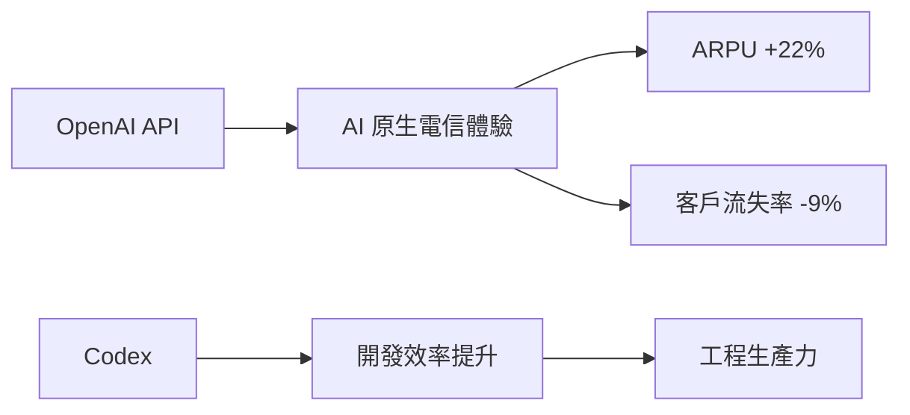
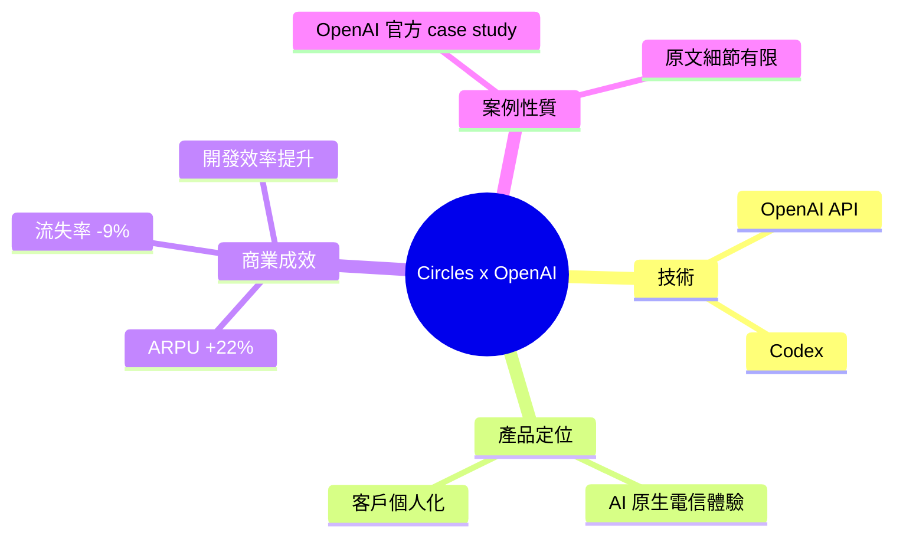

## Circles powers telco personalization with OpenAI technology

Circles 運用 OpenAI API 和 Codex 驅動電信業 AI 原生服務，實現顯著商業成效：年度經常性收入（ARPU）增加 22%，客戶流失率降低 9%，同時開發效率大幅提升。此案例展示大語言模型在電信客戶個人化領域的實際應用價值與投資報酬率，涵蓋營收成長、留存改善和工程生產力三大商業指標。

### 重點
- ARPU 增長 22%：直接營收提升，電信營收最關鍵指標
- 流失率下降 9%：客戶留存改善，降低客戶獲取成本壓力
- 開發效率提升：Codex 驅動工程團隊生產力增長（具體倍數未公開）

**原文：** [openai-blog](https://openai.com/index/circles)

---

<!-- deep-analysis:begin -->
## 📌 摘要 (TL;DR)

- 電信服務商 **Circles** 導入 **OpenAI API** 與 **Codex**，打造「AI 原生」（AI-native）的電信客戶體驗。
- 商業成效：**ARPU 提升 22%**、**客戶流失率（churn）降低 9%**，並提升工程開發效率。
- 這是 **OpenAI 官方發布的客戶案例（case study）**，用來佐證大型語言模型在電信個人化場景的實際投資報酬率（ROI）。
- ⚠️ 注意：本次提供的原文內容僅有標題與一句摘要，未包含技術架構、實作細節或方法說明；以下整理已避免臆測未載明的內容。

## 🎯 核心概念

- **AI 原生 (AI-native)**：產品體驗從設計之初就以 AI 為核心驅動，而非事後外掛。
- **ARPU (Average Revenue Per User)**：每位用戶平均貢獻的營收，是電信業衡量變現能力的核心指標（註：先前 brief 將其譯為「年度經常性收入 / ARR」有誤，電信語境下標準定義為「每用戶平均收入」）。
- **客戶流失率 (churn)**：一段期間內流失客戶占總客戶的比率，數字越低代表留存越好。
- **Codex**：OpenAI 的程式碼生成 / agentic coding 工具，此案例用於提升開發效率。

## 📖 整理分析

### 1. Circles 的定位與做法
Circles 是一家電信服務公司，透過 **OpenAI API** 搭配 **Codex**，將 AI 整合進電信服務的個人化（telco personalization）體驗。原文以「AI-native telco experiences」描述其產品定位，強調 AI 是體驗的核心驅動力。（原文未進一步說明具體的功能模組或系統設計。）

### 2. 三項可量化商業成效
案例主打三個對電信業關鍵的指標：**ARPU +22%**（變現能力）、**churn −9%**（客戶留存）、以及開發效率提升（工程生產力）。這三項分別對應「營收成長、留存改善、工程效率」三大商業維度，是 OpenAI 用來論證導入 LLM 之商業價值的典型指標組合。

### 3. Codex 帶動的工程生產力
除了面向終端用戶的 API 應用，Circles 另以 **Codex** 提升內部開發效率。這顯示此案例同時涵蓋「產品層（用 API 做個人化）」與「研發層（用 Codex 加速開發）」兩種 AI 應用路徑。（原文未提供效率提升的具體百分比或衡量方式。）

## 🧭 流程圖 / 架構圖

## 🧠 Mindmap

<!-- deep-analysis:end -->
### 📄 原文內容

點此展開 / 收合

Circles uses the OpenAI API and Codex to power AI-native telco experiences, increasing ARPU by 22%, reducing churn by 9%, and improving development efficiency.

