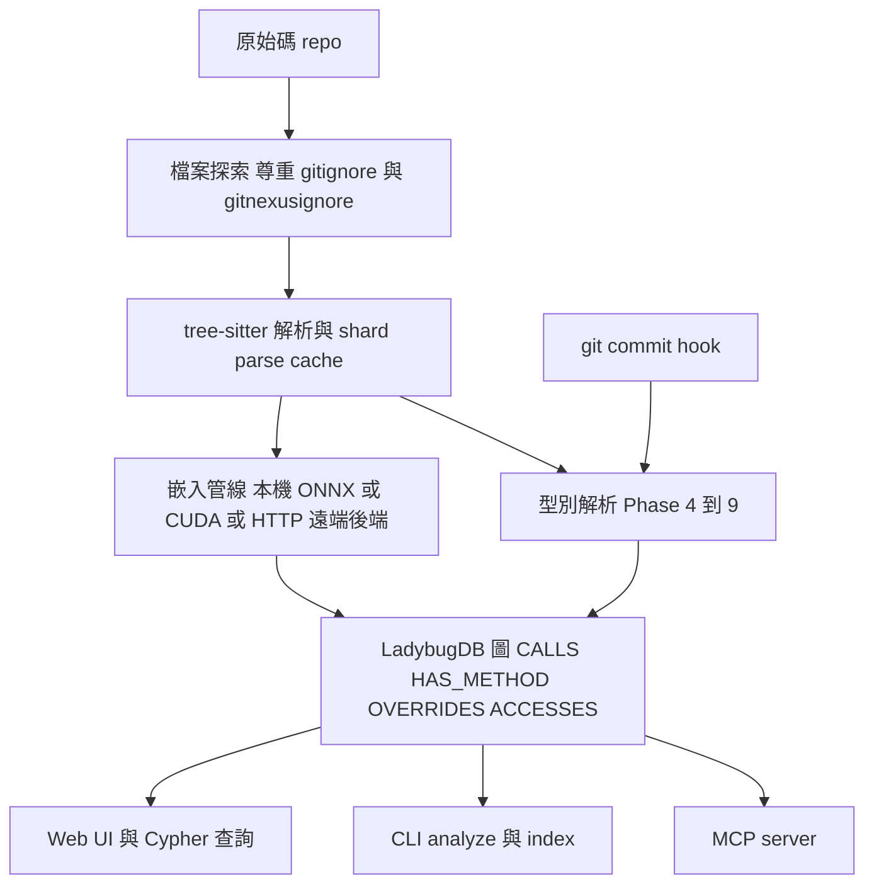
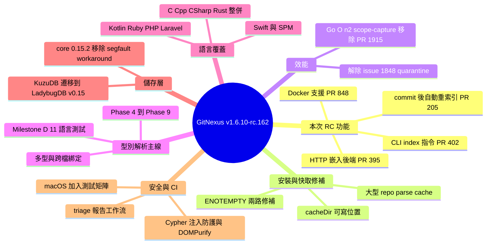

## Release Candidate v1.6.10-rc.162

GitNexus v1.6.10-rc.162 帶來型別推論系統的重大升級和多語言擴展。核心進展包括：分階段型別解析（Phase 4-8）現已涵蓋 10+ 語言，支援 nullable 解除包裝、for-loop 推型、鏈式呼叫、模式匹配和欄位存取追蹤；新增 Swift/iOS 完整支援（SPM 解析、建構器解析）、Ruby 方法級解析、PHP 8+/Laravel 完整支援（Eloquent 模型追蹤）、Kotlin 支援；Go 模組的 O(n²) scope-capture 重走被消除（效能大幅提升，解決隔離 #1848）。部署層面增加 Docker 支援和 HTTP 嵌入後端以支持自架端點，git commit 後自動重新索引且保留嵌入向量。資料庫從 KuzuDB 遷移至 LadybugDB v0.15。

### 重點
- 型別解析進入 Phase 8：支援 10+ 語言、nullable 解除、loop 推型、鏈式呼叫、pattern matching、欄位/屬性存取追蹤的完整框架
- 效能突破：消除 Go 模組 O(n²) scope-capture 重走，直接提升大型倉庫分析速度（PR #1915、隔離 #1848）
- 部署靈活性：Docker 容器支援 + HTTP 嵌入後端（支援自架推論）+ git commit 鉤子自動重新索引保留嵌入向量

**原文：** [gitnexus-releases](https://github.com/abhigyanpatwari/GitNexus/releases/tag/v1.6.10-rc.162)

---

<!-- deep-analysis:begin -->
## 📌 摘要 (TL;DR)

- GitNexus 釋出候選版本（release candidate）v1.6.10-rc.162，由 main 分支自動建置：來源 commit `f36c3eb`、版本樹 commit `0692e24`，安裝指令為 `npm install gitnexus@rc`；RC 屬 pre-stable，穩定版仍留在 latest dist-tag。
- 本次 RC 明列 5 項新功能：git commit 後自動重新索引且保留嵌入向量（PR 205）、HTTP 嵌入後端（PR 395）、Swift 支援補完（PR 408）、CLI `index` 指令註冊既有 `.gitnexus/` 目錄（PR 402）、Docker 支援（PR 848）。
- 效能只有一條但份量重：Go 的 O(n²) scope-capture 重走被移除（PR 1915），並解除 issue 1848 的 quarantine 狀態。
- 4 條 Bug Fix 全部落在安裝與快取穩定性：preinstall 清理避免 ENOTEMPTY（PR 843）、`env.cacheDir` 改到使用者可寫位置（PR 845）、devendor tree-sitter-proto 安裝生命週期（PR 846）、大型 repo 的 shard parse cache 持久化（PR 1580）。
- 「Other Changes」區段自 PR 3 一路列到 PR 503 之後，等同專案自初期以來的累積清單，其中最具結構性的是型別解析 Phase 4→9 與 Milestone D、KuzuDB→LadybugDB v0.15 資料庫遷移，以及 Swift / Kotlin / Ruby / PHP / C 系列語言支援。

## 🎯 核心概念

- **型別解析（type resolution）**：不依賴編譯器，從 AST 推導變數、回傳值與欄位的型別；PR 463 顯示解析失敗會直接造成 CALLS 邊為 0，可見它是呼叫圖正確性的前提。
- **TypeEnvironment API**（PR 274）：提供建構子推論與 self / this / super 解析的型別環境介面。
- **定點鏈式傳播（fixpoint chain propagation）**（PR 379）：Phase 9 用統一的定點迭代讓「回傳型別感知的變數綁定」傳播到收斂。
- **ACCESSES 邊（ACCESSES edge）**（PR 372）：新的邊型別，追蹤欄位的讀 / 寫存取；同族還有既有的 CALLS、HAS_METHOD、OVERRIDES。
- **MRO（Method Resolution Order）**（PR 238）：語言感知程式碼智能中用來決定方法解析順序的機制，搭配 symbol resolution 與建構子辨別。
- **SPM（Swift Package Manager）**（PR 94）：Swift / iOS 支援中用來解析 import 的套件管理來源。
- **LadybugDB**（PR 275、374）：取代 KuzuDB 的圖資料庫，`@ladybugdb/core` 升到 0.15.2 後移除了原本的 segfault 繞道處理。
- **ENOTEMPTY**：npm 全域升級時因目錄非空導致安裝失敗的錯誤碼，本次由 PR 843 / 846 兩路修補。

## 📖 整理分析

### 1. 這個 RC 真正新增了什麼

本 RC 的功能清單集中在「部署與工作流」而非分析核心：Docker 支援（PR 848，@BRAINIFII）讓 GitNexus 可容器化執行；HTTP 嵌入後端（PR 395，@zm2231）允許把 embedding 推論指到自架或遠端端點，不再綁死本機 ONNX；hooks 層新增 git commit 後自動重新索引並保留既有嵌入向量（PR 205，@L1nusB），避免每次 commit 都重算向量；CLI 端加入 `index` 指令，把既有的 `.gitnexus/` 資料夾直接註冊進來（PR 402，@adonisdoda）。

### 2. 安裝穩定性是本次修補主軸

四條 fix 都不是分析邏輯問題，而是安裝／執行環境：`preinstall` 清理與 tree-sitter-proto 的 devendor（PR 843、846，@magyargergo）針對全域升級的 ENOTEMPTY；`env.cacheDir` 指向使用者可寫位置（PR 845，@enihcam）解決權限受限環境；PR 1580（@BlackOvOoo）修好大型 repo 上 shard parse cache 無法持久化的問題。標為 🚨 Security 的兩條實際內容是 MCP 啟動相容性與 CLI 指令延遲載入（PR 207，@Shockang）以及補整合測試並修 KuzuDB fork crash（PR 209），比較接近可靠性而非漏洞修補。

### 3. 型別解析從 Phase 4 走到 Milestone D

累積清單裡最有系統性的一條線：PR 274 先立起 TypeEnvironment API，PR 284 補上回傳型別推論、doc-comment 解析與各語言型別抽取器；接著 Phase 4（PR 310）處理 nullable 解包、for-loop 推型與賦值鏈，Phase 5（PR 315）加入鏈式呼叫、模式比對與 class-as-receiver，Phase 6（PR 318）帶到容器描述子與 10 語言覆蓋，Phase 7（PR 341）做 return-aware 迴圈推論與 PHP 類別屬性可迭代物件，Phase 8（PR 354）補欄位與屬性型別，Phase 9（PR 379）以定點鏈式傳播統一收斂。Milestone D（PR 387）再加 Phases A/B/C、Kotlin 修正與 11 語言整合測試，之後才有多型與方法多載（PR 392）和跨檔案綁定傳播（PR 397）。

### 4. 語言覆蓋與架構重構

語言面向由社群 PR 堆起：Swift / iOS 含 SPM import 解析（PR 94，@jandyx）與本次的補完（PR 408，@marxo126）、Kotlin（PR 84）、Ruby（PR 111，@candidosales）與其方法級呼叫解析 + HAS_METHOD 邊 + dispatch table（PR 278）、PHP 8+ / Laravel 含 Eloquent 模型追蹤（PR 64、133，@gunesbizim），以及把 6 個重疊 PR 整併成一份的 C/C++/C#/Rust 支援（PR 237）。架構上則有 SICP-informed 的 LanguageProvider 重構（PR 488）與以編譯期窮舉表統一語言分派（PR 409），對應 PR 364 修過的「語言不在 call router 時解析出 undefined」問題。

### 5. 儲存層、Web 與安全硬化

資料庫從 KuzuDB 遷到 LadybugDB v0.15（PR 275），並升級 `@ladybugdb/core` 到 0.15.2 移除 segfault workaround（PR 374）；PR 425 為外部程序造成的 BUSY / lock 錯誤加上重試。Web 端補了 Cypher 注入防護、DOMPurify SVG 與 readOnly executeQuery（PR 475），效能面做 O(1) 查表、memoization 與 bundle 最佳化（PR 477）。此外 MCP 在平行工具呼叫下的崩潰（PR 349）、impact 工具改回傳結構化錯誤與部分結果而非崩潰（PR 345）、以 per-relation-type 信心下限取代固定 1.0（PR 427）都屬同期修正。

## 🧭 型別解析演進線

## 🧭 索引到消費端的資料流

## 🧠 Mindmap

<!-- deep-analysis:end -->
### 📄 原文內容

點此展開 / 收合

Automated release candidate build from main .\n\n npm: npm install gitnexus@rc \n Version: 1.6.10-rc.162 \n Target base: 1.6.10 (rc #162 )\n Source commit (main): f36c3eb \n Release commit (versioned tree): 0692e24 \n\nRelease candidates are pre-stable builds intended for early testing. Stable releases remain on the latest dist-tag. 

 What's Changed 
 🚨 Security 
 
 Improve MCP startup compatibility and lazy-load CLI commands by @Shockang in #207 
 test: add integration test coverage and fix KuzuDB fork crashes by @magyargergo in #209 
 
 🚀 Features 
 
 feat(hooks): auto-reindex after git commit with embeddings preservation by @L1nusB in #205 
 feat: HTTP embedding backend for self-hosted/remote endpoints by @zm2231 in #395 
 feat: complete Swift support — query fix, export detection, implicit imports, constructor resolution by @marxo126 in #408 
 feat(cli): add 'index' command to register existing .gitnexus/ folder by @adonisdoda in #402 
 feat: add docker support by @BRAINIFII in #848 
 
 🐛 Bug Fixes 
 
 fix: add preinstall cleanup to prevent ENOTEMPTY on global upgrade by @magyargergo with @Copilot in #843 
 fix: set env.cacheDir to user-writable location by @enihcam in #845 
 fix: devendor tree-sitter-proto install lifecycle to prevent ENOTEMPTY on global upgrade by @magyargergo in #846 
 fix: shard parse cache persistence on large repos by @BlackOvOoo in #1580 
 
 🏎️ Performance 
 
 perf(go): kill O(n2) scope-capture re-walks (resolves #1848 quarantine) by @magyargergo in #1915 
 
 👷 CI/CD 
 
 ci: add macOS to cross-platform test matrix by @magyargergo in #208 
 workflow: triage reporting by @zander-raycraft in #421 
 
 📝 Other Changes 
 
 readme by @abhigyanpatwari in #3 
 
 Embeddings pipeline by @abhigyanpatwari in #4 
 
 Embeddings pipeline by @abhigyanpatwari in #5 
 
 highlight tool for agent, prompt enhancements by @abhigyanpatwari in #6 
 
 highlight tool fixes by @abhigyanpatwari in #7 
 
 prompt enhancements, azure ai provider fixes by @abhigyanpatwari in #8 
 
 Embeddings pipeline by @abhigyanpatwari in #9 
 
 Embeddings pipeline by @abhigyanpatwari in #10 
 
 prompt changes by @abhigyanpatwari in #14 
 
 Schema experiments by @abhigyanpatwari in #16 
 
 Minor prompt fix by @abhigyanpatwari in #17 
 
 Agent UI improved. Prompt injected with repo directory structure, hot... by @abhigyanpatwari in #18 
 
 better regex for grounding, UI improvements by @abhigyanpatwari in #19 
 
 Agent and UI improvements by @abhigyanpatwari in #20 
 
 fixed settings icon and added openai provider support by @abhigyanpatwari in #21 
 
 readme updated by @abhigyanpatwari in #22 
 
 minor change in readme by @abhigyanpatwari in #23 
 
 Schema experiments by @abhigyanpatwari in #24 
 
 blast radius tool implemented by @abhigyanpatwari in #25 
 
 readme mermain fix by @abhigyanpatwari in #26 
 
 Mcp bridge by @abhigyanpatwari in #28 
 
 Leidens algorithm and processmap by @abhigyanpatwari in #31 
 
 Leidens algorithm and processmap by @abhigyanpatwari in #33 
 
 Leidens algorithm and processmap by @abhigyanpatwari in #34 
 
 updated readme by @abhigyanpatwari in #35 
 
 Gitnexus cli by @abhigyanpatwari in #36 
 
 Add Claude Code GitHub Workflow by @abhigyanpatwari in #46 
 
 fix: use cross-platform npx command in .mcp.json by @abhigyanpatwari in #48 
 
 fix: disable embeddings by default, fix segfault on macOS/Linux by @abhigyanpatwari in #51 
 
 feat: local backend mode for web UI by @paulrobello in #49 
 
 feat(plugin): self-contained Claude Code plugin with bundled MCP, hooks, and skills by @L1nusB in #68 
 
 feat(ui): Add a copy button to the Nexus AI and copy the md result by @CrazyBunQnQ in #75 
 
 feat(php): full PHP 8+ / Laravel support with Eloquent model tracking by @gunesbizim in #64 
 
 Probe for CUDA before attempting GPU embeddings by @BlockSecCA in #58 
 
 feat: remote server connection mode and multi-repo switching by @baconwasr1ght in #66 
 
 fix(mcp): don't crash server when no repos are indexed by @abhigyanpatwari in #96 
 
 fix: lazy-import embeddings to avoid onnxruntime crash on Node v24+ by @abhigyanpatwari in #99 
 
 fix: ensure exec usage does not allow poisoning by @strazzere in #61 
 
 feat(ingestion): add AST decorator-based entrypoint hints by @PurpleNewNew in #102 
 
 fix(web): map API path field to repoPath in fetchRepoInfo by @christopheralex-cc in #105 
 
 feat(swift): full Swift / iOS language support with SPM import resolution by @jandyx in #94 
 
 feat: add Kotlin language support by @magyargergo in #84 
 
 Feat/php laravel support by @gunesbizim in #133 
 
 feat: inline imperative instructions in CLAUDE.md/AGENTS.md by @abhigyanpatwari in #190 
 
 chore: bump version to 1.3.7 by @abhigyanpatwari in #191 
 
 fix(cli): force-exit after analyze to prevent KuzuDB hang by @abhigyanpatwari in #192 
 
 chore: bump version to 1.3.8 by @abhigyanpatwari in #193 
 
 fix(ingestion): align CALLS edge sourceId with node ID format by @abhigyanpatwari in #194 
 
 fix: guard createASTCache against zero maxSize to prevent LRU cache crash by @magyargergo in #144 
 
 fix(ci): harden CI/CD workflows with security fixes and reliability improvements by @magyargergo with @Copilot in #222 
 
 fix(ci): move PR report to workflow_run for fork PR support by @magyargergo in #225 
 
 fix: skip unavailable native Swift parsers in sequential ingestion by @Gujiassh in #188 
 
 fix: consolidate C/C++/C#/Rust language support from 6 overlapping PRs by @magyargergo in #237 
 
 feat(models): add DeepSeek model configurations by @JasonOA888 in #217 
 
 FEAT: Added support for optional skill generation based on KuzuDB after initial repo analysis (npx gitnexus analyze --skills) by @zander-raycraft in #171 
 
 feat: language-aware code intelligence — symbol resolution, MRO, constructor discrimination by @magyargergo in #238 
 
 fix(cli): dynamically discover and install agent skills by @cnighut in #270 
 
 feat(ruby): Add Ruby language support for CLI and web by @candidosales in #111 
 
 fix(ruby): method-level call resolution, HAS_METHOD edges, and dispatch table by @magyargergo in #278 
 
 feat: TypeEnvironment API with constructor inference, self/this/super resolution by @magyargergo in #274 
 
 refactor: migrate from KuzuDB to LadybugDB v0.15 by @candidosales in #275 
 
 feat: return type inference, doc-comment parsing, and per-language type extractors by @magyargergo in #284 
 
 feat(ingestion): respect .gitignore and .gitnexusignore during file discovery by @ivkond in #231 
 
 feat: Phase 4 type resolution — nullable unwrapping, for-loop typing, assignment chains, code review fixes by @magyargergo in #310 
 
 feat: Phase 5 type resolution — chained calls, pattern matching, class-as-receiver by @magyargergo in #315 
 
 docs: add Codex MCP configuration to README by @ZakAnun in #236 
 
 fix(resolver): fix for same-directory python imports by @cnighut in #328 
 
 feat: Phase 6 type resolution — for-loop Tier 1c, pattern matching, container descriptors, 10-language coverage by @magyargergo in #318 
 
 fix: add postinstall permission fix for CLI and hook scripts ( #330 ) by @ShunsukeHayashi in #348 
 
 fix(impact): add HAS_METHOD and OVERRIDES to VALID_RELATION_TYPES by @karesansui-u in #350 
 
 fix(cli): write tool output to stdout via fd 1 instead of stderr ( #324 ) by @ShunsukeHayashi in #346 
 
 fix(impact): return structured error + partial results instead of crashing ( #321 ) by @ShunsukeHayashi in #345 
 
 feat: Phase 7 type resolution — return-aware loop inference &amp; PHP class-property iterables by @magyargergo in #341 
 
 fix: MCP server crashes under parallel tool calls ( #326 ) by @RyuzakiH in #349 
 
 fix: add Python enumerate() for-loop support with nested tuple patterns by @cnighut in #356 
 
 Fix undefined parsing error on languages missing from call routers by @demirciberk in #364 
 
 feat: Phase 8 field/property type resolution by @magyargergo in #354 
 
 feat: ACCESSES edge type with read/write field access tracking by @magyargergo in #372 
 
 feat: upgrade @ladybugdb/core to 0.15.2 and remove segfault workarounds by @abhigyanpatwari in #374 
 
 feat: Phase 9 — Return-type-aware variable binding with unified fixpoint chain propagation by @magyargergo in #379 
 
 feat(type-resolution): Milestone D — Phases A, B, C + Kotlin fix + 11-language integration tests by @magyargergo in #387 
 
 FIX - Claude review fork 403 for PR reviews by @zander-raycraft in #388 
 
 CI sticky notes by @zander-raycraft in #391 
 
 SEC/ spam guards for the PR and issue claude-review workflow for contributions by @zander-raycraft in #394 
 
 feat(type-resolution): polymorphism and method overloading support by @magyargergo in #392 
 
 fix: sequential enrichment queries + stale data detection ( #285 , #290 , #292 , #297 ) by @hiromima in #396 
 
 feat: add MiniMax provider support by @ximiximi423 in #224 
 
 feat(cli): add Codex MCP + skills support to setup by @x0m4ek in #69 
 
 feat: add markdown file indexing (headings + cross-links) by @abhigyanpatwari in #399 
 
 fix: register Section in NODE_TABLES and NODE_SCHEMA_QUERIES by @abhigyanpatwari in #401 
 
 fix: hydrate worker DB in server mode + fix LadybugDB getAll API mismatch by @fabianhug in #404 
 
 feat(type-resolution): cross-file binding propagation by @magyargergo in #397 
 
 refactor: unify language dispatch with compile-time exhaustive tables by @magyargergo in #409 
 
 fix: prevent native crash when CUDA libs present but ORT lacks provider by @jim80net in #300 
 
 docs(schema): add Community and Process node properties to cypher tool description ( #411 ) by @ShunsukeHayashi in #428 
 
 fix(analyze): allow indexing folders without a .git directory ( #384 ) by @ShunsukeHayashi in #426 
 
 fix(server): allow private/LAN network origins in CORS ( #390 ) by @ShunsukeHayashi in #424 
 
 fix(lbug): retry withLbugDb on BUSY/lock error from external process ( #325 ) by @ShunsukeHayashi in #425 
 
 fix(impact): use per-relation-type confidence floor instead of fixed 1.0 ( #412 ) by @ShunsukeHayashi in #427 
 
 update method for labeling prs by @zander-raycraft in #464 
 
 Fix gitnexus-web server-mode repo switching and query readiness by @JayceeB1 in #400 
 
 feat(ui): ship HelpPanel — because great tools don't make you google how to use them by @che3zcake in #465 
 
 fix(python): resolve module-qualified constructor calls — 0 CALLS edges (Issue #337 ) by @ShunsukeHayashi in #463 
 
 fix(web): LadybugDB getAllRows, loadServerGraph, BM25, highlight clearing by @jreakin in #474 
 
 fix(ingestion): resolve Python import-alias CALLS edges by @ShunsukeHayashi in #461 
 
 fix(web): Cypher injection guards, DOMPurify SVG, readOnly executeQuery by @jreakin in #475 
 
 fix(web): resolve Vercel build errors from security hardening PR by @abhigyanpatwari in #483 
 
 fix(web): 18 multi-language CSV tables, RFC 4180, schema sync by @jreakin in #476 
 
 perf(web): O(1) lookups, memoization, bundle optimizations, React fixes by @jreakin in #477 
 
 feat: deep flow detection — consumer access tracking, middleware chains, error shapes, api_impact tool by @marxo126 in #482 
 
 Updating claude mcp init for window and adding OS detection when installing by @zander-raycraft in #490 
 
 fix(ui): use actual repository name instead of top-level folder for GitHub clones by @che3zcake in #491 
 
 feat(web): add GLM (Z.AI) as LLM provider by @huyphung1602 in #468 
 
 ci: E2E workflow, web typecheck job, pre-commit hook, test suite by @jreakin in #486 
 
 refactor: SICP-informed LanguageProvider architecture by @magyargergo in #488 
 
 fix( #480 ): resolve impact/context returning empty results for Java cl... by @Yashgarg2928 in #489 
 
 docs: agent development framework, GitHub templates, eval refactor by @jreakin in #479 
 
 feat: PHP response shape extraction for json_encode patterns by @marxo126 in #502 
 
 feat: add Expo Router file-based route detection by @marxo126 in #503 
 
 feat(wiki): add Cursor CLI as LLM provider option by @cnighut in #381 
 
 ch

[... truncated for safety ...]

