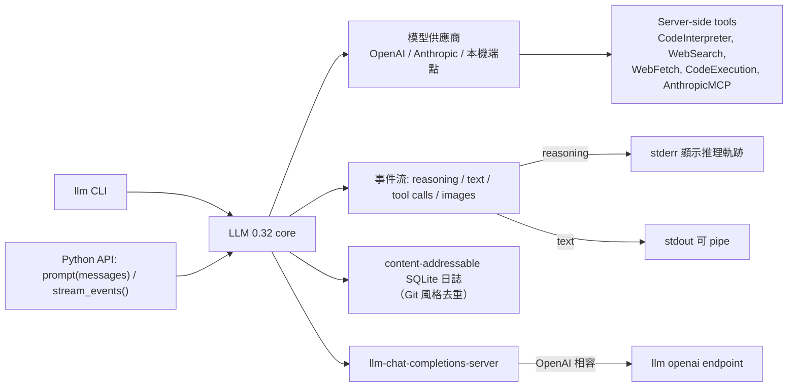

## New release of LLM adds support for reasoning traces, OpenAI Responses, server-side tools, and smarter logging

LLM CLI 0.32 是 Simon Willison 自項目啟動以來最重要版本，專注推理模型、server-side tools、流事件架構與日誌優化。推理迹象（reasoning traces）可視化輸出到 stderr（-R/--hide-reasoning 控制），避免污染實際輸出；預設模型切換至 GPT-5.6 Luna（低成本高能力）。核心新特性是 server-side tools 統一支援：OpenAI (CodeInterpreter/WebSearch)、Anthropic via llm-anthropic 0.26 (Claude 5/WebSearch/WebFetch/CodeExecution/AnthropicMCP)。新 Python API 引入 model.prompt(messages=[]) 與 stream_events() 方法，區分 reasoning/text/tool-calls/images 異構響應。日誌採用 Git 風格 content-addressable 消息存儲避免重複；新 llm-chat-completions-server 與 llm openai endpoint 提供 OpenAI 兼容性。Datasette Agent 等應用驅動本版本演變，LLM 逐步呈現 agent 框架特徵。

### 重點
- 推理迹象可視化輸出至 stderr 避免污染 stdout；GPT-5.6 Luna 作為新預設模型（低成本高能力）；Claude 5 family 完整支援
- Server-side tools 統一 API：OpenAI (CodeInterpreter/WebSearch)、Anthropic (WebSearch/WebFetch/CodeExecution/AnthropicMCP)；stream_events() 區分 reasoning/text/tool-calls/images 異構類型
- Git 風格 content-addressable 消息存儲避免多輪重複；model.prompt(messages=[]) 完整歷史傳入；llm-chat-completions-server + llm openai endpoint OpenAI 兼容接口

**原文：** [simon-willison](https://simonwillison.net/2026/Aug/4/new-release-of-llm/#atom-everything)

---


<!-- deep-analysis:begin -->
## 📌 摘要 (TL;DR)

- Simon Willison 發布 **LLM 0.32**，自稱是專案啟動以來最重要的版本，涵蓋可見的推理軌跡（reasoning traces）、供應商端工具（server-side tools）、重新設計的 content-addressable SQLite 日誌，以及 OpenAI Responses API 帶來的新功能。
- 對推理模型跑 prompt 時，推理軌跡會輸出到 **standard error**，不會污染可以 pipe 給其他工具的 standard output；用 `-R/--hide-reasoning` 可關閉。
- 內建支援 **GPT-5.6** 系列，`llm "prompt"` 的預設模型改為便宜但堪用的 **GPT-5.6 Luna**。
- 新增 server-side tools：OpenAI 的 `CodeInterpreter`、`WebSearch`；`llm-anthropic 0.26` 追加 `WebSearch`、`WebFetch`、`CodeExecution`、`AnthropicMCP`，並支援 Claude 5 系列。
- Python API 大改：新增 `model.prompt(messages=[])` 與 `stream_events()`，讓推理、文字、工具呼叫、圖片附件等異質輸出能各自分流處理。
- 作者最後承認：「我猜 LLM 現在算是一個 agent 框架了」——多數底層改動是被 **Datasette Agent** 的需求推動的。

## 🎯 核心概念

- **推理軌跡（reasoning traces）**：推理模型在給出答案前的「思考」內容，0.32 把它寫到 stderr 而非 stdout。
- **供應商端工具（server-side tools）**：由模型供應商在自己伺服器上執行的工具，如 OpenAI 的程式碼執行環境，不需本機跑任何東西。
- **內容定址訊息儲存（content-addressable message store）**：仿 Git 的日誌設計，相同訊息只存一份，避免多輪對話重複記錄同一段 JSON。
- **串流事件（streaming events）**：把回應拆成帶 `type` 的事件流（`reasoning` / `text` / 其他），取代舊的「純字串迭代器」模型。
- **AnthropicMCP**：透過 Anthropic API 讓模型端直接對指定的 MCP server 發出呼叫，整個過程在單一 request/response 內完成。

## 📖 整理分析

### 1. 推理軌跡與新預設模型

跑推理模型時，LLM 現在會把「思考」內容顯示在 standard error，這樣 standard output 仍然乾淨、可以直接 pipe 給下一個工具；不想看就加 `-R` 或 `--hide-reasoning`。同時 0.32 開箱支援 GPT-5.6 模型家族，`llm "prompt"` 的預設模型換成 GPT-5.6 Luna，作者形容它「便宜但有能力」。

### 2. Server-side tools：一行指令跨供應商

OpenAI 提供程式碼執行環境作為 server-side tool，現在可以直接寫 `llm --tool CodeInterpreter 'Show current python and SQLite versions'`，另有 `WebSearch`。`llm-anthropic` 這邊新增 `WebSearch`、`WebFetch`、`CodeExecution` 與 `AnthropicMCP`，例如：

```bash
llm -m claude-sonnet-5 -T 'AnthropicMCP("https://datasette.simonwillison.net/-/mcp")' \
  'how many rows in the blog_blogmark table?'
```

這會讓 Anthropic 端在單次 API 互動中，對作者新的 `datasette-mcp` plugin 執行 MCP 呼叫。

### 3. `llm openai endpoint` 與本機模型

新的 `llm openai endpoint` 指令可以一行對任何 OpenAI 相容端點送 prompt，且**不寫入 log**，適合一次性測試。作者示範用 `uvx`（不需安裝 LLM）搭配 `llm-tools-quickjs`，對本機 LM Studio 上的 Gemma 4 12B 下指令：

```bash
uvx --with llm-tools-quickjs \
  llm openai endpoint http://localhost:1234/v1 -m google/gemma-4-12b \
  -T QuickJS 'Use QuickJS to multiply 3434 * 2434' --td
```

### 4. Python API：messages 參數與 stream_events()

舊 API 要求先建立 conversation 再逐則送訊息，這層抽象掩蓋了 LLM 的真實運作方式——每次請求本來就攜帶完整歷史。0.32 改為可直接傳 `messages`：

```python
import llm
from llm import user, assistant, system

model = llm.get_model("gpt-5.6-luna")
response = model.prompt(messages=[
    system("You are a helpful pirate."),
    user("What is the capital of France?"),
    assistant("Paris, matey."),
    user("And Germany?"),
])
print(response.text())
```

另一個改動是回應形狀：舊版回傳字串序列，但今天的模型會混合輸出推理文字、輸出字串、工具呼叫甚至圖片附件，因此新增 `stream_events()`：

```python
for event in model.prompt("Explain cats").stream_events():
    if event.type == "reasoning":
        print(f"[thinking] {event.chunk}", end="", flush=True)
    elif event.type == "text":
        print(event.chunk, end="", flush=True)
    else:
        print(f"Other event: {event}")
```

### 5. chat-completions server 與 Git 風格日誌

上述兩項能力結合後，作者得以實作半標準的 OpenAI chat completions API，釋出為 `llm-chat-completions-server`：`llm chat-completions-server --port 9000` 就能在 `http://127.0.0.1:9000/v1` 提供服務，再用 `llm openai endpoint` 反過來呼叫它。這種「每次請求都附上完整訊息序列」的模式帶來日誌難題——不希望每一輪都重複記錄同樣的 JSON。解法是仿 Git 的 content-addressable message store，新 schema 見官方文件，而 `llm logs` 與 `llm logs --json` 都已升級成能把該格式轉回易讀形式。

### 6. 相容性與「LLM 變成 agent 框架」

既有 plugin 都能繼續運作，但提供額外模型的 plugin 需升級到 0.32 才能完整參與新的 streaming events 系統，文件中有 Structured messages and streaming events 的實作指南。`llm-anthropic 0.26` 已更新；`llm-gemini`、`llm-openrouter`、`llm-mistral` 快好了。作者說明許多底層改動源自 Datasette Agent 的需求：工具鏈現在可以暫停等待人工核可，再從儲存的訊息歷史恢復執行。他回顧自己過去因為「agent」定義太模糊而拒用此詞，直到 2025 年 9 月接受「an LLM agent runs tools in a loop to achieve a goal」這個說法；如今 LLM 已能作為 Datasette Agent 與 `llm-coding-agent` 的基礎，下一版可能會把 agent 概念直接內建進核心函式庫，但他還在想那該長什麼樣子。

## 🧭 架構圖



## 🧠 Mindmap

```mermaid
mindmap
  root((LLM 0.32))
    推理軌跡
      輸出到 stderr
      -R/--hide-reasoning
    新模型
      GPT-5.6 系列
      預設 GPT-5.6 Luna
      Claude 5（llm-anthropic 0.26）
    Server-side tools
      CodeInterpreter / WebSearch
      WebFetch / CodeExecution
      AnthropicMCP
    Python API
      prompt(messages=[])
      stream_events()
    日誌重構
      content-addressable store
      llm logs 已升級
    OpenAI 相容層
      llm openai endpoint
      llm-chat-completions-server
    Agent 化
      Datasette Agent 驅動
      工具鏈可暫停/恢復
      下一版或內建 agent
```
<!-- deep-analysis:end -->
### 📄 原文內容

<details>
<summary>點此展開 / 收合</summary>

I released LLM 0.32 this morning, the most significant new version of LLM since the initial launch of the project. The new version includes support for visible reasoning traces, server-side provider tools, redesigned content-addressable SQLite logs, new models, and new features enabled by the OpenAI Responses API. I also released a new version of the llm-anthropic plugin with substantial updates of its own. 
 Headline features for LLM CLI users 
 Running LLM against reasoning models now displays their reasoning traces to standard error, so you can see what they are "thinking" without that information being included in the standard output that you might pipe to another tool. Add -R/--hide-reasoning to turn this off. 
 
 LLM includes support out-of-the-box for the GPT-5.6 model family , and the new default model used with llm "prompt" is now the inexpensive but capable GPT-5.6 Luna . 
 LLM calls can now use server-side tools from various providers. OpenAI provide a code execution environment as a server-side tool; LLM can now run prompts that benefit from that like so: 
 llm --tool CodeInterpreter ' Show current python and SQLite versions ' 
 OpenAI also gets a WebSearch tool. 
 The llm-anthropic plugin adds WebSearch , WebFetch , CodeExecution , and AnthropicMCP , which looks like this: 
 llm -m claude-sonnet-5 -T ' AnthropicMCP("https://datasette.simonwillison.net/-/mcp") ' \
 ' how many rows in the blog_blogmark table? ' 
 That causes Anthropic to execute MCP calls against my new datasette-mcp plugin as part of a single request/response interaction with their API. 
 The new llm openai endpoint command provides a tool for executing prompts against any OpenAI compatible endpoint as a one-liner. These aren't logged, which makes this a handy tool for running one-off prompts against anything that speaks the lingua franca of the LLM API world. 
 Here's how I use that to run prompts against Gemma 4 12B running in my localhost LM Studio API, via uvx (no LLM installation required) and mixing in the llm-tools-quickjs tool plugin for good measure: 
 uvx --with llm-tools-quickjs \
 llm openai endpoint http://localhost:1234/v1 -m google/gemma-4-12b \
 -T QuickJS ' Use QuickJS to multiply 3434 * 2434 ' --td 
 
 New features in the Python API 
 LLM's Python API previously required you to create a conversation and then send messages to it one at a time. This was an abstraction over the true nature of LLMs, where each request carries a complete history of the messages that came before it. That abstraction started to get in the way for some more advanced cases, so the new release introduces a model.prompt(messages=[]) parameter that can be used like this: 
 import llm 
 from llm import user , assistant , system 

 model = llm . get_model ( "gpt-5.6-luna" )

 response = model . prompt ( messages = [
 system ( "You are a helpful pirate." ),
 user ( "What is the capital of France?" ),
 assistant ( "Paris, matey." ),
 user ( "And Germany?" ),
])
 print ( response . text ()) 
 LLM previously returned an iterable sequence of strings from each prompt. This worked great when models returned a string response, but failed to predict the weird shape that models would evolve towards. Today many models return a mix of reasoning text, output strings, tool calls, and even image attachments. With LLM 0.32 you can do this instead : 
 for event in model . prompt ( "Explain cats" ). stream_events ():
 if event . type == "reasoning" :
 print ( f"[thinking] { event . chunk } " , end = "" , flush = True )
 elif event . type == "text" :
 print ( event . chunk , end = "" , flush = True )
 else :
 print ( f"Other event: { event } " ) 
 Combine these features and we can finally provide a robust implementation of the semi-standard OpenAI chat completions API, which I've now released as the llm-chat-completions-server plugin: 
 llm install llm-chat-completions-server
llm chat-completions-server --port 9000
 # Server is now running on http://127.0.0.1:9000/v1 
 Now you can run prompts against LLM via that server, using the new llm openai endpoint command! 
 llm openai endpoint http://127.0.0.1:9000/v1 ' hello ' -m gpt-5.4-mini 
 The bigger challenge with that kind of API concerns logging. If we're going to support the pattern where the message sequence is appended to on every request, ideally we can avoid logging all of that duplicate JSON for every turn. 
 The solution is the new content-addressable message store , modeled after Git. You can see the new schema for that in the documentation , but the llm logs and llm logs --json commands have both been upgraded to convert that format back into something that's easy to consume. 
 And the rest 
 There is a whole lot more in this release. The 0.32 release notes are pretty comprehensive, and the notes for 0.32rc2 , 0.32rc , 0.32a3 , 0.32a2 , and 0.32a0 should fill in any gaps. 
 Existing LLM plugins should all continue to work, but plugins that provide extra models will need to be upgraded to 0.32 in order to participate fully in the new streaming events system. There's a guide to implementing plugins with Structured messages and streaming events in the documentation. 
 I've updated some of my own plugins: 
 
 
 llm-anthropic 0.26 adds support for the Claude 5 family of models, plus WebSearch , WebFetch , CodeExecution , and AnthropicMCP server-side tools. 
 
 llm-gemini and llm-openrouter and llm-mistral are nearly there, releases coming soon. 
 
 I guess LLM is an agent framework now 
 Quite a few of the lower-level tools changes in this release were driven by the needs of Datasette Agent . When I started work on LLM, the term "agent" had such a vague definition that I refused to use it. In September 2025 I came around to the idea that " An LLM agent runs tools in a loop to achieve a goal " is well established enough now that I could stop avoiding the term entirely. 
 Tool chains can now pause for human approval and resume from a stored message history - both needed by Datasette Agent. 
 Looking at LLM today it's beginning to look very agent-shaped to me. There's something neat about having a CLI utility that can mix and match different tools from different sources with different models all as a one-liner, and that includes a Python library powerful enough to build systems like Datasette Agent and llm-coding-agent . 
 Maybe the next version of LLM will bake the concept of an "agent" into the core library. I'm still trying to figure out what that would look like. 
 
 Tags: projects , releases , ai , openai , generative-ai , llms , llm , anthropic , llm-tool-use , llm-reasoning , model-context-protocol

</details>