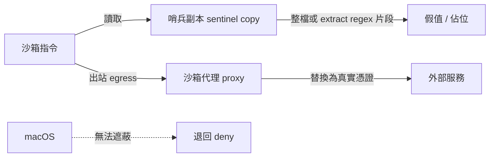
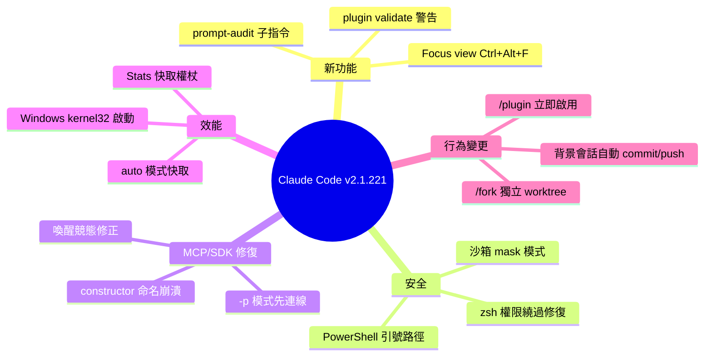

## v2.1.221

Claude Code v2.1.221 釋出 40+ 項功能改進和修復，涵蓋 UI 增強、安全改進和效能最佳化。新增 Focus view（Ctrl+Alt+F 快捷鍵）隱藏工具活動摘要，支援在 Linux/WSL 上對沙箱憑證檔案進行遮蔽（mask 模式，讀取哨兵副本，代理替換真實值）。修復 Bash 工具權限檢查繞過、PowerShell 路徑引號問題、MCP 伺服器連接失敗等關鍵 bug。Windows 啟動效能改進：改用原生 kernel32 呼叫而非 PowerShell，避免端點安全工具阻擋。統計面板現可計算快取令牌並分類顯示（input/output/cache read/cache write）。背景會話自動提交推送以保存工作，改進 /ultrareview 和 /plugin install 等功能行為。

### 重點
- Focus view (Ctrl+Alt+F)：隱藏工具活動於可擴展摘要後，帶即時工具執行指示器
- Sandbox credential masking：Linux/WSL 沙箱讀取憑證副本（整檔或正規表達式提取），代理替換真實值；macOS 回退至 deny
- Windows 啟動效能：kernel32 原生呼叫取代 PowerShell 衍生，相容端點安全軟體

**原文：** [claude-code-releases](https://github.com/anthropics/claude-code/releases/tag/v2.1.221)

---

<!-- deep-analysis:begin -->
## 📌 摘要 (TL;DR)

- Claude Code **v2.1.221** 是一次含 40+ 項改動的維護版本，橫跨 UI、安全、MCP 穩定性、效能與外掛行為五大面向。
- VSCode 新增 **Focus view**（Ctrl+Alt+F 或指令「Claude Code: Toggle Focus view」），把工具活動折疊成每輪可展開的摘要，並保留即時執行中指示器，減少對話雜訊。
- 安全面推出沙箱憑證檔案的 **mask 模式**（Linux/WSL）：沙箱指令只讀到「哨兵副本」，真實憑證由沙箱代理在出站時才替換；macOS 因無法遮蔽而退回 deny。
- 修補兩個權限繞過：zsh 在 `[[ ]]` regex 條件式中執行隱藏指令、PowerShell 對含引號路徑判斷失誤，兩者現在都會要求授權。
- Windows 啟動改用原生 **kernel32** 呼叫讀取行程建立時間，取代呼叫 PowerShell，避免端點安全工具攔截 powershell.exe。
- 背景會話行為改變：自動 commit/push 保存工作、必要時才開草稿 PR、遵循 CLAUDE.md 的 git 指示，並在結束時回報產出位置。

## 🎯 核心概念

- **專注檢視（Focus view）**：一個聊天選單開關，把冗長的工具執行過程隱藏在可展開的每輪摘要背後。
- **遮蔽模式（mask mode）**：沙箱憑證檔案的一種讀取模式，靠「哨兵副本（sentinel copy）」餵假值、由代理在出站（egress）時替換真值。
- **哨兵副本（sentinel copy）**：整份檔案或僅擷取正則（extract regex）命中的片段所做的替身檔，供沙箱指令讀取。
- **提示稽核（prompt-audit）**：`claude-api` skill 新增的子指令，用來檢查提示與工具描述中「為舊模型而寫」的過時寫法。
- **WIF OAuth**：工作負載身分聯盟（Workload Identity Federation）的 OAuth 憑權，本版修掉其權杖被兩個行程同時刷新的競態。

## 📖 整理分析

### 1. 兩個新功能：Focus view 與提示稽核
VSCode 端的 Focus view 讓使用者用 Ctrl+Alt+F 把工具活動收合成每輪摘要，同時顯示即時執行中指示器，適合在長流程中降低視覺干擾。CLI 端則在 `claude-api` skill 加入 `prompt-audit` 子指令，可稽核提示與工具描述是否仍沿用針對舊模型的寫法；`claude plugin validate` 也新增警告，提醒 marketplace 或 plugin 名稱會被 Claude Desktop 的受管同步拒絕。

### 2. 安全強化：憑證遮蔽與權限繞過修復
沙箱憑證檔案新增 mask 模式：在 Linux 與 WSL 上，沙箱指令讀到的是哨兵副本（整檔或 extract regex 擷取的片段），真實值只在代理出站時替換；macOS 因無法遮蔽而退回 deny。同時修補兩個權限漏洞——zsh 可在 `[[ ]]` regex 條件式中執行隱藏指令的 Bash 工具繞過，以及 PowerShell 對含引號字元路徑的誤判，兩者現在都會跳出授權提示。

### 3. MCP 與 SDK 穩定性修復
本版針對 MCP 修了多個問題：`--mcp-config` 的伺服器在 print 模式（`-p`）第一輪前未連上，導致模型把工具呼叫當純文字輸出；連線途中停用 MCP 伺服器不再靜默回復；喚醒（wake-from-sleep）時兩個行程同時刷新同一 MCP 連接器或 WIF OAuth 權杖、逼使重新認證的競態也已修正。SDK 端則修掉 MCP 工具以 `constructor` 等內建物件屬性命名時準備 API 請求的崩潰。

### 4. 效能與 Windows 最佳化
Windows 啟動改用原生 kernel32 呼叫讀取行程建立時間，不再產生 PowerShell 子行程，讓會攔截 powershell.exe 的端點安全工具不再跳提示。auto 模式的平行工具權限檢查改為快取友善，並透過重用已快取的對話前綴降低 prompt-cache 成本；Google Vertex AI 的工具搜尋也重新對 Claude 4.5 世代以上模型開放。統計面板（Stats panel）現在把快取權杖計入總量，並拆成 input、output、cache read、cache write 四類顯示。

### 5. 背景會話與外掛行為變更
背景會話改為自動 commit 並 push 以保存工作、必要時才開草稿 PR、遵循 CLAUDE.md 的 git 指示，並在結束時回報工作存放位置；`/status` 也新增顯示會話類型（互動、或背景任務的 attached / unattended）。外掛方面，`/plugin install` 找不到套件時會先刷新過期的 marketplace 目錄再重試；由 `/plugin` 安裝的外掛在安全時立即啟用，不再一律要求 `/reload-plugins`；`/fork` 分叉的會話改建立自己的 worktree 而非共用原會話目錄。

## 🧭 沙箱憑證遮蔽（mask 模式）流程

## 🧠 Mindmap

<!-- deep-analysis:end -->
### 📄 原文內容

點此展開 / 收合

What's changed 
 
 [VSCode] Added Focus view: a chat-menu toggle that hides tool activity behind an expandable per-turn summary with a live running-tool indicator, toggled with Ctrl+Alt+F or the "Claude Code: Toggle Focus view" command 
 Added mode: "mask" for sandbox credential files on Linux and WSL — sandboxed commands read a sentinel copy (the whole file, or just the spans captured by an extract regex) while the sandbox proxy substitutes the real value on egress; on macOS file masking falls back to deny 
 Added warnings to claude plugin validate when a marketplace or plugin name would be rejected by Claude Desktop's managed marketplace sync 
 Added a prompt-audit subcommand to the claude-api skill for auditing prompts and tool descriptions for patterns written for older models 
 Fixed a Bash tool permission-check bypass where zsh could execute hidden commands in [[ ]] regex conditionals; affected commands now prompt for permission 
 Fixed PowerShell permission checks mishandling paths containing quote characters on Windows; such paths now prompt for approval 
 Fixed the thinking toggle having no effect for the rest of a session that started with thinking off; disabling an MCP server mid-connect no longer silently reverts 
 Fixed MCP servers from --mcp-config not being connected before the first turn in print mode ( -p ), which made the model emit tool calls as literal text 
 Fixed @-mentioned files being silently dropped when pressing Esc to retract a prompt and resubmitting it 
 Fixed a crash when preparing API requests for SDK MCP tools named after built-in object properties such as constructor 
 Fixed WebSearch failing with a 400 error at effort xhigh / max when thinking is disabled 
 Fixed sandboxed large uploads failing with TLS errors through the sandbox proxy 
 Fixed Team and Enterprise spend-limit message incorrectly blaming the org's monthly limit instead of your individual spend limit 
 Fixed Bedrock authentication with AWS SSO named profiles failing in desktop-managed sessions on Windows machines that set a stray HOME environment variable 
 Fixed CLAUDE_CODE_RESUME_INTERRUPTED_TURN=0 not disabling interrupted-turn auto-resume; falsy values are now honored 
 Fixed a rare wake-from-sleep race where two Claude Code processes could both refresh the same MCP connector or WIF OAuth token at once, forcing re-authentication 
 Fixed renaming a session from Claude Code Desktop or claude.ai not updating the CLI's session name; session names from every rename surface are now sanitized 
 Fixed plugin- and org-delivered skills named after terminal-only built-ins (e.g. /help , /feedback ) being un-invocable in non-interactive sessions 
 Fixed the "Plugins changed" notification lingering after plugins were reloaded instead of clearing 
 Fixed Vim mode: the yank register now survives dialogs, history search, and the transcript view instead of being silently emptied 
 Fixed Vim mode: undoing back to an empty prompt now arms the "press ← again" confirm before returning to the agent view 
 Improved tool search on Google Vertex AI: re-enabled for Claude 4.5-generation and newer models 
 Improved auto mode: permission checks for parallel tool calls are now cache-efficient, and switching modes while a check is pending reliably prompts instead of applying the stale result 
 Reduced prompt-cache costs for auto-mode permission checks by reusing the cached conversation prefix across decisions 
 Improved Stats panel to count cache tokens in its token totals, with a breakdown by input, output, cache read, and cache write 
 Improved /ultrareview error messages when a repo shares no history with its base: a checkout with no branches is now refused up front with advice to create one, and refusal hints no longer suggest git fetch --unshallow on clones that are already complete 
 Improved Windows startup: process creation times are now read via a native kernel32 call instead of spawning PowerShell, so endpoint security tools that gate powershell.exe no longer prompt 
 Changed background sessions to commit and push to preserve work, open a draft PR only when the task calls for one, follow your CLAUDE.md git instructions, and always end by reporting where the work lives 
 Changed /plugin install to refresh a stale marketplace catalog and retry before reporting a plugin not found 
 Changed plugins installed from /plugin to activate immediately when safe, instead of always requiring /reload-plugins 
 Changed plugins to accept "." as a skills path, and the root-level SKILL.md validation error now suggests using the plugin root 
 Changed /status to show the session kind: interactive , or a background job that is attached or unattended 
 Changed emoji autocomplete to accept common alternate shortcodes like :thumbsup: , :thumbsdown: , and :love: 
 Changed sessions forked with /fork to create a new worktree of their own instead of working in the original session's checkout 
 Changed Claude in Chrome to close the browser tabs it opens once it no longer needs them 
 Changed fast mode to report on the stream when usage credits run out mid-session, instead of failing silently 
 Changed Monitor: a watch that exits without producing any output now says so instead of reporting "stream ended" 
 Changed the Gateway model field validation: non-string values are rejected with a 400 instead of being forwarded 
 Removed the repeated "Permission mode changed while the auto-mode classifier call was queued" notice from approval prompts

