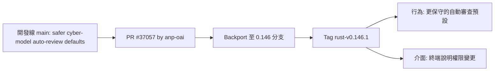
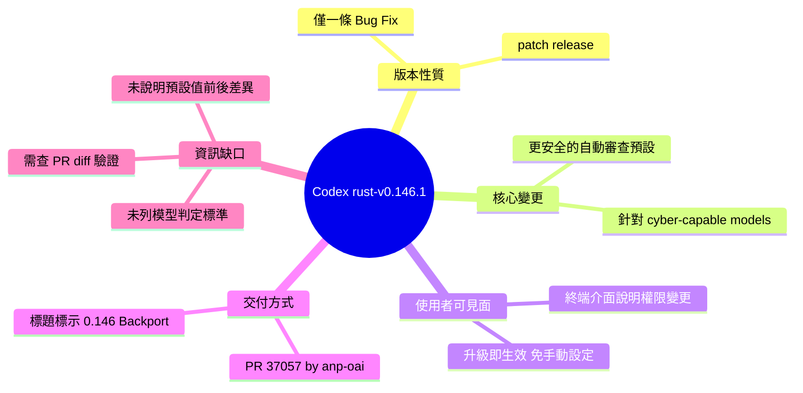

## 0.146.1

OpenAI Codex 於 2026 年 8 月 5 日發布 v0.146.1 修復版本。此版本改進了具有網路安全能力模型（cyber-capable models）的自動審查預設值，確保在涉及網路操作時應用更嚴格的控制機制。終端介面新增權限變更說明，提高用戶對已授予能力的可見性和感知。此修復通過 PR #37057 從開發線 backport 引入，針對可能執行危險網路操作的模型提供額外的安全層。

### 重點
- 對網路安全模型應用更安全的自動審查預設值（PR #37057 backport）
- 終端介面中新增權限變更說明，提升用戶感知度
- 針對 cyber-capable models 的針對性安全加固

**原文：** [codex-releases](https://github.com/openai/codex/releases/tag/rust-v0.146.1)

---

<!-- deep-analysis:begin -->
## 📌 摘要 (TL;DR)

- OpenAI Codex 釋出 `rust-v0.146.1`，是一個純修補（bug fix）的 patch 版本，Release Notes 中只列出**一條**變更。
- 唯一變更：對「具網路安全能力的模型」（cyber-capable models）套用更安全的**自動審查預設值**（safer automatic-review defaults），並在終端介面（terminal interface）**說明權限變更**。
- 該變更來自 PR **#37057**，作者 **@anp-oai**，PR 標題明確標示為 `[0.146] Backport`，代表它先在開發線上合併，再回移（backport）到 0.146 穩定分支。
- 對使用者的意義：升級後預設行為變得更保守，且權限異動會被明白告知，不需要自行改設定；但官方說明沒有揭露判定門檻或適用模型清單。
- 這是一則資訊密度很低的發布公告，**任何超出上述兩句話的細節都必須回頭看 PR diff 才能確認**（本文會明確標示哪些是推論）。

## 🎯 核心概念

- **自動審查預設值**（automatic-review defaults）：Codex 在執行動作前自動進行審查／把關的預設組態；此版把它調成更保守（safer）的一組值。原文未定義審查的具體項目。
- **具網路安全能力的模型**（cyber-capable models）：發布說明中用來指涉一類模型的原文用語，這次針對這類模型單獨套用更嚴的預設。原文未列出屬於此類的模型名稱或判定標準。
- **回移**（backport）：把已在較新開發線合併的修改，挑回既有穩定版本分支再發布。PR 標題 `[0.146] Backport safer cyber-model auto-review defaults` 即是此模式。
- **修補版本**（patch release）：版號自 `0.146.0` → `0.146.1`，僅第三碼遞增，慣例上代表不含破壞性變更與新功能。

## 📖 整理分析

### 1. 這次只動一件事

完整 Release Notes 只有一個 Bug Fixes 條目：`Apply safer automatic-review defaults for cyber-capable models and explain permission changes in the terminal interface. (#37057)`。沒有其他修復、沒有新功能、沒有相依套件升級條目。對照 Full Changelog 區間 `rust-v0.146.0...rust-v0.146.1`，這是一個為單一議題而生的 hotfix 型發布。

### 2. 變更被拆成「行為」與「告知」兩半

這一句英文其實包含兩個動作：一是**改變預設行為**（對 cyber-capable models 套用更安全的自動審查預設值），二是**改變介面訊息**（在終端介面解釋權限變更）。第二半很關鍵——當工具悄悄把預設收緊時，若不告知，使用者會誤以為是壞掉或行為不一致；Codex 選擇在 CLI 內把權限差異講清楚，屬於可觀測性／可預期性的補強。

### 3. 為什麼特別針對 cyber-capable models（此段為推論）

發布說明沒有解釋原因。**以下是推論**：對特定能力類別的模型套用差異化的預設安全策略，通常代表該類模型被評估為誤用風險較高，因此在「自動放行」與「需人工確認」之間把界線往保守方向移。原文沒有提供風險等級、評估框架或模型名單，因此無法確認觸發條件，也無法判斷一般使用者日常使用的模型是否會受影響。

### 4. Backport 的訊號：走 patch 通道而非等下一個版本

PR 標題前綴 `[0.146]` 明示這是針對 0.146 系列的回移。把安全相關的預設值調整用 backport + patch release 送出，而不是併入下一個 minor 版本，代表維護者希望**已在 0.146.x 上的使用者立即拿到**這組更保守的預設，而不必先承擔升級 minor 版本的其他變動。

### 5. 資訊缺口：想知道細節只能看 diff

目前**無法從這份 Release Notes 確定**的事項包括：（a）「自動審查」實際檢查什麼；（b）哪些模型被歸類為 cyber-capable；（c）預設值從什麼變成什麼；（d）終端介面新增的文案內容為何；（e）是否有環境變數或設定可覆寫。要回答這些，需直接查閱 `openai/codex` 的 PR #37057 變更內容與 `rust-v0.146.0...rust-v0.146.1` 的完整 diff。

## 🧭 發布路徑

## 🧠 Mindmap

<!-- deep-analysis:end -->
### 📄 原文內容

點此展開 / 收合

Bug Fixes 
 
 Apply safer automatic-review defaults for cyber-capable models and explain permission changes in the terminal interface. ( #37057 ) 
 
 Changelog 
 Full Changelog: rust-v0.146.0...rust-v0.146.1 
 
 #37057 [0.146] Backport safer cyber-model auto-review defaults @anp-oai

