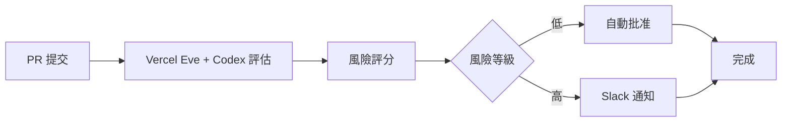

## Build an AI code review bot in 30 minutes with Vercel Eve

作者用 Vercel Eve agents 和 Codex 在 30 分鐘內構建了 Merge Mommy ─ 一個自動化 PR 審查機器人。該機器人具備三項核心功能：評估 PR 風險等級、自動批准低風險變更、對高風險變更發送 Slack 通知。此案例展示了如何快速組合現代 AI agent 框架與程式碼模型，實現 code review 流程自動化，並透過分層設計最小化人工審查工作量。

### 重點
- Vercel Eve agents + Codex 30 分鐘完成 PR 審查機器人 Merge Mommy 構建
- 三層功能：風險評分、自動批准低風險變更、Slack 異常通知
- 分層設計分離機械性判斷與人工判斷，最小化 code review 人力投入

**原文：** [substack-lennys-newsletter](https://www.lennysnewsletter.com/p/build-an-ai-code-review-bot-in-30)

---

### 📄 原文內容

點此展開 / 收合

# Build an AI code review bot in 30 minutes with Vercel Eve

Watch now | &#127897;&#65039; I used Vercel Eve agents and Codex to build Merge Mommy: a PR review bot that scores risk, auto-approves the easy ones, and pings me in Slack for the rest

