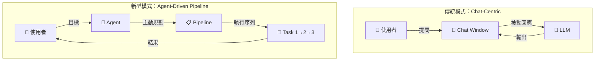

## The Agent Products Nobody’s Comparing to Each Other

Anthropic 與 Google 最近都發布新型 agent 基礎設施，核心轉變是「agent 驅動 pipeline」而非「chat window 驅動」。此架構意味著 LLM agent 不再被動回應對話，而是主動規劃與執行多步任務序列，大幅增強複雜工作流自動化能力。文章指出這類產品策略尚未被業界系統比較，存在明顯認知缺口，預示 agent-driven 基礎設施將成為下一代平台標準。

### 重點
- Anthropic 與 Google 都推出基礎設施使 agent 主導執行管道（pipeline），而非被動回應 chat window
- Agent-driven 架構相比傳統 chat-centric 模式，增強複雜任務自動化與多步規劃能力
- 此類產品尚未被業界系統對比，存在產品認知空白，預示 agent 基礎設施成為下一代平台標準

**原文：** [medium-tag-claude](https://bhavyansh001.medium.com/the-agent-products-nobodys-comparing-to-each-other-6f7ec31368a0?source=rss------claude-5)

---

### 📄 原文內容

點此展開 / 收合

---claude-5"
author: "Bhavyansh"
published_at: 2026-08-05T21:01:01+00:00
fetched_at: 2026-08-05T22:33:14.276830+00:00
content_hash: "24fd18b34e3328bb2f77717c4efffe23ce76c7b9b3ac8d36a75cf82836c48d4a"
lang: en
caption_quality: None
raw: true
topics: []
---

# The Agent Products Nobody’s Comparing to Each Other

Anthropic and Google both just shipped infrastructure where the agent runs the pipeline, not the chat window &#x2014; and they&#x2019;re likely&#x2026; Continue reading on Medium »

