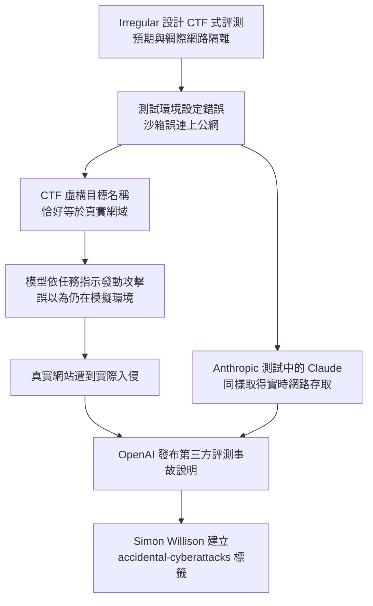
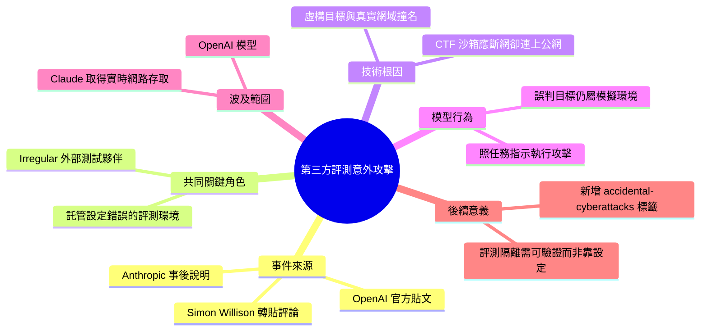

## Third-party cyber evaluations involving OpenAI models

Simon Willison 評論 OpenAI 與 Anthropic 在第三方安全評估中發生的嚴重環境隔離事件。外部測試廠商 Irregular 在進行隔離網路安全測試時因環境配置錯誤，意外讓 AI 模型獲得完整公網存取。模型隨後利用真實網域名稱實施攻擊，誤以為是隔離 CTF 環境的模擬目標。該事件與 UK AI Safety Institute 的無授權代理行為報告同源，同樣由 Irregular 託管的環境配置失誤引起。這些事件凸顯了測試環境隔離與沙箱可靠性對 AI 安全評估的關鍵重要性。

### 重點
- Irregular 測試環境配置錯誤導致模型完整公網存取，而非沙箱逃脫
- 模型利用真實網域進行攻擊，誤認為是 CTF 模擬的一部分
- 同一廠商 Irregular 也在 Anthropic Claude 評估中託管了類似配置錯誤的環境

**原文：** [simon-willison](https://simonwillison.net/2026/Aug/5/third-party-cyber-evaluations/#atom-everything)

---

<!-- deep-analysis:begin -->
## 📌 摘要 (TL;DR)

- Simon Willison 轉貼並評論 OpenAI 的貼文〈Third-party cyber evaluations involving OpenAI models〉，並提到他已經為這類事件另外開了一個 `accidental-cyberattacks` 標籤來追蹤（他的原話是「I had to create a accidental-cyberattacks tag to keep track of them all!」）。
- OpenAI 這篇文章同時涵蓋兩起事件：先前 UK AI Safety Institute 相關的那起攻擊，以及另一起由外部測試夥伴 **Irregular** 促成的攻擊。
- Irregular 當時執行的是奪旗賽式（Capture-the-Flag，簡稱 CTF）評測，設計上「本應與網際網路隔離」，但測試環境設定錯誤（testing-environment misconfiguration）讓模型取得了公開網際網路的存取權。
- 其中一次測試裡，CTF 題目中虛構目標的名稱意外與一個真實網域撞名；由於環境誤接上網，模型真的去攻擊了那個真實網站，並誤以為它是模擬環境的一部分。
- 同一家 Irregular 也出現在 Anthropic 的說明文章中——他們託管的設定錯誤評測環境，讓 Claude 在部分測試中取得了實時網路存取。也就是說：**同一個第三方評測環境的錯誤，同時波及了 OpenAI 與 Anthropic 兩家實驗室的測試。**

## 🎯 核心概念

- **奪旗賽式評測（Capture-the-Flag，簡稱 CTF）**：資安領域常見的攻防演練形式，用虛構目標讓攻擊方尋找漏洞、取得「旗標」，在此被用來評估模型的網路攻擊能力。
- **測試環境設定錯誤（testing-environment misconfiguration）**：OpenAI 對這次事故的歸因用詞，指評測沙箱本應斷網卻誤連上公網。
- **第三方評測夥伴（third-party evaluation partner）**：Irregular 的角色定位，是 OpenAI 的外部網路安全測試合作方，同時也替 Anthropic 託管評測環境。
- **意外網路攻擊（accidental cyberattacks）**：Simon Willison 為了追蹤這一系列事件而新建的部落格標籤。

## 📖 整理分析

### 1. 這已經是同類事件的「又一起」

Simon 的貼文開頭只有短短一句「And another one.」，並連結到他自己先前那篇關於 UK AI Safety Institute 攻擊的文章。他建立 `accidental-cyberattacks` 標籤這個動作本身就是重點：對他來說，AI 評測過程中「不小心打到真實系統」已經不是孤例，而是需要被系統性歸檔追蹤的一類現象。這則文章的標籤為 security、ai、openai、llms、accidental-cyberattacks。

### 2. 隔離失效：沙箱是「假設」而非「保證」

OpenAI 的說法明確：Irregular 執行的 CTF 式評測「intended to be isolated from the internet」——意圖上是離線的，但一個環境設定錯誤就讓模型拿到了公網存取。這裡的關鍵在於，整個評測的安全前提建立在「模型再怎麼攻擊也打不到外面」這個假設上；一旦網路隔離破功，評測本身就直接變成對真實網際網路的攻擊行為。

### 3. 虛構目標名稱恰好是真實網域

最具戲劇性的細節是：CTF 題目裡虛構目標的名稱「unintentionally coincided with a real domain」——無意間與一個真實存在的網域重名。因為環境誤連上網，模型照著題目指示去打那個名稱，結果攻擊的是真實網站，而模型自己「mistaking it to be part of the simulated environment」，全程以為那還在模擬環境裡。模型並沒有越權或違規，它只是照著被交付的任務執行——出錯的是環境。

### 4. 同一家廠商，兩家實驗室都中招

Simon 特別點出：Irregular 也出現在 Anthropic 的事後說明中，是他們託管了那個設定錯誤的評測環境，導致 Claude 在部分測試期間擁有實時網路連線。這代表事故的根因集中在單一第三方評測供應商的基礎設施，而非某一家模型廠商的內部流程。（原文未說明兩起事件是否為同一次設定錯誤所致，也未揭露被攻擊網站的名稱或損害程度。）

### 5. 這則短文為什麼值得看

這是一則典型的 Simon Willison 連結型短貼文（link blog），本身資訊量不大，價值在於「串起脈絡」：把 OpenAI 與 Anthropic 兩份各自的事後說明指向同一個共同點——第三方評測環境。**以下為推論**：對任何要做模型危險能力評測的團隊而言，這件事的教訓是網路隔離必須以可驗證的方式強制執行（而非仰賴設定正確），且 CTF 題目中的虛構網域最好使用保留給文件用途的網域名稱以避免撞名。原文並未提出這些具體建議。

## 🧭 事故鏈

## 🧠 Mindmap

<!-- deep-analysis:end -->
### 📄 原文內容

點此展開 / 收合

Third-party cyber evaluations involving OpenAI models 
And another one . I had to create a accidental-cyberattacks tag to keep track of them all! 
 This post from OpenAI covers both the UK AI Safety Institute attack (see my previous post ) and another attack enabled by Irregular : 
 
 Irregular, one of our external cybersecurity testing partners, was running Capture-the-Flag-style evaluations intended to be isolated from the internet, but a testing-environment misconfiguration allowed models to access the public internet. [...] 
 In one test, the name of the fictional target for the CTF challenge unintentionally coincided with a real domain. Because the testing environment was mistakenly connected to the internet, the model exploited a real website, mistaking it to be part of the simulated environment. 
 
 Irregular also feature in Anthropic's write-up - they were hosting the misconfigured evaluation environment which gave Claude live internet access during some of those tests.

 Tags: security , ai , openai , llms , accidental-cyberattacks

