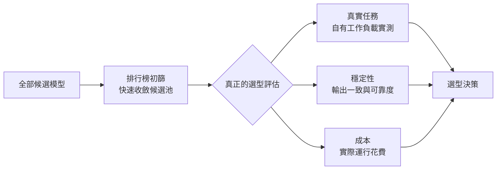
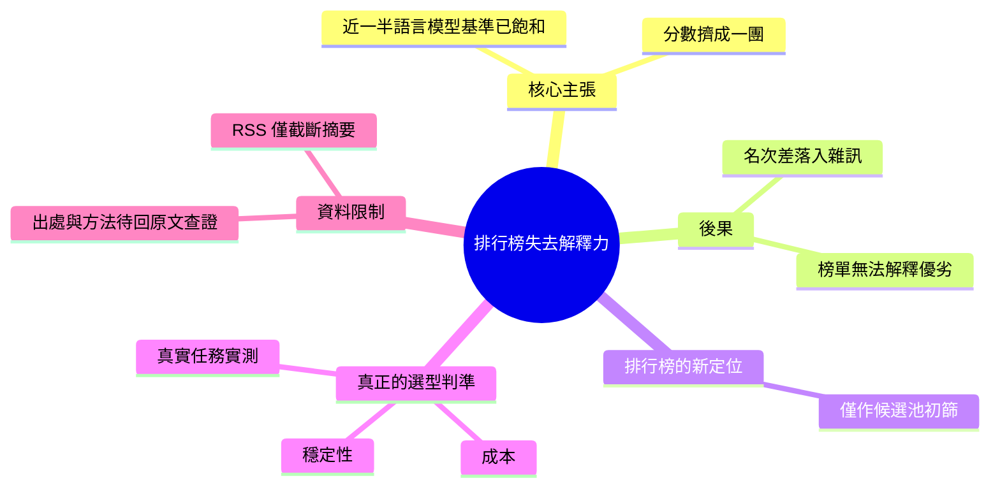

## 当 AI 模型跑分挤成一团:排行榜正在失去解释力

Medium 文章「當 AI 模型跑分擠成一團：排行榜正在失去解釋力」分析了當今模型評估的核心困境。研究指出，近一半的語言模型基準已達飽和狀態，模型間性能差異逐漸縮小。雖然排行榜仍能作為初步篩選工具，但由於基準飽和導致區分力下降，真正的模型選型應回歸真實應用任務、系統穩定性和成本效益進行綜合評估。這反映了業界評估方法論從單一基準排名向多維實踐導向的轉變，對工程決策有重要啟示。

### 重點
- 近一半語言模型基準已飽和——模型間性能差異收斂，排行榜區分力下降
- 排行榜仍具初篩價值但無法作為最終決策依據——真實任務表現、穩定性和成本才是關鍵
- 模型選型應從「排行榜排名」轉向「基於實際工作負載的多維評估」

**原文：** [medium-tag-llm](https://medium.com/@yapingchen00/%E5%BD%93-ai-%E6%A8%A1%E5%9E%8B%E8%B7%91%E5%88%86%E6%8C%A4%E6%88%90%E4%B8%80%E5%9B%A2-%E6%8E%92%E8%A1%8C%E6%A6%9C%E6%AD%A3%E5%9C%A8%E5%A4%B1%E5%8E%BB%E8%A7%A3%E9%87%8A%E5%8A%9B-619b00a5e380?source=rss------large_language_models-5)

---

<!-- deep-analysis:begin -->
## 📌 摘要 (TL;DR)

- 本文（Medium，作者 yapingchen00，來源標籤 large_language_models）的核心主張只有一句：**接近一半的語言模型基準（benchmark）已經出現飽和**。
- 飽和的直接後果是排行榜（leaderboard）「擠成一團」——頂端模型的分數差距縮到雜訊等級，榜單因此失去解釋力。
- 作者的結論是分工式的：排行榜**仍可用來初步篩選候選模型**，但真正的模型選型要回到**真實任務、穩定性與成本**三件事。
- ⚠️ **資料限制（重要）**：本次抓取到的內容是 Medium RSS 的截斷版本，正文只有上述摘要句加上「Continue reading on Medium »」。文章引用的資料來源、統計方法、具體是哪些 benchmark 飽和、飽和的判定門檻等，**都不在可取得的內容裡**。以下整理嚴格限於可得文字，不補任何未經證實的數字或研究名稱。

## 🎯 核心概念

- **基準飽和（benchmark saturation）**：一個評測集上，領先模型的分數逼近上限（或逼近人類/標註天花板），再進步也只剩極小空間，導致該基準無法再區分模型優劣。
- **解釋力 / 區分力**：排行榜排名能否真的告訴你「A 比 B 好、且好在哪」；當分差落在誤差範圍內，排名就只剩形式意義。
- **模型選型（model selection）**：在實際產品或系統中挑選要用哪個模型的決策行為，與「誰在榜上第一」是兩個不同問題。

## 📖 整理分析

### 1. 唯一可查證的主張：近一半基準已飽和
可取得的原文只給出一個量化陳述——「接近一半的語言模型基準已經出現飽和」。這個比例來自何處、以什麼標準判定飽和（例如 SOTA 分數超過某門檻、或年度提升幅度低於某值），在 RSS 截斷版中沒有交代，需回原文查證。

### 2. 「擠成一團」等於排行榜資訊量歸零
當多數模型在同一批基準上都逼近上限，榜單上的名次差就不再對應能力差。此時看排行榜選模型，等於用一把已經量到底的尺去比長度——這是文章標題「正在失去解釋力」的具體所指。

### 3. 排行榜沒有被否定，只是被降級
作者的立場不是「排行榜無用」，而是把它的角色限縮成**候選池篩選器**：用來把數十個模型收斂成少數幾個值得認真測的對象。真正決定用哪一個，排行榜給不出答案。

### 4. 選型應回到的三個軸
原文明確點名三項替代判準：**真實任務**（用你自己的實際工作負載去測，而非公開題庫）、**穩定性**（輸出一致性、可靠度，跨次呼叫與長期表現）、**成本**（實際跑起來的花費）。這三項的共同點是——它們都無法從第三方榜單讀出來，只能自己量。

### 5. 缺口與查證建議
因為只有摘要，以下都無法確認，若要引用請回原文：飽和比例的出處與定義；作者是否提供具體評測流程或工具；是否有案例、圖表或 benchmark 清單。**在補齊之前，本文只能當作一個觀點性提醒，不能當作可引用的數據來源。**

## 🧭 流程圖

下圖依原文摘要句所描述的分工重建（非原文附圖）：

## 🧠 Mindmap

<!-- deep-analysis:end -->
### 📄 原文內容

點此展開 / 收合

&#x63a5;&#x8fd1;&#x4e00;&#x534a;&#x7684;&#x8bed;&#x8a00;&#x6a21;&#x578b;&#x57fa;&#x51c6;&#x5df2;&#x7ecf;&#x51fa;&#x73b0;&#x9971;&#x548c;&#x3002;&#x6392;&#x884c;&#x699c;&#x4ecd;&#x80fd;&#x7b5b;&#x9009;&#x5019;&#x9009;&#xff0c;&#x4f46;&#x771f;&#x6b63;&#x7684;&#x6a21;&#x578b;&#x9009;&#x578b;&#x9700;&#x8981;&#x56de;&#x5230;&#x771f;&#x5b9e;&#x4efb;&#x52a1;&#x3001;&#x7a33;&#x5b9a;&#x6027;&#x4e0e;&#x6210;&#x672c;&#x3002; Continue reading on Medium »

