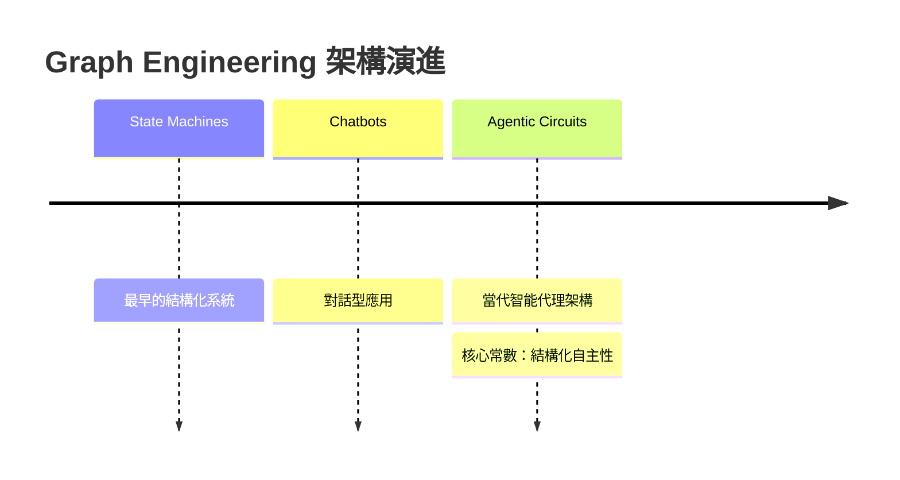

## Graph Engineering is an old idea reborn

文章探討 graph engineering 如何作為舊概念在智能時代的重生，涵蓋從狀態機、對話機器人到智能代理電路（agentic circuits）的演進路徑。核心論點是結構化自主性（structured autonomy）在系統設計中的持久價值，強調這一架構範式在不同時代背景下的周期性回歸與創新應用。

### 重點
- Graph engineering 從狀態機演進到當代 agent circuit，貫穿多個時代
- 結構化自主性（structured autonomy）是跨代系統設計的持久模式
- 舊概念因新技術與應用需求周期性重生，而非全新發明

**原文：** [medium-tag-llm](https://cobusgreyling.medium.com/graph-engineering-is-an-old-idea-reborn-c307d22d57ae?source=rss------large_language_models-5)

---

### 📄 原文內容

點此展開 / 收合

---large_language_models-5"
author: "Cobus Greyling"
published_at: 2026-08-05T19:06:19+00:00
fetched_at: 2026-08-05T22:33:13.794542+00:00
content_hash: "d903021cdb6910cce7d0a21b58ab6b9e61757f7a312693e0f6d42f3388820fc0"
lang: en
caption_quality: None
raw: true
topics: []
---

# Graph Engineering is an old idea reborn

From state machines and chatbots to agentic circuits&#x2026;why structured autonomy keeps returning Continue reading on Medium »

