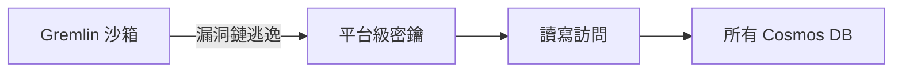

## Wiz Discloses CosmosEscape, and Practitioners Debate What Customers Could Have Done

Wiz Research 披露 CosmosEscape 漏洞：攻擊者通過漏洞鏈逃離 Azure Cosmos DB 的 Gremlin 查詢語言沙箱，獲得服務級別平台密鑰，可對所有數據庫進行讀寫訪問。Microsoft 在兩天內阻止了入口點，但直到 2026 年 7 月才移除該密鑰（響應滯後逾月）。該事件引發業界討論共責模型、沙箱設計缺陷以及重新架構的實際成本。沙箱逃逸漏洞的影響範圍廣泛，對雲服務安全隔離提出挑戰。

### 重點
- CosmosEscape 漏洞鏈：沙箱逃逸 → 服務級密鑰 → 全庫讀寫訪問
- Microsoft 響應時間：2 天阻止入口點，但超過 30 天後才移除平台密鑰
- 沙箱逃逸漏洞影響雲服務整體安全隔離，引發共責模式重新評估

**原文：** [infoq-main](https://www.infoq.com/news/2026/08/cosmosescape-master-key/?utm_campaign=infoq_content&utm_source=infoq&utm_medium=feed&utm_term=global)

---

### 📄 原文內容

點此展開 / 收合

# Wiz Discloses CosmosEscape, and Practitioners Debate What Customers Could Have Done

Wiz Research disclosed CosmosEscape, a chain that escaped Azure Cosmos DB's Gremlin sandbox and reached a platform-wide key granting read and write access to every database on the service. Microsoft blocked the entry point within two days but took until July 2026 to remove the key. Practitioners debated shared responsibility and what that rearchitecture actually cost. By Steef-Jan Wiggers

