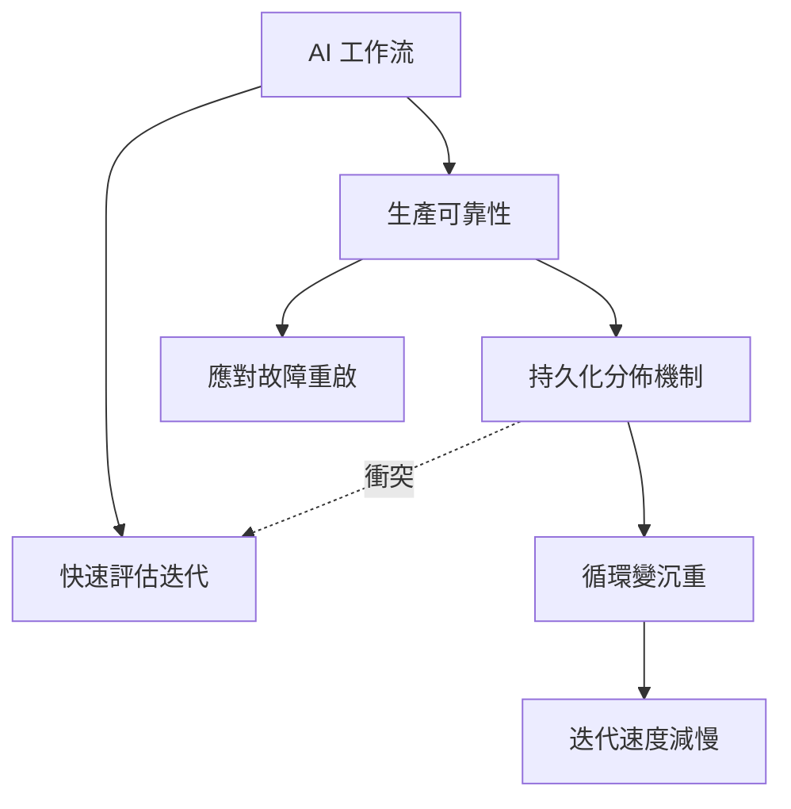

## Article: Runtime-Agnostic AI Workflows: A Pattern for Production Durability and Fast Eval Iteration

文章揭示 AI 工作流中的核心權衡悖論：生產可靠性與快速評估迭代相互衝突。生產環境需要持久化和分佈每個步驟以應對崩潰、部署和重啟，但同樣的機制導致評估循環過於沉重，減慢了快速檢查 LLM 輸出質量的迭代速度。作者提出「運行時無關工作流」模式，試圖在兩者間找到平衡。這是 MLOps 實踐中經常被忽視但根本的設計張力。

### 重點
- AI 工作流固有的矛盾：生產耐久性 vs 評估迭代速度（同一機制導致相反需求）
- 生產可靠性需求：每步持久化和分佈（應對故障和重啟）
- 快速評估需求：輕量級、可拋棄的循環（快速檢查模型輸出質量）

**原文：** [infoq-main](https://www.infoq.com/articles/ai-workflow-pattern/?utm_campaign=infoq_content&utm_source=infoq&utm_medium=feed&utm_term=global)

---

### 📄 原文內容

點此展開 / 收合

# Article: Runtime-Agnostic AI Workflows: A Pattern for Production Durability and Fast Eval Iteration

AI workflows have two needs that trade off directly. Running reliably in production requires persisting and distributing every step so it survives crashes, deploys, and restarts. But that same machinery is what makes runs too heavy for the fast, throwaway loop you need to check an LLM's output quality. The properties that buy durability are the ones that kill iteration speed. By Mateus Moury

