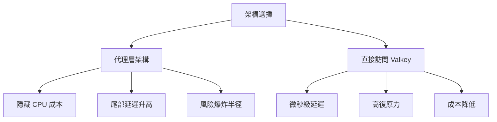

## Presentation: From ms to μs: OSS Valkey Architecture Patterns for Modern AI

Dumanshu Goyal 的演講探討 Valkey 架構模式在低延遲 AI feature stores 中的應用。他指出代理層架構會帶來隱藏的 CPU 成本、尾部延遲升高和風險爆炸半徑，而直接訪問 Valkey 架構則能達到微秒級延遲、提升復原力並大幅降低基礎設施成本。演講借鑒 NASA Space Shuttle 的設計經驗，強調架構選擇對 AI 工作負載性能的直接影響。

### 重點
- 代理層架構的成本：隱藏 CPU 開銷、尾部延遲增加、風險爆炸半徑提高
- 直接訪問 Valkey 架構實現微秒級延遲和基礎設施成本顯著降低
- 架構決策對 AI feature stores 的性能和成本產生決定性影響

**原文：** [infoq-main](https://www.infoq.com/presentations/valkey-architecture-patterns/?utm_campaign=infoq_content&utm_source=infoq&utm_medium=feed&utm_term=global)

---

### 📄 原文內容

點此展開 / 收合

# Presentation: From ms to μs: OSS Valkey Architecture Patterns for Modern AI

Dumanshu Goyal discusses optimizing data layers for low-latency workloads like AI feature stores. Drawing lessons from NASA's Space Shuttle, he explains how proxy architectures introduce hidden CPU costs, elevated tail latencies, and blast-radius risks. He demonstrates how direct-access Valkey architectures achieve microsecond latency, improve resilience, and slash infrastructure costs. By Dumanshu Goyal

