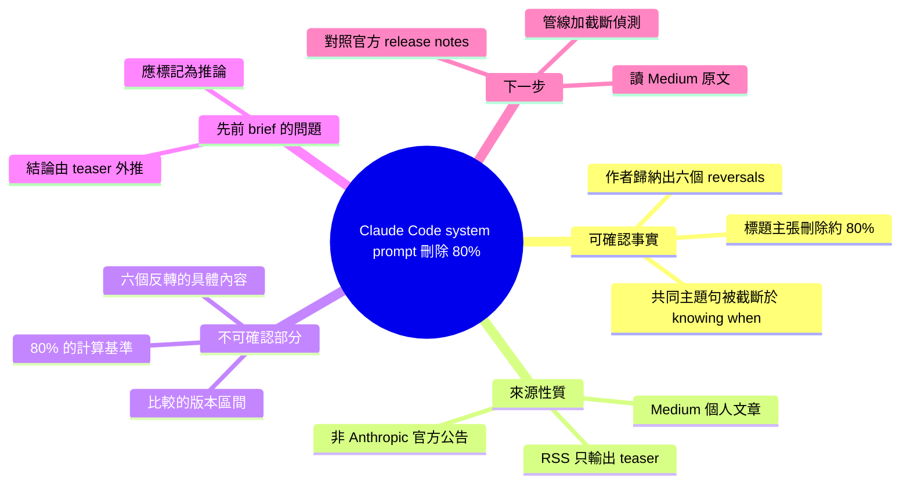

## Anthropic Deleted 80% of Claude Code’s System Prompt.

Anthropic 進行了一次激進的 Claude Code system prompt 重構，刪除了 80% 的原有內容，整合為六個核心改變（reversals）。這次重構不是簡單的刪除，而是對 prompt 工程哲學的深層反思。所有改變圍繞一個中心主題：AI agent 需要學會何時停止干預、何時委託給人工的決策時機，而非盲目「做更多」。這體現了從追求功能完整性轉向「有節制的智能」的哲學轉變。該改變對 AI 安全性、用戶信任和系統穩定性都有深遠影響。深層來看，Anthropic 正在通過精簡和重構系統提示來改進 AI agent 的判斷能力和自我約束。

### 重點
- Anthropic 刪除了 Claude Code system prompt 的 80%，這是激進的簡化和重構，表明對 prompt 設計的根本反思
- 六個核心反轉改變了 agent 的行為哲學，重點從「做什麼」轉向「何時停止」和「何時委託」的決策時機
- "知道何時停止"比"做更多"更重要是 AI agent 設計的核心原則，直接影響安全性、信任度和用戶體驗

**原文：** [medium-tag-claude](https://medium.com/@rajdeepsinghrajput/anthropic-deleted-80-of-claude-codes-system-prompt-351412be1f4e?source=rss------claude-5)

---

<!-- deep-analysis:begin -->
## 📌 摘要 (TL;DR)

- **本則內容抓取不完整**：透過 RSS（`source=rss------claude-5`）取得的 `body_md` 只有一句導言：「Six quiet reversals in how Anthropic prompts its own coding agent — and why every one of them is really about the same thing: knowing when… Continue reading on Medium »」，正文全部停在 Medium 付費／導流牆之後。
- 可確認的事實只有三項：文章標題主張 **Anthropic 刪掉了 Claude Code 系統提示（system prompt）約 80% 的內容**；作者把改動歸納成 **六個「安靜的反轉」（six quiet reversals）**；作者認為六者共同指向同一件事，而這句話在導言處被截斷（「knowing when…」）。
- 導言只寫到「knowing when…」，**後面接什麼並未出現在可取得的文字中**。任何補完（例如「知道何時停止」「何時交還給人類」）都屬於推測，本整理不做補完。
- 這是一篇**個人部落格觀察文**（Medium，作者 rajdeepsinghrajput），不是 Anthropic 官方公告；即使正文可讀，其中的「80%」與「六個反轉」也是作者自己的歸納與計算方式，需回到一手來源核對。
- 對讀者的實際意義：若你關心 agent prompt 設計，這篇值得點原文讀完；但在讀到正文之前，**不應把標題的「80%」當成已驗證的事實引用**。

## 🎯 核心概念

- **系統提示（system prompt）**：在使用者訊息之前注入、用來設定模型角色、工具使用規則與行為邊界的一段指令文字。
- **Claude Code**：Anthropic 推出的終端機／編碼代理（coding agent）產品，本文討論的對象是它內部的系統提示。
- **反轉（reversal）**：作者用來指「先前 prompt 明確要求做某件事，新版改成不做或反過來做」的改動類型，全文以此為分類軸。
- **RSS 截斷全文（truncated feed）**：Medium 的 RSS 只輸出標題＋一段導言＋「Continue reading on Medium »」導流連結，因此自動化管線抓不到正文。

## 📖 整理分析

### 1. 這次抓到的到底是什麼

輸入的 `body_md` 全長不到 40 個英文字，內容是標題重複一次，加上一句 teaser 與導流語。沒有小標、沒有清單、沒有程式碼區塊、沒有任何圖片連結。換句話說，**文章的六個論點一個都沒有進到資料裡**，只有「有六個」這個資訊本身。

### 2. 標題與導言可以拆出的資訊

標題給了量化主張（刪除 80%）與對象（Claude Code 的 system prompt）。導言給了結構（六個 reversals）、語氣（quiet，暗示 Anthropic 沒有公開宣告這些改動）、以及一個未完成的收束句（「really about the same thing: knowing when…」）。從語法可判斷作者要講的是一個「知道何時做／不做某事」的判斷主題，但**受詞不在可取得的文字內**。

### 3. 先前 brief 摘要有過度延伸的風險

本 item 附帶的 `summary_zh` 寫到「AI agent 需要學會何時停止干預、何時委託給人工」「從功能完整性轉向有節制的智能」「對 AI 安全性、用戶信任和系統穩定性有深遠影響」等結論。這些句子在可取得的原文中**找不到對應文字**，最合理的解釋是它們由被截斷的「knowing when…」外推而成。標示清楚：這些是推論，不是原文陳述，不應再被下游引用為事實。

### 4. 若要驗證，該去哪裡

（以下為作法建議，非原文內容。）第一，點開 `medium.com/@rajdeepsinghrajput/...` 讀完正文，確認作者比較的是哪兩個版本、80% 是以字元數、token 數還是段落數計算。第二，Anthropic 官方對 Claude Code 的說明與 release notes 是一手來源，作者的歸納若與其衝突，以官方為準。第三，「六個反轉」是作者的分類框架，不等於 Anthropic 內部的改動清單。

### 5. 對抓取管線的啟示

Medium 的 RSS 屬於截斷型輸出，任何以 feed 為唯一來源的自動摘要，遇到這類來源都只能拿到 teaser。實務上應在管線加一道判斷：**當 `body_md` 長度低於門檻或結尾出現「Continue reading on …」時，標記為內容不完整**，改走正文抓取或直接跳過摘要生成，避免產出看似完整、實則由標題外推的內容。

## 🧠 Mindmap

<!-- deep-analysis:end -->
### 📄 原文內容

點此展開 / 收合

Six quiet reversals in how Anthropic prompts its own coding agent &#x2014; and why every one of them is really about the same thing: knowing when&#x2026; Continue reading on Medium »

