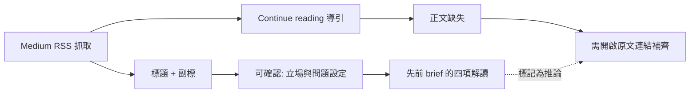
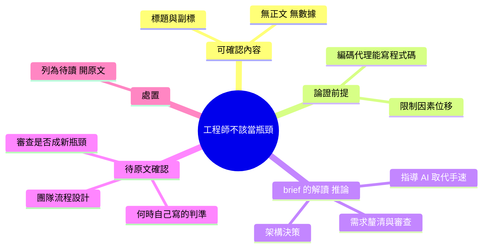

## Stop Being the Bottleneck: The Engineer’s New Job in the Age of Coding Agents

本文探討 AI 編碼工具時代軟體工程師的新角色定位。當 AI 可自動生成代碼時，工程師應停止成為實現層面的瓶頸，而應優化在更高層面的價值——架構決策、需求澄清、代碼評審、和系統整體方向。文章提出重要觀念框架：資深開發者的核心技能轉向「指導 AI」和「把握全局」，而非「手工編碼速度」。這對當前依賴 GitHub Copilot、Claude Code 等工具的開發組織有重要的人員角色調整啟示。

### 重點
- 工程師角色轉變：從代碼實現者→AI 編碼指導者 + 架構決策人
- 新的價值優化焦點：需求清晰度、架構合理性、決策質量（而非編碼速度）
- 資深開發者的競爭優勢在於「判斷力」和「系統思維」而非「編碼量」

**原文：** [medium-tag-claude](https://medium.com/@el_mohamad/stop-being-the-bottleneck-the-engineers-new-job-in-the-age-of-coding-agents-9fb50db04d74?source=rss------claude-5)

---

<!-- deep-analysis:begin -->
> ⚠️ **來源完整度說明**：此則來自 Medium RSS（tag: claude）的抓取內容，`body_md` 實際只有標題、副標與「Continue reading on Medium »」導引，**沒有文章正文**。以下整理嚴格區分「原文可確認內容」與「先前 brief 摘要的解讀（屬推論）」，未擅自補完不存在的段落、數據或案例。要取得完整論述需前往原文連結。

## 📌 摘要 (TL;DR)

- 文章標題主張：在編碼代理（coding agents）時代，工程師不該再當**瓶頸**（bottleneck），而要重新定義自己的工作內容。
- 可確認的副標只有一句：「What experienced developers should actually optimize for when AI can write the code」——即「當 AI 能寫程式碼時，資深開發者真正該優化的是什麼」。
- 原文正文未包含在此次抓取中，因此**沒有可引用的具體數字、工具版本、benchmark 或案例**。
- 先前產出的 brief 摘要把重點解讀為：價值上移到架構決策、需求釐清、程式碼審查與系統方向；核心技能從「手寫程式碼的速度」轉向「指導 AI」與「掌握全局」。這段屬於摘要層的解讀，**無法用原文正文交叉驗證**。
- 讀者若在導入 GitHub Copilot、Claude Code 等工具的團隊中做角色分工調整，這個題目值得追讀原文；但目前這則 item 只能當作**題目書籤**，不足以支撐決策。

## 🎯 核心概念

- **編碼代理（coding agents）**：能自主產出、修改程式碼的 AI 代理，是標題設定的時代前提。
- **瓶頸（bottleneck）**：標題中的核心比喻——當產出程式碼不再是限制因素時，人類工程師若仍卡在實作環節，反而成為流程的限制點。
- **該優化的目標（what to optimize for）**：副標提出的問題本體，即資深工程師應把心力投注在哪一層。原文對此的具體答案未包含在可取得的內容中。

## 📖 整理分析

### 1. 原文可確認的全部內容
本次抓取到的正文欄位僅有標題重複一次、副標一句、以及 Medium 的「Continue reading on Medium »」導引字串。這是 Medium RSS 常見的**摘要式輸出（truncated feed）**：只推送前導文字，全文留在網站上。因此本則不存在可引用的章節結構、圖片（``）或引文。

### 2. 標題本身傳達的論證骨架
標題「Stop Being the Bottleneck」是祈使句，預設了一個因果：AI 已能承擔實作，**限制因素從「寫得多快」移動到別處**。副標的 “actually optimize for” 暗示作者要反駁某個常見但錯誤的優化目標。至於作者認為錯誤的是什麼、正確的替代方案為何，均未在可取得內容中出現。

### 3. brief 摘要的解讀屬於推論
先前的 `summary_zh` 提出了四個上移方向（架構決策、需求澄清、程式碼審查、系統方向）與一組對照（指導 AI vs 手工編碼速度）。這些命題與標題方向一致，但**在本次可取得的文字中找不到對應句子**，應標記為推論而非原文結論。若要引用，必須先回原文核對。

### 4. 待原文確認的關鍵問題
讀取全文時，建議優先確認以下四點，才能判斷這篇是否有超出同類「AI 改變工程師角色」文章的增量：作者是否給出可操作的判準（何時該自己寫、何時交給代理）；是否有具體工作流程或團隊制度設計；是否提供實測數據或個人專案案例；以及對 code review 在代理產出量暴增下如何不變成新瓶頸的處理方式。

### 5. 對讀者的處置建議
在正文缺失的前提下，把這則歸類為**待讀清單**而非已消化的觀點來源。若團隊正在調整 AI 工具下的角色分工，直接開原文閱讀；若只是掃 feed，標題本身已傳達了完整的立場，不必額外處理。

## 🧭 內容完整度示意

## 🧠 Mindmap

<!-- deep-analysis:end -->
### 📄 原文內容

點此展開 / 收合

What experienced developers should actually optimize for when AI can write the code Continue reading on Medium »

